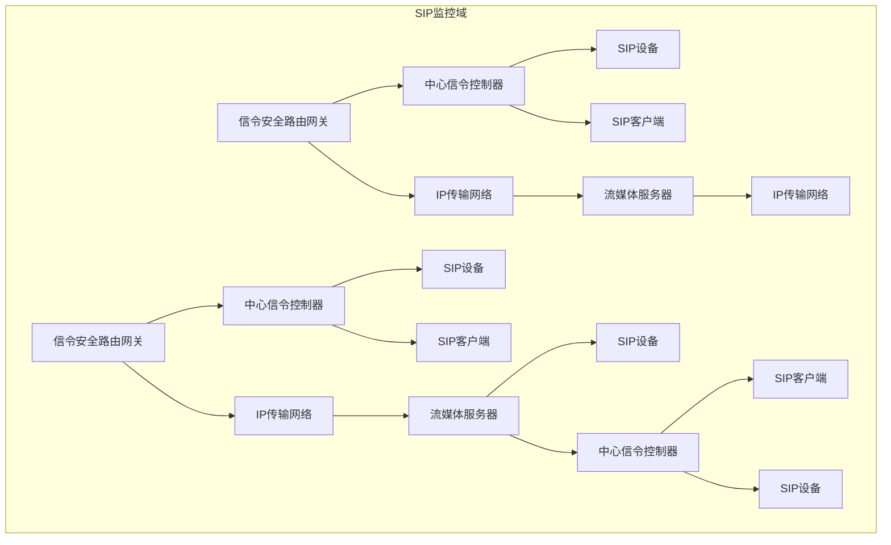
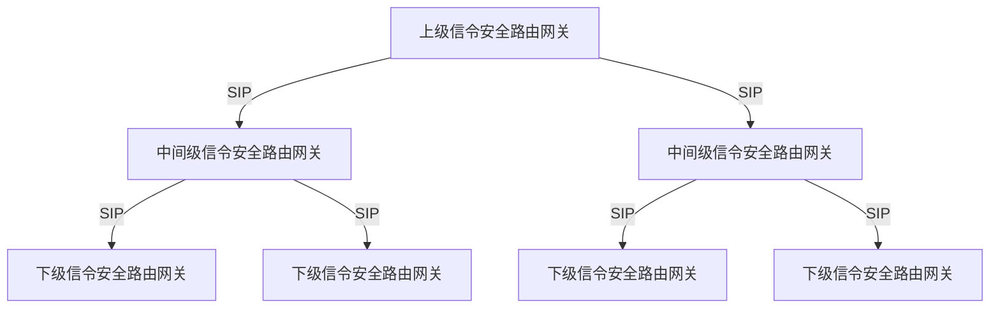
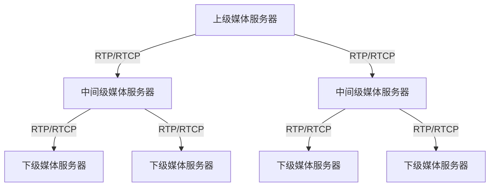
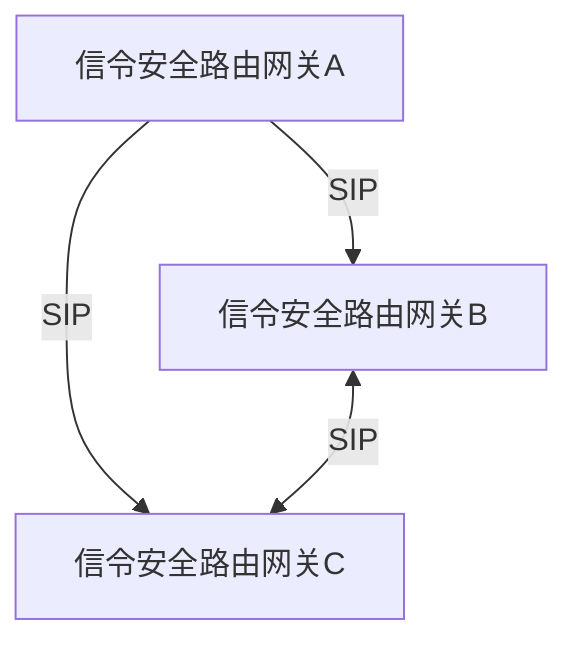
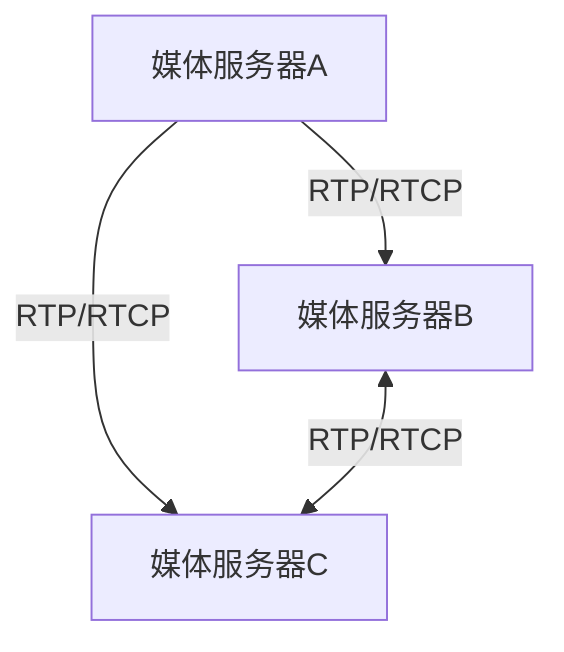
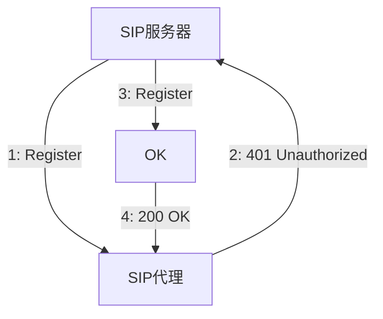
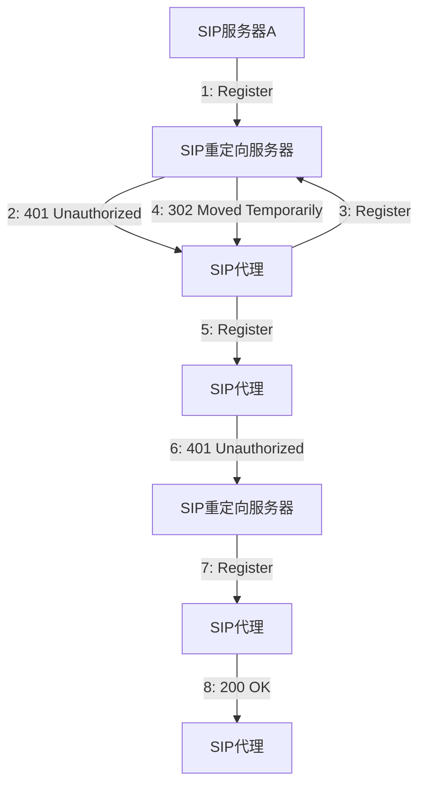
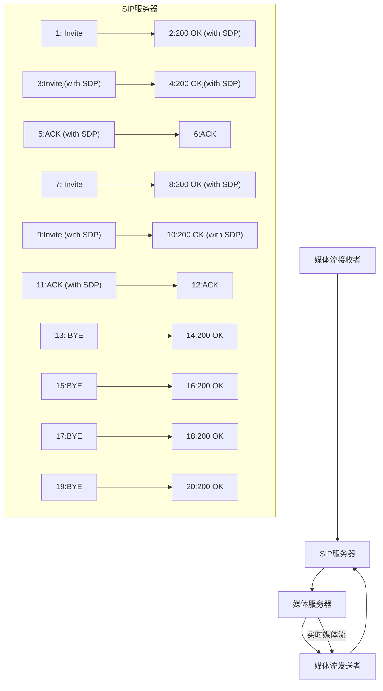

# 公共安全视频监控联网系统 信息传输、交换、控制技术要求

# Technical requirements for information transmission, switch and control in video surveillance networking system for public security

2022-12-30 发布

2023-07-01 实施

# 目次

# 前言 Ⅲ

1 范围 1  
2 规范性引用文件 …… 1  
3 术语和定义、缩略语…… 3

3.1 术语和定义 …… 3   
3.2 缩略语 5

4 互联结构 …… 6

4.1 SIP监控域互联结构 6  
4.2 SIP监控域与非SIP监控域互联结构 8  
4.3 联网系统通信协议结构 9

5 传输要求…… 10

5.1 网络传输协议要求 …… 10  
5.2 媒体传输协议要求 …… 10  
5.3 信息传输延迟时间 …… 10  
5.4 网络传输带宽 11  
5.5 网络传输质量 11  
5.6 视频帧率 11

6 交换要求…… 11

6.1 统一编码规则 …… 11   
6.2 媒体编解码 …… 11  
6.3 媒体存储封装格式 …… 11  
6.4 SDP 定义 …… 11  
6.5 网络传输协议的转换 …… 12  
6.6 控制协议的转换 …… 12  
6.7 媒体传输协议的转换 …… 12   
6.8 媒体数据格式的转换 …… 12  
6.9 与其他系统的互联 …… 12  
6.10 信令字符集 12  
6.11 多路径级联结构 12

7 控制要求…… 12

7.1 注册 12   
7.2 实时视音频点播 …… 12   
7.3 控制 13

7.4 报警事件通知和分发 …… 13

7.5 设备信息查询 …… 13

7.6 状态信息报送 …… 13

7.7 历史视音频文件检索 …… 14

7.8 历史视音频回放 …… 14

7.9 历史视音频文件下载 …… 14

7.10 网络校时 14

7.11 订阅和通知 14

7.12 语音广播和语音对讲 …… 14

7.13 设备软件升级 14

7.14 图像抓拍 14

8 传输、交换、控制安全性要求……15

8.1 设备身份认证 …… 15

8.2 数据加密 …… 15

8.3 SIP 信令认证 …… 15

8.4 数据完整性保护 …… 15

8.5 访问控制 15

8.6 高安全级别要求 …… 15

9 控制、传输流程和协议接口 16

9.1 注册和注销 …… 16

9.2 实时视音频点播 …… 18

9.3 控制 23

9.4 报警事件通知和分发 26

9.5 网络设备信息查询 28

9.6 状态信息报送 …… 30

9.7 设备视音频文件检索 …… 31

9.8 历史视音频的回放 32

9.9 视音频文件下载 38

9.10 校时 43

9.11 订阅和通知 44

9.12 语音广播和语音对讲 48

9.13 设备软件升级 52

9.14 图像抓拍 53

附录 A（规范性） 监控报警联网系统控制描述协议(MANSCDP)命令集 …… 56

A.1 命令的名称和说明 56

A.2 命令定义 56

A.3 前端设备控制协议 …… 100

A.4 联网系统扩展应用 104

附录 B（规范性） 监控报警联网系统实时流协议(MANSRTSP)命令集 …… 106

B.1 命令的名称和说明 …… 106  
B.2 命令定义 106

附录 C （规范性） 基于 RTP 的视音频数据封装 109

C.1 基于 RTP 的视音频数据 PS 封装 109  
C.2 基于 RTP 的视音频基本流封装…… 110

附录 D （规范性） 基于 TCP 协议的视音频媒体传输 112

附录 E（规范性） 统一编码规则 113

E.1 编码规则 113  
E.2 行业编码对照表 115  
E.3 县以下区划代码编制规则 …… 117

附录 F（规范性） 视音频编/解码技术要求 …… 119

F.1 基本要求 119  
F.2 基于 H.264 的视频编、解码技术要求 119  
F.3 基于 MPEG-4 的视频编、解码技术要求 122  
F.4 音频编、解码总体要求 124   
F.5 G.711 格式 124  
F.6 G.723.1 格式 125  
F.7 G.729 格式 125  
F.8 SVAC 视频和 SVAC 音频编、解码技术要求 125  
F.9 H.265 视频编、解码技术要求 …… 125  
F.10 AAC 格式 128

附录 G（规范性） SDP 定义 129

附录 H（资料性） 摄像机和平台路径选择技术要求 133

H.1 基本要求 …… 133  
H.2 处理逻辑 133  
H.3 多路径 SIP 头域扩展定义 …… 134  
H.4 路径推送及选择示范 135

附录 I（规范性） 协议版本标识…… 138

附录 J（规范性） 目录查询应答说明…… 139

附录 K（资料性） 媒体流保活机制 143

附录 L（规范性） Subject 头域定义 …… 144

附录 M（规范性） 多响应消息传输 145

附录 N（规范性） 域间目录订阅通知 146

N.1 基本要求 146  
N.2 应用场景及处理逻辑 146

# GB/T 28181—2022

N.3 命令流程 147  
N.4 协议接口 149

附录 O（规范性） 摄像机采集部位类型代码 151

参考文献…… 159

# 前言

本文件按照 GB/T 1.1—2020《标准化工作导则 第1部分:标准化文件的结构和起草规则》的规定起草。

本文件代替 GB/T 28181—2016《公共安全视频监控联网系统信息传输、交换、控制技术要求》，与 GB/T 28181—2016 相比，除结构调整和编辑性改动外，主要技术变化如下。

——更改了标准范围(见第1章,2016年版的第1章)。  
——删除了“联网系统信息”“数字接入”“模拟接入”“模数混合型监控系统”“数字型监控系统”“监控点”“监控中心”的术语和定义，更改了“SIP监控域”“非SIP监控域”“级联”“互联”的术语和定义（见3.1,2016年版的3.1）。  
——增加了缩略语“PTZ”(见 3.2)。  
——更改了“SIP 监控域互联结构示意图”(见 4.1.1,2016 年版的 4.1.1)。  
——更改了“联网系统通信协议结构图”，媒体流通道增加了 H.265、G.722.1、AAC（见 4.3.1，2016 年版的 4.3.1）。  
——增加了媒体流数据传输的 RTP 时间戳要求(见 4.3.6)。  
——更改了网络传输带宽要求、视频帧率要求(见 5.4、5.6,2016 年版的 5.4、5.6)。  
——增加了对 H.265、AAC 的支持(见 6.2、A.2.1.9、附录 C、附录 F、附录 G)。  
——更改了 SDP 协议的引用(见 6.4、附录 G,2016 年版的 6.4、附录 F)。  
——更改了与其他系统的数据交换(见 6.9、附录 A,2016 年版的 6.9、附录 G)。  
——更改了信令字符集要求(见 6.10,2016 年版的 6.10)。  
——更改了控制要求(见第7章,2016年版的第7章)。  
——更改了传输、交换、控制安全性要求(见第8章,2016年版的第8章)。  
——更改了注册和注销基本要求(见9.1.1,2016年版的9.1.1)。  
——增加了注册重定向(见9.1.2.3)。  
——更改了设备控制和设备配置基本要求及数据类型(见9.3.1、A.2.1、A.2.3.1、A.2.3.2)。  
——增加了看守位信息查询、巡航轨迹列表查询、巡航轨迹查询、PTZ精准状态查询、存储卡状态查询及应答命令(见9.5.3、A.2.4.10～A.2.4.14、A.2.6.12～A.2.6.16)。  
——增加了 PTZ 精准位置变化事件订阅和通知(见 9.11.1、9.11.2、A.2.4.13、A.2.6.15)。  
——增加了设备软件升级、图像抓拍信令流程和协议接口(见9.13、9.14)。  
——更改了附录 A 部分内容。增加了部分数据类型定义(见 A.2.1, 2016 年版的 A.2.1); 增加了部分控制命令及参数(见 A.2.3, 2016 年版的 A.2.3); 增加了部分查询命令及参数(见 A.2.4, 2016 年版的 A.2.4); 修改部分通知命令及参数(见 A.2.5, 2016 年版的 A.2.5); 增加、修改了部分应答命令及参数(见 A.2.6, 2016 年版的 A.2.6); 部分修改了 PTZ 指令举例(见 A.3.2, 2016 年版的 A.3.2); 增加了联网系统扩展应用(见 A.4)。  
——更改了附录 B, 补充了媒体播放命令说明(见附录 B, 2016 年版附录 B)。  
——更改了附录 C, 补充了 H.265 封装描述(见附录 C, 2016 年版附录 C)。  
——更改了附录 D 基于 TCP 协议的视音频媒体传输要求(见附录 D,2016 年版的附录 L)。  
——更改了附录 E。扩展了类型编码，删除了编码规则 B，更改了行业编码对照表，增加了统计用县以下区划代码编制规则（见附录 E，2016 年版的附录 D）。  
——更改了附录 F，补充了 H.265 编解码技术要求、AAC 格式（见附录 F，2016 年版的附录 E）。

——更改了附录 G，补充了部分 SDP 参数要求（见附录 G，2016 年版的附录 F）。  
——删除了 2016 年版的附录 G、附录 H、附录 I、附录 J。  
——增加了附录 H 摄像机和平台路径选择技术要求(见附录 H)。  
——增加了附录 I 协议版本标识(见附录 I)。  
——更改了附录 J 目录查询应答说明(见附录 J,2016 年版的附录 O)。  
——更改了附录 M 多响应消息传输要求说明(见附录 M,2016 年版的附录 N)。  
——更改了附录 N 域间目录订阅通知说明(见附录 N,2016 年版的附录 P)。  
——增加了附录 O 摄像机采集部位类型代码(见附录 O)。

请注意本文件的某些内容可能涉及专利。本文件的发布机构不承担识别专利的责任。

本文件由中华人民共和国公安部提出。

本文件由全国安全防范报警系统标准化技术委员会(SAC/TC 100)归口。

本文件起草单位:公安部第一研究所、视频图像信息智能分析与共享应用技术国家工程实验室、国家信息中心、杭州海康威视数字技术股份有限公司、浙江大华技术股份有限公司、浙江宇视科技有限公司、华为技术有限公司、中星微技术股份有限公司。

本文件及其所代替文件主要起草人:陈朝武、崔云红、王冰洋、朱雷、廖双龙、孔维生、吴参毅、黄强雄、张祎、孟卿卿、王建勇、尹萍。

本文件的历次版本发布情况为：

——2011年首次发布为 GB/T 28181—2011,2016 年第一次修订；

——本次为第二次修订。

# 公共安全视频监控联网系统 信息传输、交换、控制技术要求

# 1 范围

本文件规定了公共安全视频监控联网系统(以下简称“联网系统”)的互联结构,传输、交换、控制的基本要求和安全性要求,以及控制、传输流程和协议接口等技术要求。

本文件适用于公共安全视频监控联网系统的方案设计、系统检测、验收以及与之相关的设备研发、生产。其他视频监控联网系统可参照执行。

# 2 规范性引用文件

下列文件中的内容通过文中的规范性引用而构成本文件必不可少的条款。其中，注日期的引用文件，仅该日期对应的版本适用于本文件；不注日期的引用文件，其最新版本（包括所有的修改单）适用于本文件。

GB/T 4754 国民经济行业分类

GB/T 10114—2003 县级以下行政区划代码编制规则

GB 18030 信息技术 中文编码字符集

GB/T 25724 公共安全视频监控数字视音频编解码技术要求

GB 35114 公共安全视频监控联网信息安全技术要求

GA/T 380 全国公安机关机构代码编制规则

ISO/IEC 13818-1:2019 信息技术 运动图像和伴音信息的通用编码 第1部分:系统(Information technology—Generic coding of moving pictures and associated audio information—Part 1: Systems)

ISO/IEC 14496-2:2004 信息技术 视听对象编码 第2部分:视频(Information technology—Coding of audio-visual objects—Part 2: Visual)

ISO/IEC 14496-2:2004/Amd 2:2005 信息技术 视听对象编码 第2部分:视频 修订稿2:简单档次的新级别（Information technology—Coding of audio-visual objects—Part 2: Visual—Amendment 2: New Levels for Simple Profile)

ISO/IEC 14496-3:2019 信息技术 视听对象编码 第3部分:音频(Information technology—Coding of audio-visual objects—Part 3:Audio)

ISO/IEC 14496-4 信息技术 视听对象编码 第4部分:一致性测试(Information technology—Coding of audio-visual objects—Part 4: Conformance testing)

ISO/IEC 14496-4:2004/AMD 10:2005 信息技术视听对象编码 第4部分:一致性测试 修订稿10:简单轮廓等级4a和5的一致扩展(Information technology—Coding of audio-visual objects—Part 4: Conformance testing—Amendment 10: Conformance extensions for simple profile levels 4a and 5)

ISO/IEC 14496-5:2001 信息技术 视听对象的编码 第5部分:参考软件(Information technology—Coding of audio-visual objects—Part 5:Reference software)

ITU-T G.711 语音频率的脉冲编码调制[Pulse code modulation (PCM) of voice frequencies]

ITU-T G.723.1(2006) 5.3 和 6.3 kbit 的多媒体通信传输中的双速率语音编码器 (Dual rate speech coder for multimedia communications transmitting at 5.3 and 6.3 kbit/s)

ITU-T G.729(2012) 利用共轭结构代数码激励线形预测的 8 kbit/s 语音编码 [Coding of speech at 8 kbit/s using conjugate-structure algebraic-code-excited linear prediction (CS-ACELP)]

ITU-T H.264(2019) 通用音视频服务的先进视频编码(Advanced video coding for generic audio-visual services)

ITU-T H.264.1(2016) H.264 先进视频编码的一致性说明 (Conformance specification for ITU-T H.264 advanced video coding)

ITU-T H.264.2(2016) H.264 先进视频编码的参考软件 (Reference software for ITU-T H.264 advanced video coding)

ITU-T H.265(2019) 高性能视频编码(High efficiency video coding)

ITU-T H.265.1(2018) H.265 高性能视频编码的一致性说明 (Conformance specification for ITU-T H.265 high efficiency video coding)

ITU-T H.265.2(2016) H.265 高性能视频编码的参考软件 (Reference software for ITU-T H.265 high efficiency video coding)

IETF RFC 2030 适用于 IPv4、IPv6 和 OSI 的简单网络时间协议(SNTP)第 4 版[Simple Network Time Protocol(SNTP) Version 4 for IPv4, IPv6 and OSI]

IETF RFC 2250 用于 MPEG1/MPEG2 视频的 RTP 负载格式 (RTP Payload Format for MPEG1/MPEG2 Video)

IETF RFC 2326 实时流协议[Real Time Streaming Protocol(RTSP)]

IETF RFC 2976 SIP INFO 方法(The SIP INFO Method)

IETF RFC 3016 用于 MPEG-4 音频/视频流的 RTP 负载格式(RTP Payload Format for MPEG-4 Audio/Visual Streams)

IETF RFC 3261 会话初始协议(SIP: Session Initiation Protocol)

IETF RFC 3428 会话初始协议(SIP)即时消息扩展[Session Initiation Protocol(SIP) Extension for Instant Messaging]

IETF RFC 3550 实时传输协议(RTP: A Transport Protocol for Real-Time Applications)

IETF RFC 3551 音频和视频会议最小控制的 RTP 描述(RTP Profile for Audio and Video Conferences with Minimal Control)

IETF RFC 3640 用于传输 MPEG-4 基本流传输的 RTP 有效载荷负载格式 (RTP Payload Format for Transport of MPEG-4 Elementary Streams)

IETF RFC 3725 会话初始协议(SIP)中第三方呼叫控制(3PCC)的当前最佳实现[Best Current Practices for Third Party Call Control(3pcc) in the Session Initiation Protocol(SIP)]

IETF RFC 3984 H.264 视频的 RTP 负载格式(RTP Payload Format for H.264 Video)

IETF RFC 4566:2006 会话描述协议(SDP:Session Description Protocol)

IETF RFC 4571 面向连接的传输数据包帧实时传输协议(RTP)和实时传输控制协议(RTCP)[Framing Real-time Transport Protocol(RTP) and RTP Control Protocol(RTCP) Packets over Connection-Oriented Transport]

IETF RFC 6665 会话初始协议(SIP)事件通知(SIP-Specific Event Notification)

IETF RFC 7798 高效率视频编码(HEVC)的 RTP 有效载荷格式[RTP Payload Format for High

Efficiency Video Coding(HEVC)]

# 3 术语和定义、缩略语

# 3.1 术语和定义

下列术语和定义适用于本文件。

3.1.1

公共安全视频监控联网系统 video surveillance networking system for public security

以维护国家安全和社会稳定、预防和打击违法犯罪活动为目的，综合应用视音频、通信、计算机网络、系统集成等技术，构建的具有信息采集、传输、交换、控制、显示、存储、处理等功能的能够实现不同设备及系统间互联、互通、互控的视频综合网络系统。

3.1.2

前端设备 front-end device

联网系统中安装于观察现场的信息采集、编码/处理、存储、传输、安全控制等设备。

3.1.3

用户终端 user terminal

经联网系统注册并授权的、对系统内的数据和/或设备有操作需求的客户端设备。

3.1.4

会话初始协议 session initiation protocol; SIP

由互联网工程任务组(Internet Engineering Task Force, IETF)制定的,用于多方多媒体通信的框架协议。

注：会话初始协议是一个基于文本的应用层控制协议，独立于底层传输协议，用于建立、修改和终止 IP 网络上的双方或多方多媒体会话。

3.1.5

会话控制 session control

建立、修改或结束一个或多个参与者之间通信的过程。

3.1.6

SIP 监控域 SIP surveillance realm

由符合本文件规定的前端设备、用户终端、服务器和网络等组成的监控系统。

3.1.7

非 SIP 监控域 non-SIP surveillance realm

不符合本文件规定的监控系统。

3.1.8

第三方控制者 the third party controller

一个 SIP 用户代理(UA)，能够在另外两个用户代理之间创建会话。

注：第三方控制者一般采用背靠背用户代理(B2BUA)实现。

3.1.9

第三方呼叫控制 the third party call control

第三方控制者在另外两方或者更多方之间发起、建立会话以及释放会话的操作，负责会话方之间的媒体协商。

# 3.1.10

# 用户代理 user agent

IETF RFC 3261 规定的 SIP 逻辑终端实体,由用户代理客户端(UAC)和用户代理服务器(UAS)组成,UAC 负责发起呼叫,UAS 负责接收呼叫并作出响应。

# 3.1.11

# 代理服务器 proxy server

IETF RFC 3261 规定的 SIP 逻辑实体,通过它把来自用户代理客户端(UAC)的请求转发到用户代理服务端(UAS),并把 UAS 的响应消息转发回 UAC。

# 3.1.12

# 注册服务器 register server

IETF RFC 3261 规定的 SIP 逻辑实体, 具有接收注册请求、将请求中携带的信息进行保存并提供本域内位置服务的功能服务器。

# 3.1.13

# 重定向服务器 redirect server

IETF RFC 3261 规定的 SIP 逻辑实体,负责规划 SIP 路由,将获得的信令下一跳地址信息告诉请求方,以使请求方根据此地址直接向下一跳发出请求的服务器。

# 3.1.14

# 背靠背用户代理 back to back user agent

IETF RFC 3261 规定的 SIP 逻辑实体, 它作为用户代理服务端(UAS)接收请求消息并处理该消息, 同时, 为了判决该请求消息如何应答, 它也作为用户代理客户端(UAC)来发送请求消息。

注：背靠背用户代理(B2BUA)和代理服务器不同的是，B2BUA需要维护一个它所创建的对话状态。

# 3.1.15

# 功能实体 functional entity

实现一些特定功能的逻辑单元的集合。

注：一个物理设备可以由多个功能实体组成，一个功能实体也可以由多个物理设备组成。

# 3.1.16

# 源设备 source device

主动发起业务请求的设备。

# 3.1.17

# 目标设备 target device

最终响应业务请求的设备。

# 3.1.18

# SIP 客户端 SIP client

符合 IETF RFC 3261 规定的, 具有注册登记、建立/终止会话连接、接收和播放视音频流等功能的实体, 主要包括用户界面、用户代理(UA)、媒体解码模块和媒体通信模块。

# 3.1.19

# SIP 设备 SIP device

符合 IETF RFC 3261 规定的, 具有注册、建立/终止会话连接和控制、采集/编解码以及传送视音频流等功能的实体, 主要包括用户代理(UA)、媒体采集/编解码模块和媒体通信模块。

# 3.1.20

# 中心信令控制服务器 center control server

具有向 SIP 客户端、SIP 设备、媒体服务器和网关提供注册、路由选择以及逻辑控制功能，并且提供接口与应用服务器通信的服务器。

# 3.1.21

# 媒体服务器 media server

提供实时媒体流的转发、媒体存储、历史媒体信息的检索和点播服务的服务器。

# 3.1.22

# 信令安全路由网关 secure signal routing gateway

具有接收或转发域内外 SIP 信令功能,实现 SIP 域间路由信息传递以及路由信令、信令身份标识的添加和鉴别等功能的实体。

# 3.1.23

# 级联 cascaded networking

SIP 监控域之间按照上下级关系连接。

# 3.1.24

# 互联 peer-to-peer networking

SIP 监控域之间按照平级关系连接。

# 3.2 缩略语

下列缩略语适用于本文件。

B2BUA: 背靠背用户代理 (Back to Back User Agent)

CIF: 通用中间格式(Common Intermediate Format)

ID:标识(Identification)

IP: 因特网协议(Internet Protocol)

IPC: 网络摄像机 (IP Camera)

MANSCDP: 监控报警联网系统控制描述协议 (Monitoring and Alarming Network System Control Description Protocol)

MANSRTSP: 监控报警联网系统实时流协议 (Monitoring and Alarming Network System Real-Time Streaming Protocol)

NTP: 网络时间协议(Network Time Protocol)

NVR: 网络硬盘录像机(Network Video Recorder)

PS: 节目流(Program Stream)

PTZ: 水平转动/垂直转动/放大缩小(Pan/Tilt/Zoom)

RTCP:实时传输控制协议(Real-time Transport Control Protocol)

RTP: 实时传输协议 (Real-time Transport Protocol)

RTSP: 实时流化协议(Real-Time Streaming Protocol)

SDP:会话描述协议(Session Description Protocol)

SIP:会话初始协议(Session Initiation Protocol)

SVAC: 公共安全视频监控数字视音频编解码 (Surveillance Video and Audio Coding)

TCP:传输控制协议(Transmission Control Protocol)

UA: 用户代理(User Agent)

UAC: 用户代理客户端(User Agent Client)

UAS: 用户代理服务端(User Agent Server)

UDP: 用户数据报协议(User Datagram Protocol)

URI: 全局资源标识符 (Universal Resource Identifier)

XML: 可扩展标记语言 (Extensible Markup Language)

# 4 互联结构

# 4.1 SIP 监控域互联结构

# 4.1.1 概述

联网系统的信息传输、交换、控制方面的 SIP 监控域互联结构见图 1。图 1 描述了在单个 SIP 监控域内、不同 SIP 监控域间两种情况下，功能实体之间的连接关系。功能实体之间的通道互联协议分为会话通道协议、媒体流（本文件主要指视/音频）通道协议两种类型，会话通道协议见 4.3.2～4.3.4 的规定，媒体流通道协议见 4.3.5 和 4.3.6 的规定。


<details>
<summary>flowchart</summary>


</details>

图 1 SIP 监控域互联结构示意图

# 4.1.2 区域内联网

区域内的 SIP 监控域由 SIP 客户端、SIP 设备、中心信令控制服务器、流媒体服务器和信令安全路由网关等功能实体组成。各功能实体以传输网络为基础，实现 SIP 监控域内联网系统的信息传输、交换、控制。

# 4.1.3 跨区域联网

若干个相对独立的 SIP 监控域或非 SIP 监控域以信令安全路由网关和流媒体服务器为核心,通过 IP 传输网络,实现跨区域监控域之间的信息传输、交换、控制。

# 4.1.4 联网方式

# 4.1.4.1 级联

两个信令安全路由网关之间是上下级关系,下级信令安全路由网关主动向上级信令安全路由网关发起注册,经上级信令安全路由网关鉴权认证后方可进行系统间通信。

级联方式的多级联网结构示意图如图 2、图 3 所示，信令流都应逐级转发；媒体流宜采用图 3 所示方式传送，也可跨媒体服务器传送。


<details>
<summary>flowchart</summary>


</details>

图 2 信令级联结构示意图  


<details>
<summary>flowchart</summary>


</details>

图 3 媒体级联结构示意图

# 4.1.4.2 互联

信令安全路由网关之间是平级关系,需要共享对方 SIP 监控域的监控资源时,由信令安全路由网关向目的信令安全路由网关发起注册,经目的信令安全路由网关鉴权认证后方可进行系统间通信。

互联方式的联网结构示意图如图 4、图 5 所示，信令流应通过信令安全路由网关传送，媒体流宜通过媒体服务器传送。


<details>
<summary>flowchart</summary>


</details>

图 4 信令互联结构示意图  


<details>
<summary>flowchart</summary>


</details>

图 5 媒体互联结构示意图

# 4.2 SIP 监控域与非 SIP 监控域互联结构

# 4.2.1 概述

SIP 监控域与非 SIP 监控域通过网关进行互联,互联结构见图 6。网关是非 SIP 监控域接入 SIP 监控域的接口设备,在多个层次上对联网系统信息数据进行转换。根据转换的信息数据类型,网关逻辑上分为控制协议网关和媒体网关。


<details>
<summary>flowchart</summary>

```mermaid
graph LR
    A["SIP监控域"] --> B["网关"]
    B --> C["控制协议网关"]
    B --> D["媒体网关"]
    C --> E["非SIP监控域"]
    D --> E
    style A fill:#f9f,stroke:#333
    style E fill:#bbf,stroke:#333
    linkStyle 0 stroke:#000,stroke-width:2px
    linkStyle 1 stroke:#000,stroke-width:2px
    linkStyle 2 stroke:#000,stroke-width:2px
    linkStyle 3 stroke:#000,stroke-width:2px
    linkStyle 4 stroke:#000,stroke-width:2px
    linkStyle 5 stroke:#000,stroke-width:2px
    linkStyle 6 stroke:#000,stroke-width:2px
    linkStyle 7 stroke:#000,stroke-width:2px
    linkStyle 8 stroke:#000,stroke-width:2px
    linkStyle 9 stroke:#000,stroke-width:2px
    linkStyle 10 stroke:#000,stroke-width:2px
    linkStyle 11 stroke:#000,stroke-width:2px
    linkStyle 12 stroke:#000,stroke-width:2px
    linkStyle 13 stroke:#000,stroke-width:2px
    linkStyle 14 stroke:#000,stroke-width:2px
    linkStyle 15 stroke:#000,stroke-width:2px
    linkStyle 16 stroke:#000,stroke-width:2px
    linkStyle 17 stroke:#000,stroke-width:2px
    linkStyle 18 stroke:#000,stroke-width:2px
    linkStyle 19 stroke:#000,stroke-width:2px
    linkStyle 20 stroke:#000,stroke-width:2px
    linkStyle 21 stroke:#000,stroke-width:2px
    linkStyle 22 stroke:#000,stroke-width:2px
    linkStyle 23 stroke:#000,stroke-width:2px
    linkStyle 24 stroke:#000,stroke-width:2px
    linkStyle 25 stroke:#000,stroke-width:2px
    linkStyle 26 stroke:#000,stroke-width:2px
    linkStyle 27 stroke:#000,stroke-width:2px
    linkStyle 28 stroke:#000,stroke-width:2px
    linkStyle 29 stroke:#000,stroke-width:2px
    linkStyle 30 stroke:#000,stroke-width:2px
    linkStyle 31 stroke:#000,stroke-width:2px
    linkStyle 32 stroke:#000,stroke-width:2px
    linkStyle 33 stroke:#000,stroke-width:2px
    linkStyle 34 stroke:#000,stroke-width:2px
    linkStyle 35 stroke:#000,stroke-width:2px
    linkStyle 36 stroke:#000,stroke-width:2px
    linkStyle 37 stroke:#000,stroke-width:2px
    linkStyle 38 stroke:#000,stroke-width:2px
    linkStyle 39 stroke:#000,stroke-width:2px
    linkStyle 40 stroke:#000,stroke-width:2px
    linkStyle 41 stroke:#000,stroke-width:2px
    linkStyle 42 stroke:#000,stroke-width:2px
    linkStyle 43 stroke:#000,stroke-width:2px
    linkStyle 44 stroke:#000,stroke-width:2px
    linkStyle 45 stroke:#000,stroke-width:2px
    linkStyle 46 stroke:#000,stroke-width:2px
    linkStyle 47 stroke:#000,stroke-width:2px
    linkStyle 48 stroke:#000,stroke-width:2px
    linkStyle 49 stroke:#000,stroke-width:2px
    linkStyle 50 stroke:#000,stroke-width:2px
```
</details>

图 6 SIP 监控域与非 SIP 监控域互联结构示意图

# 4.2.2 控制协议网关

控制协议网关在 SIP 监控域和非 SIP 监控域的设备之间进行网络传输协议、控制协议、设备地址的转换,具体功能应包括如下的一种或几种:

a）代理非 SIP 监控域设备在 SIP 监控域的 SIP 服务器上进行注册；  
b）将非 SIP 监控域的网络传输协议与 5.1 规定的网络传输协议进行双向协议转换；  
c) 将非 SIP 监控域的设备控制协议与 4.3 规定的会话初始协议、会话描述协议、控制描述协议和媒体回放控制协议进行双向协议转换；  
d) 将非 SIP 监控域的设备地址与 6.1 规定的设备地址进行双向地址转换。

# 4.2.3 媒体网关

媒体网关在 SIP 监控域和非 SIP 监控域的设备之间进行媒体传输协议、媒体数据编码格式的转换,具体功能应包括如下的一种或几种:

a) 将非 SIP 监控域的媒体传输协议和数据封装格式与 5.2 规定的媒体传输协议和 4.3.6 规定的数据封装格式进行双向协议转换；  
b）将非 SIP 监控域的媒体数据与 6.2 规定的媒体数据编码进行双向转码。

# 4.3 联网系统通信协议结构

# 4.3.1 总体要求

联网系统内部进行视频、音频、数据等信息传输、交换、控制时，应遵循 4.3 规定的通信协议，通信协议的结构见图 7。


<details>
<summary>text_image</summary>

会话通道
SDP	MANSCDP	MANSRTSP
SIP
媒体流通道
MPEG-4/H.264/
H.265/SVAC	G.711/G.722.1/
G.723.1/G.729/AAC
RTP/RTCP
TCP/UDP
IP
</details>

图 7 通信协议结构

联网系统在进行视音频传输及控制时应建立两个传输通道:会话通道和媒体流通道。会话通道用于在设备之间建立会话并传输系统控制命令;媒体流通道用于传输视音频数据,经过编码的视音频流采用流媒体协议 RTP/RTCP 传输。

# 4.3.2 会话初始协议

安全注册、实时视音频点播、历史视音频的回放等应用的会话控制采用 SIP 协议 IETF RFC 3261 规定的 REGISTER、INVITE 等请求和响应方法实现，历史视音频回放控制采用 SIP 扩展协议 IETF RFC 2976 规定的 INFO 方法实现，前端设备控制、信息查询、报警事件通知和分发等应用的会话控制采用 SIP 扩展协议 IETF RFC 3428 规定的 MESSAGE 方法实现。

SIP 消息应支持基于 UDP 和 TCP 的传输。

互联的联网系统平台及设备不应向对方的 SIP 端口发送应用无关消息,避免应用无关消息占用联网系统平台及设备的 SIP 消息处理资源。

本文件基于 IETF RFC 3261 等基础性协议,进行监控联网各项业务功能的规定。如本文件对各项功能有特殊规定应遵循本文件,否则应遵循 IETF RFC 3261 等引用协议。

# 4.3.3 会话描述协议

联网系统有关设备之间会话建立过程的会话协商和媒体协商应采用 IETF RFC 4566 协议描述，主要内容包括会话描述、媒体信息描述、时间信息描述。会话协商和媒体协商信息应采用 SIP 消息的消息体携带传输。

# 4.3.4 控制描述协议

联网系统有关前端设备控制、报警信息、设备目录信息等控制命令应采用 MANSCDP 描述，应符合附录 A 的规定。联网系统控制命令应采用 SIP 消息 MESSAGE 的消息体携带传输。

# 4.3.5 媒体回放控制协议

历史视音频的回放控制命令应采用 MANSRTSP, 协议描述应符合附录 B 的规定, 实现设备在端到端之间对视音频流的正常、快速、暂停、停止、随机拖动播放等远程控制。历史媒体的回放控制命令采用 SIP 消息 INFO 的消息体携带传输。

# 4.3.6 媒体传输和媒体编解码协议

媒体流在联网系统 IP 网络上传输时应支持 RTP 传输，媒体流发送源端应支持控制媒体流发送峰值功能。RTP 的负载应采用如下两种格式之一：基于 PS 封装的视音频数据或视音频基本流数据，应符合附录 C 的规定。媒体流的传输应采用 IETF RFC 3550 规定的 RTP 协议，提供实时数据传输中的时间戳信息及各数据流的同步，同一帧视音频数据包封装成的所有 RTP 数据包的 RTP 时间戳相同，且与不同帧视音频数据包的 RTP 数据包的 RTP 时间戳不同；宜采用 IETF RFC 3550 规定的 RTCP 协议，为按序传输数据包提供可靠保证，提供流量控制和拥塞控制。

# 5 传输要求

# 5.1 网络传输协议要求

联网系统网络层应支持 IP 协议,传输层应支持 TCP 和 UDP 协议。

# 5.2 媒体传输协议要求

视音频流在基于 IP 的网络上传输时应支持 RTP/RTCP 协议；视音频流的数据封装格式应符合 4.3.6 的要求。

视音频流在基于 IP 的网络上传输时宜扩展支持 TCP 协议, 协议应符合附录 D 的规定。

# 5.3 信息传输延迟时间

当联网系统信息经由 IP 网络传输时,端到端的信息延迟时间(包括发送端信息采集、编码、网络传输,接收端信息解码、显示等过程所经历的时间)应满足下列要求:

a）前端设备与信号直接接入监控中心相应设备间端到端的信息延迟时间应不大于2 s；  
b）前端设备与用户终端设备间端到端的信息延迟时间应不大于4 s。

# 5.4 网络传输带宽

联网系统网络带宽设计应能满足前端设备接入监控中心、监控中心互联、用户终端接入监控中心的带宽要求，并留有余量。

# 5.5 网络传输质量

联网系统 IP 网络的传输质量(如传输时延、包丢失率、包误差率、虚假包率等)应符合如下要求：

a）网络时延上限值为 400 ms；  
b) 时延抖动上限值为 50 ms;  
c) 包丢失率上限值为 $1 \times 10^{-3}$ ;  
d) 包误差率上限值为 $1 \times 10^{-4}$ 。

# 5.6 视频帧率

一类视频监控点、二类视频监控点的本地录像和网络传输的最大视频帧率应不低于25帧/s。

# 6 交换要求

# 6.1 统一编码规则

# 6.1.1 ID 统一编码规则

联网系统应对前端设备、监控中心设备、用户终端ID进行统一编码，该编码具有全局唯一性。编码应采用符合附录E中的E.1规定的编码规则(20位十进制数字字符编码)。联网系统管理平台之间的通信、管理平台与其他系统之间的通信应采用本章规定的统一编码标识联网系统的设备和用户。

# 6.1.2 SIP URI 编码规则

参照 IETF RFC 3261, 规定联网系统中 SIP 消息的 From、To 头域中的 SIP URI 格式如下:

sip[s]: username@domain; uri-parameters

其中，用户名 username 的命名应保证在同一个 SIP 监控域内具有唯一性，宜采用 6.1.1 规定的 ID 统一编码。domain 宜采用 ID 统一编码的前十位编码，扩展支持十位编码加“.spvmn.cn”后缀格式；或采用 IP:port 格式，port 宜采用 5060；或域名。uri-parameters 可用于携带扩展参数。

SIP 消息中其他头域的 SIP URI 取值应符合 IETF RFC 3261 的规定。

# 6.2 媒体编解码

联网系统中视频编解码应采用 SVAC、H.264、H.265 或 MPEG-4，优先采用 SVAC。音频编解码宜采用 G.711、G.722.1、G.723.1、G.729、SVAC 或 AAC。相关技术要求应符合附录 F 的规定。

# 6.3 媒体存储封装格式

联网系统中视音频等媒体数据的存储封装格式应为 PS 格式,格式见 ISO/IEC 13818-1:2019。

# 6.4 SDP 定义

联网系统中 SIP 消息体携带的 SDP 内容应符合 IETF RFC 4566 的相关要求, 应有字段应符合附

录 G 的规定。

# 6.5 网络传输协议的转换

应支持将非 SIP 监控域的网络传输协议与 5.1 规定的网络传输协议进行双向协议转换。

# 6.6 控制协议的转换

应支持将非 SIP 监控域的设备控制协议与 4.3 规定的会话初始协议、会话描述协议、控制描述协议和媒体回放控制协议进行双向协议转换。

# 6.7 媒体传输协议的转换

应支持将非 SIP 监控域的媒体传输协议和数据封装格式与 5.2 规定的媒体传输协议和 4.3.6 规定的数据封装格式进行双向协议转换。

# 6.8 媒体数据格式的转换

应支持将非 SIP 监控域的媒体数据转换为符合 6.2 规定的媒体编码格式的数据。

# 6.9 与其他系统的互联

联网系统与其他系统的互联应符合附录 A、附录 E 的要求。

# 6.10 信令字符集

联网系统与设备的 SIP 信令字符集应采用 GB 18030 编码格式。

# 6.11 多路径级联结构

若某些联网系统管理平台存在多个上级平台,则整个级联结构并非如图 2、图 3 所示的树状结构,存在上级平台通过多个路径访问下级平台目标设备的可能性,管理平台宜按照附录 H 的技术要求支持该功能。

# 7 控制要求

# 7.1 注册

注册满足以下要求：

a）应支持设备或系统进入联网系统时向 SIP 服务器进行注册登记的工作模式；  
b) 设备或系统注册应扩展支持携带协议版本标识, 协议版本标识应符合附录 I 的规定;  
c) 如果设备或系统注册不成功,宜延迟一定的随机时间后重新注册;  
d) 宜实现注册重定向功能,给设备动态分配接入服务器,以应付大规模设备接入时服务器端的负载均衡和故障迁移;  
e）设备或系统注册的会话控制过程见 9.1。

# 7.2 实时视音频点播

实时视音频点播满足以下要求：

a) 应支持按照指定设备、指定通道进行视音频的实时点播，支持多用户对同一视音频资源的同时

点播；

b）实时视音频点播的会话控制过程见9.2，会话描述信息采用6.4规定的格式。

# 7.3 控制

控制满足以下要求：

a）应支持向指定设备发送控制信息，如摄像机云台控制、录像控制、报警设备的布防/撤防等，实现对设备的各种动作进行遥控；  
b) 宜支持远程启动、报警复位、强制关键帧、拉框放大、拉框缩小、看守位控制、PTZ 精准控制等控制；  
c) 宜支持对摄像机存储卡的格式化；  
d）宜支持对视频实况画面中的目标进行自动及手动跟踪；  
e) 宜支持对设备进行参数配置,包括基本参数、视频参数范围、SVAC 编码、SVAC 解码、视频参数属性、录像计划、报警录像、视频画面遮挡、画面翻转、报警上报开关、前端 OSD 设置、图像抓拍配置等;  
f) 设备控制的会话控制过程见 9.3, 设备控制命令 SIP 消息体采用 XML 封装, 并符合附录 A 的规定。

# 7.4 报警事件通知和分发

报警事件通知和分发应满足以下要求：

a）能实时接收报警源发送的报警信息，根据报警处置预案将报警信息及时分发给相应的用户终端或系统、设备；  
b) 报警信息的接收和分发的会话控制过程见 9.4, 报警事件通知命令 SIP 消息体采用 XML 封装, 并符合附录 A 的格式规定。

# 7.5 设备信息查询

设备信息查询应满足以下要求：

a）支持分级查询并获取联网系统中注册设备或系统的设备目录、设备信息、设备状态、设备配置、设备预置位、看守位、巡航轨迹列表、巡航轨迹、PTZ精准状态、存储卡状态等信息；  
b) 查询的会话控制过程见 9.5.2, 设备目录、设备信息、设备状态、设备配置、设备预置位、看守位、巡航轨迹列表、巡航轨迹、PTZ 精准状态、存储卡状态的查询命令 SIP 消息体采用 XML 封装, 并符合附录 A 的规定;  
c) 支持查询设备的基本信息,如设备厂商、设备型号、版本、支持协议类型等;  
d) 设备目录组织方式按照附录 J 的相关规定。

# 7.6 状态信息报送

状态信息报送应满足以下要求：

a）支持以主动报送的方式搜集、检测网络内的监控设备、报警设备、相关服务器以及连接的联网系统的运行情况；  
b) 状态信息报送的会话过程见 9.6, 状态信息报送命令 SIP 消息体采用 XML 封装, 并符合附录 A 的规定。

# 7.7 历史视音频文件检索

历史视音频文件检索应满足以下要求：

a）支持对指定设备上指定时间段的历史视音频文件进行检索；  
b）历史视音频检索过程见9.7。

# 7.8 历史视音频回放

历史视音频回放满足以下要求：

a）应支持对指定设备或系统上指定时间的历史视音频数据进行远程回放，回放过程应支持正常播放、快速播放、慢速播放、画面暂停、随机拖放等媒体回放控制；  
b）宜支持录像倒放、倒放拖动功能；  
c) 历史视音频回放的会话控制和视音频回放控制过程见 9.8, 会话描述信息采用 SDP 协议规定的格式, 视音频回放控制命令应采用附录 B 规定的 MANSRTSP 协议格式。

# 7.9 历史视音频文件下载

历史视音频文件下载应满足以下要求：

a）支持对指定设备指定时间段的历史视音频文件进行下载；  
b）历史视音频下载过程见9.9。

# 7.10 网络校时

网络校时满足以下要求。

a）联网系统内的 IP 网络接入设备应支持 SIP 信令的统一校时，接入设备应在注册时接受来自 SIP 服务器通过消息头 Date 域携带的授时；  
b) 联网系统内的 IP 网络服务器设备宜支持 NTP(见 IETF RFC 2030)协议的网络统一校时服务。网络校时设备分为时钟源和客户端，支持客户/服务器的工作模式；时钟源应支持 TCP/IP、UDP 及 NTP 协议，能将输入的或自身产生的时间信号以标准的 NTP 信息包格式输出。

# 7.11 订阅和通知

宜支持订阅和通知机制，支持事件以及目录订阅和通知，具体协议信令流程见9.11。

# 7.12 语音广播和语音对讲

宜支持语音广播、语音对讲机制，协议信令流程见9.12。

# 7.13 设备软件升级

宜支持对指定设备进行软件升级,协议信令流程见9.13。

# 7.14 图像抓拍

宜支持指定设备进行图像抓拍功能,将抓拍图像传输到指定位置,协议信令流程见9.14。

# 8 传输、交换、控制安全性要求

# 8.1 设备身份认证

设备身份认证满足以下要求：

a）应支持对接入系统的所有设备进行统一编码，设备编码规范见6.1的规定；  
b) 接入设备认证应根据不同情况采用不同认证方式。对于非标准 SIP 设备, 宜通过网关进行认证;  
c) 应支持采用基于口令的数字摘要认证方式对设备进行身份认证,认证流程见 9.1 和 IETF RFC 3261 的第 22 章;  
d) 宜支持数字证书的认证方式。

# 8.2 数据加密

宜在网络层采用 IPSec 或在传输层采用 TLS 对 SIP 消息实现逐跳安全加密。

# 8.3 SIP 信令认证

应对 SIP 信令做数字摘要认证，宜支持 SM3 等数字摘要算法。在 SIP 消息头域中，启用 Date 域，增加 Note 域。Note=(Digest nonce="", algorithm=), nonce 的值为数字摘要经过 BASE64 编码后的值，algorithm 的值为数字摘要的算法名称。当跨域访问时，若该信令是由本域的用户发起，则信令安全路由网关宜将发送到外域的信令添加 Monitor-User-Identity 头域，其取值为信令安全路由网关 ID 和用户的身份信息；若该信令不是由本域的用户发起，则只在原有 Monitor-User-Identity 域值前添加信令安全路由网关 ID；各段分隔符为“-”。用户的身份为用户 ID 以及用户身份属性信息（用户身份属性信息包括用户隶属机构属性、用户类别属性和用户职级属性）。

# 8.4 数据完整性保护

联网系统宜采用数字摘要、数字时间戳及数字水印等技术防止信息的完整性被破坏，即防止恶意篡改系统数据。

# 8.5 访问控制

联网系统应实现统一的用户管理和授权，在身份鉴别的基础上，系统宜采用基于属性或基于角色的访问控制模型对用户进行访问控制。当跨域访问时，宜采用信令 Monitor-User-Identity 携带的用户身份信息进行访问控制。

# 8.6 高安全级别要求

在高安全级别情况下,设备身份认证、数据加密、SIP 信令认证、数据完整性保护、访问控制应符合 GB 35114 的规定。

# 9 控制、传输流程和协议接口

# 9.1 注册和注销

# 9.1.1 基本要求

注册和注销满足以下基本要求。

a) SIP 客户端、网关、SIP 设备、联网系统等 SIP 代理(SIP UA)应使用 IETF RFC 3261 定义的 REGISTER 方法进行注册和注销。注册和注销时应进行认证，认证方式应支持数字摘要认证方式，高安全级别的宜支持数字证书的认证方式。  
b) 注册成功后，SIP 代理在注册过期时间到来之前，应向注册服务器进行刷新注册，刷新注册消息流程应与 9.1.2.1 的流程描述一致，并遵循 IETF RFC 3261 对刷新注册的规定。  
c) 若注册失败, SIP 代理应间隔一定时间后继续发起注册过程, 与上一次注册时间间隔应可调, 一般情况下不应短于 60 s。  
d) 系统、设备注册过期时间应可配置，缺省值为 86400 s(1 天)，应在注册过期时间到来之前发送刷新注册消息，为 SIP 服务器预留适当刷新注册处理时间，注册过期时间不应短于 3600 s。  
e) SIP 代理注册成功则认为 SIP 服务器为在线状态, 注册失败则认为 SIP 服务器为离线状态。SIP 服务器在 SIP 代理注册成功后认为其为在线状态, SIP 代理注册过期则认为其为离线状态。  
f) 对于处于开启网络地址转换(NAT)功能的路由器内侧的 SIP 代理,宜支持使用 TCP 发起 SIP 注册,并在注册成功后保持 TCP 连接不关闭,SIP 代理及服务器在该 TCP 通道里发送心跳、刷新注册、视音频点播、控制等所有请求及响应 SIP 消息。若 TCP 通道断开,则认为 SIP 代理异常掉线,SIP 代理应按前述要求间隔一定时间后重新发起注册。

# 9.1.2 信令流程

# 9.1.2.1 基本注册

基本注册即采用 IETF RFC 3261 规定的基于数字摘要的挑战应答式安全技术进行注册, 具体注册流程应与图 8 相符合。


<details>
<summary>flowchart</summary>


</details>

图 8 基本注册流程

基本注册流程描述如下：

a) 1: SIP 代理向 SIP 服务器发送 REGISTER 请求；  
b) 2: SIP 服务器向 SIP 代理发送响应 401, 并在响应的消息头 WWW-Authenticate 字段中给出适合 SIP 代理的认证体制和参数；  
c) 3: SIP 代理重新向 SIP 服务器发送 REGISTER 请求, 在请求的 Authorization 字段给出信任书, 包含认证信息;  
d) 4: SIP 服务器对请求进行验证, 如果检查出 SIP 代理身份合法, 向 SIP 代理发送成功响应 200 OK, 如果 SIP 代理身份不合法则发送拒绝服务应答。

# 9.1.2.2 基本注销

基本注销流程应与图 9 相符合。


<details>
<summary>flowchart</summary>

```mermaid
graph TD
    A["SIP服务器"] -->|1:Register(Expires=0)| B["SIP代理"]
    B -->|2:401 Unauthorized| A
    A -->|3:Register(Expires=0)| B
    B -->|4:200 OK| A
```
</details>

图 9 基本注销流程

基本注销流程描述如下：

a) 1: SIP 代理向 SIP 服务器发送 REGISTER 请求, Expires 字段的值为 0, 表示 SIP 代理要注销;  
b) 2: SIP 服务器向 SIP 代理发送响应 401, 并在响应的消息头 WWW-Authenticate 字段中给出适合 SIP 代理的认证体制和参数；  
c) 3: SIP 代理重新向 SIP 服务器发送 REGISTER 请求, 在请求的 Authorization 字段给出信任书, 包含认证信息, Expires 字段的值为 0;  
d) 4: SIP 服务器对请求进行验证, 如果检查出 SIP 代理身份合法, 向 SIP 代理发送成功响应 200 OK, 如果 SIP 代理身份不合法则发送拒绝服务应答。

# 9.1.2.3 注册重定向

注册重定向应符合 IETF RFC 3261 中 8.3“重定向服务器”和 21.3.3“302 临时重定向”相关规定，具体注册流程应与图 10 相符合。


<details>
<summary>flowchart</summary>


</details>

图 10 注册重定向流程

注册重定向流程描述如下：

a) 1: 设备或系统端的 SIP 代理向 SIP 重定向服务器发起注册请求；  
b) （可选）2: SIP 重定向服务器向 SIP 代理发送响应 401，并在响应的消息头 WWW-Authenticate 字段中给出适合 SIP 代理的认证体制和参数；  
c) （可选）3: SIP 代理重新向 SIP 重定向服务器发送 REGISTER 请求，在请求的 Authorization 字段给出信任书，包含认证信息；  
d) 4: SIP 重定向服务器对请求进行验证,如果检查出 SIP 代理身份合法,SIP 重定向服务器根据内部策略选择设备需注册的 SIP 服务器 A,并回复注册请求响应 302,响应消息携带 Contact 头域和 Expires,Contact 格式为<sip:SIP 服务器 A 编码@目的 IP 地址端口>,在此头域中携带 SIP 服务 A 的地址;  
e) 5: SIP 代理收到 302 重定向响应后, 向 SIP 服务器 A 发起注册;  
f) 6\~8: 完成注册重定向流程后，后续所有请求和响应动作由 SIP 服务器 A 和设备直接完成；  
g) 重定向后, 如果 SIP 代理按照 9.1.1 的注册要求或 9.6.1 的心跳要求, 判定 SIP 服务器 A 离线, 或注册被 SIP 服务器 A 拒绝(包括 403 或 500 等错误), 则 SIP 代理应重新执行注册重定向流程, 向 SIP 重定向服务器发起注册请求。

# 9.2 实时视音频点播

# 9.2.1 基本要求

实时视音频点播满足以下基本要求。

a）实时视音频点播的 SIP 消息应通过本域或其他域的 SIP 服务器进行路由、转发，目标设备的实时视音频流宜通过本域的媒体服务器进行转发。  
b) 实时视音频点播采用 SIP 协议 (IETF RFC 3261) 中的 INVITE 方法实现会话连接, 采用 RTP/RTCP 协议 (IETF RFC 3550) 实现媒体传输。  
c) 实时视音频点播的信令流程分为客户端主动发起和第三方呼叫控制两种方式,联网系统可选择其中一种或两种结合的实现方式。第三方呼叫控制的第三方控制者宜采用 B2BUA 实现,有关第三方呼叫控制见 IETF RFC 3725。  
d) 实时视音频点播应符合附录 K 规定的媒体流保活机制。

# 9.2.2 命令流程

# 9.2.2.1 客户端主动发起

客户端主动发起的实时视音频点播流程应与图 11 相符合。


<details>
<summary>flowchart</summary>

```mermaid
graph TD
    A["媒体流接收者"] -->|1:Invite (with SDP)| B["SIP服务器"]
    B -->|2: Invite| C["媒体服务器"]
    C -->|3:200 OK (with SDP)| B
    B -->|4:Invitel (with SDP)| C
    C -->|5:200 OK (with SDP)| B
    B -->|6:ACK (with SDP)| C
    C -->|7:ACK| D["媒体流发送者"]
    D -->|8:Invite (with SDP)| B
    B -->|9:200 OK (with SDP)| C
    C -->|实时媒体流| D
    D -->|实时媒体流| B
    B -->|10:200 OK (with SDP)| A
    A -->|11: ACK| B
    B -->|12: ACK| C
    C -->|13: BYE| D
    D -->|14: 200 OK| B
    B -->|15: BYE| C
    C -->|16: 200 OK| D
    D -->|17: BYE| B
    B -->|18: 200 OK| C
    C -->|19:BYE| D
    D -->|20:200 OK| B
```
</details>

图 11 客户端主动发起的实时视音频点播流程

其中，信令 1、8、9、10、11、12 为 SIP 服务器接收到客户端的呼叫请求后通过 B2BUA 代理方式建立媒体流接收者与媒体服务器之间的媒体流信令过程，信令 2～7 为 SIP 服务器通过三方呼叫控制建立媒体服务器与媒体流发送者之间的媒体流信令过程，信令 13～16 为媒体流接收者断开与媒体服务器之间的媒体流信令过程，信令 17～20 为 SIP 服务器断开媒体服务器与媒体流发送者之间的媒体流信令过程。

命令流程描述如下。

a) 1: 媒体流接收者向 SIP 服务器发送 Invite 消息, 消息头域中携带 Subject 字段, 表明点播的视频源 ID、发送方媒体流序列号、媒体流接收者 ID、接收端媒体流序列号标识等参数, SDP 消息体中 s 字段为“Play”代表实时点播。  
b) 2: SIP 服务器收到 Invite 请求后,通过三方呼叫控制建立媒体服务器和媒体流发送者之间的媒体连接。向媒体服务器发送 Invite 消息,此消息不携带 SDP 消息体。  
c) 3: 媒体服务器收到 SIP 服务器的 Invite 请求后, 回复 200 OK 响应, 携带 SDP 消息体, 消息体中描述了媒体服务器接收媒体流的 IP、端口、媒体格式等内容。  
d) 4: SIP 服务器收到媒体服务器返回的 200 OK 响应后, 向媒体流发送者发送 Invite 请求, 请求中携带消息 3 中媒体服务器回复的 200 OK 响应消息体, s 字段为 “Play” 代表实时点播, 增加 y 字段描述 SSRC 值, f 字段描述媒体参数。  
e) 5: 媒体流发送者收到 SIP 服务器的 Invite 请求后, 回复 200 OK 响应, 携带 SDP 消息体, 消息体中描述了媒体流发送者发送媒体流的 IP、端口、媒体格式、SSRC 字段等内容。  
f) 6: SIP 服务器收到媒体流发送者返回的 200 OK 响应后, 向媒体服务器发送 ACK 请求, 请求中携带消息 5 中媒体流发送者回复的 200 OK 响应消息体, 完成与媒体服务器的 Invite 会话建立过程。  
g) 7: SIP 服务器收到媒体流发送者返回的 200 OK 响应后, 向媒体流发送者发送 ACK 请求, 请求中不携带消息体, 完成与媒体流发送者的 Invite 会话建立过程。  
h) 8: 完成三方呼叫控制后, SIP 服务器通过 B2BUA 代理方式建立媒体流接收者和媒体服务器之间的媒体连接。在消息 1 中增加 SSRC 值, 转发给媒体服务器。  
i) 9: 媒体服务器收到 Invite 请求, 回复 200 OK 响应, 携带 SDP 消息体, 消息体中描述了媒体服务器发送媒体流的 IP、端口、媒体格式、SSRC 值等内容。  
j) 10: SIP 服务器将消息 9 转发给媒体流接收者。  
k) 11: 媒体流接收者收到 200 OK 响应后, 回复 ACK 消息, 完成与 SIP 服务器的 Invite 会话建立过程。  
1) 12: SIP 服务器将消息 11 转发给媒体服务器, 完成与媒体服务器的 Invite 会话建立过程。  
m）13: 媒体流接收者向 SIP 服务器发送 BYE 消息, 断开消息 1、10、11 建立的同媒体流接收者的 Invite 会话。  
n) 14: SIP 服务器收到 BYE 消息后回复 200 OK 响应,会话断开。  
o) 15: SIP 服务器收到 BYE 消息后向媒体服务器发送 BYE 消息，断开消息 8、9、12 建立的同媒体服务器的 Invite 会话。  
p) 16: 媒体服务器收到 BYE 消息后回复 200 OK 响应, 会话断开。  
q) 17: SIP 服务器向媒体服务器发送 BYE 消息, 断开消息 2、3、6 建立的同媒体服务器的 Invite 会话。  
r) 18: 媒体服务器收到 BYE 消息后回复 200 OK 响应, 会话断开。  
s) 19: SIP 服务器向媒体流发送者发送 BYE 消息, 断开消息 4、5、7 建立的同媒体流发送者的 Invite 会话。  
t) 20: 媒体流发送者收到 BYE 消息后回复 200 OK 响应, 会话断开。

# 9.2.2.2 第三方呼叫控制

第三方呼叫控制的实时视音频点播流程应与图 12 相符合。


<details>
<summary>flowchart</summary>


</details>

图 12 第三方呼叫控制的实时视音频点播流程

其中，信令 1～6 为 SIP 服务器通过三方呼叫控制建立媒体服务器与媒体流发送者之间的媒体链接信令过程，信令 7～12 为 SIP 服务器通过三方呼叫控制建立媒体流接收者与媒体服务器之间的媒体链接信令过程，信令 13～16 为断开媒体流接收者与媒体服务器之间的媒体链接信令过程，信令 17～20 为断开媒体服务器与媒体流发送者之间的媒体链接信令过程。

命令流程描述如下：

a) 1: SIP 服务器向媒体服务器发送 Invite 消息, 此消息不携带 SDP 消息体;  
b) 2: 媒体服务器收到 SIP 服务器的 Invite 请求后, 回复 200 OK 响应, 携带 SDP 消息体, 消息体中描述了媒体服务器接收媒体流的 IP、端口、媒体格式等内容;  
c) 3: SIP 服务器收到媒体服务器返回的 200 OK 响应后, 向媒体流发送者发送 Invite 请求, 请求中携带消息 2 中媒体服务器回复的 200 OK 响应消息体, s 字段为“Play”代表实时点播, 增加 y

字段描述 SSRC 值, f 字段描述媒体参数;

d) 4: 媒体流发送者收到 SIP 服务器的 Invite 请求后, 回复 200 OK 响应, 携带 SDP 消息体, 消息体中描述了媒体流发送者发送媒体流的 IP、端口、媒体格式、SSRC 字段等内容;  
e) 5: SIP 服务器收到媒体流发送者返回的 200 OK 响应后, 向媒体服务器发送 ACK 请求, 请求中携带消息 4 中媒体流发送者回复的 200 OK 响应消息体, 完成与媒体服务器的 Invite 会话建立过程;  
f) 6: SIP 服务器收到媒体流发送者返回的 200 OK 响应后, 向媒体流发送者发送 ACK 请求, 请求中不携带消息体, 完成与媒体流发送者的 Invite 会话建立过程;  
g) 7: SIP 服务器向媒体流接收者发送 Invite 消息, 此消息不携带 SDP 消息体;  
h) 8: 媒体流接收者收到 SIP 服务器的 Invite 请求后, 回复 200 OK 响应, 携带 SDP 消息体, 消息体中描述了媒体流接收者接收媒体流的 IP、端口、媒体格式等内容;  
i) 9: SIP 服务器收到媒体流接收者返回的 200 OK 响应后, 向媒体服务器发送 Invite 请求, 请求中携带消息 8 中媒体流接收者回复的 200 OK 响应消息体, s 字段为“Play”代表实时点播, 增加 y 字段描述 SSRC 值;  
j) 10: 媒体服务器收到 SIP 服务器的 Invite 请求后, 回复 200 OK 响应, 携带 SDP 消息体, 消息体中描述了媒体服务器发送媒体流的 IP、端口、媒体格式、SSRC 字段等内容;  
k) 11: SIP 服务器收到媒体服务器返回的 200 OK 响应后, 向媒体流接收者发送 ACK 请求, 请求中携带消息 10 中媒体服务器回复的 200 OK 响应消息体, 完成与媒体流接收者的 Invite 会话建立过程;  
1) 12: SIP 服务器收到媒体服务器返回的 200 OK 响应后, 向媒体服务器发送 ACK 请求, 请求中不携带消息体, 完成与媒体服务器的 Invite 会话建立过程;  
m）13: SIP 服务器向媒体流接收者发送 BYE 消息，断开消息 7、8、11 建立的同媒体流接收者的 Invite 会话；  
n）14:媒体流接收者收到 BYE 消息后回复 200 OK 响应,会话断开;  
o) 15: SIP 服务器向媒体服务器发送 BYE 消息, 断开消息 9、10、12 建立的同媒体服务器的 Invite 会话;  
p) 16: 媒体服务器收到 BYE 消息后回复 200 OK 响应, 会话断开;  
q) 17: SIP 服务器向媒体服务器发送 BYE 消息, 断开消息 1、2、5 建立的同媒体服务器的 Invite 会话;  
r) 18: 媒体服务器收到 BYE 消息后回复 200 OK 响应, 会话断开;  
s) 19: SIP 服务器向媒体流发送者发送 BYE 消息, 断开消息 3、4、6 建立的同媒体流发送者的 Invite 会话;  
t) 20: 媒体流发送者收到 BYE 消息后回复 200 OK 响应, 会话断开。

# 9.2.3 协议接口

协议接口满足以下要求。

a) SIP 消息头域(如 TO、FROM、Cseq、Call-ID、Max-Forwards、Via 等)的详细定义符合相关 SIP 消息的 RFC 文档的规定。  
b) 消息头域 Allow 字段应支持 INVITE、ACK、INFO、CANCEL、BYE、OPTIONS、MESSAGE 方法。  
c) 发送给媒体服务器的消息的消息头应包括 Subject 字段, 系统应支持该字段, 详细定义应符合

附录 L 的规定。实时视频图像点播流程中携带的请求和应答消息体采用 SDP 协议格式定义。有关 SDP 的详细描述见 IETF RFC 4566。

d) 消息头 Content-type 字段应表示消息体采用 SDP 协议格式定义, 即 Content-type: application/sdp。  
e) SDP 文本信息包括会话名称和意图、会话持续时间、构成会话的媒体、有关接收媒体的信息（地址等）。  
f) 源设备应在 SDP 协议格式的消息体中包括 t 行(见 IETF RFC 4566 的 5.9)，t 行的开始时间和结束时间均设置成 0，表示实时视音频点播。  
g) SDP 协议格式消息体应包括 o 行(见 IETF RFC 4566 的 5.2)，o 行中的 username 应为本设备的设备编码，设备编码应符合 6.1.1 的规定；c 行中应包括设备或系统 IP 地址；m 行中应包括媒体接收端口号。

# 9.3 控制

# 9.3.1 基本要求

控制满足以下基本要求：

a) 源设备向目标设备发送控制命令,控制命令的类型包括摄像机云台控制、远程启动、录像控制、报警布防/撤防、报警复位、强制关键帧、拉框放大、拉框缩小、看守位控制、PTZ精准控制、存储卡格式化、目标跟踪、软件升级、设备配置等;  
b) 设备配置的内容包括基本参数、视频参数范围、SVAC编码、SVAC解码、视频参数属性、录像计划、报警录像、视频画面遮挡、画面翻转、报警上报开关、前端OSD、图像抓拍配置等；  
c) 控制应采用 IETF RFC 3428 中的 MESSAGE 方法实现；  
d) 源设备向目标设备发送摄像机云台控制、远程启动、强制关键帧、拉框放大、拉框缩小、PTZ 精准控制、存储卡格式化、目标跟踪命令后，目标设备不发送应答命令，命令流程见 9.3.2.1；  
e) 源设备向目标设备发送录像控制、报警布防/撤防、报警复位、看守位控制、软件升级、设备配置命令后，目标设备应发送应答命令表示执行的结果，命令流程见9.3.2.2；  
f) 源设备包括 SIP 客户端、网关或者联网系统，目标设备包括 SIP 设备、网关或者联网系统。

# 9.3.2 命令流程

# 9.3.2.1 无应答命令流程

无应答设备控制流程应与图 13 相符合。


<details>
<summary>flowchart</summary>

```mermaid
graph TD
    A["源设备"] -->|1:Message(设备控制命令)| B["SIP服务器"]
    B -->|2:200 OK| A
    B -->|3:Message(设备控制命令)| C["目标设备"]
    C -->|4:200 OK| B
```
</details>

图 13 无应答设备控制流程

命令流程描述如下：

a) 1: 源设备向 SIP 服务器发送设备控制命令, 设备控制命令采用 MESSAGE 方法携带;  
b) 2: SIP 服务器收到命令后返回 200 OK;  
c) 3: SIP 服务器向目标设备发送设备控制命令, 设备控制命令采用 MESSAGE 方法携带;  
d) 4: 目标设备收到命令后返回 200 OK。

# 9.3.2.2 有应答命令流程

有应答设备控制流程应与图 14 相符合。


<details>
<summary>flowchart</summary>

```mermaid
graph TD
    A["源设备"] -->|1:Message(设备控制请求命令)| B["SIP服务器"]
    B -->|2:200 OK| A
    B -->|3:Message(设备控制请求命令)| C["目标设备"]
    C -->|4:200 OK| B
    C -->|5:Message(设备控制响应命令)| B
    B -->|6:200 OK| C
    C -->|7:Message(设备控制响应命令)| B
    B -->|8:200 OK| C
```
</details>

图 14 有应答设备控制流程

命令流程描述如下：

a) 1: 源设备向 SIP 服务器发送设备控制命令, 设备控制命令采用 MESSAGE 方法携带;  
b) 2: SIP 服务器收到命令后返回 200 OK;

c) 3: SIP 服务器向目标设备发送设备控制命令, 设备控制命令采用 MESSAGE 方法携带;  
d) 4: 目标设备收到命令后返回 200 OK;  
e) 5: 目标设备向 SIP 服务器发送设备控制响应命令, 设备控制响应命令采用 MESSAGE 方法携带;  
f) 6: SIP 服务器收到命令后返回 200 OK;  
g) 7: SIP 服务器向源设备转发设备控制响应命令, 设备控制响应命令采用 MESSAGE 方法携带;  
h) 8: 源设备收到命令后返回 200 OK。

# 9.3.3 协议接口

# 9.3.3.1 请求命令

请求命令满足以下要求：

a) MESSAGE 消息头 Content-type 头域为 Content-type: Application/MANSCDP+xml;  
b) 设备控制命令采用 MANSCDP 协议格式定义: 设备控制命令消息体采用 XML 封装, 消息体元数据序列格式应符合 A.2.3.1 和 A.2.3.2 的规定;  
c) 设备控制命令应包括命令类型(CmdType)、命令序列号(SN)、设备编码(DeviceID)、子命令等,采用MESSAGE方法的消息体携带;  
d) 设备在收到 MESSAGE 消息后,应立即返回应答,应答命令中应无消息体。

# 9.3.3.2 应答命令

应答命令满足以下要求：

a) MESSAGE 消息头 Content-type 头域为 Content-type: Application/MANSCDP+xml;  
b) 设备控制应答命令采用 MANSCDP 协议格式定义: 设备控制命令应答消息体采用 XML 封装, XML 消息体格式定义应符合 A.2.6.1 规定的前导声明, 消息体元数据序列格式应符合 A.2.6.2 的规定;  
c) 设备控制应答命令应包括命令类型(CmdType)、命令序列号(SN)、设备编码(DeviceID)、执行结果(Result);  
d) 设备在收到 MESSAGE 消息后,应立即返回应答,应答均无消息体。

# 9.3.3.3 请求命令和应答命令章节对应关系

各个设备控制功能与请求命令和应答命令的 XML 消息体格式定义章节对应关系如表 1 所示, 各个设备配置功能与请求命令和应答命令的 XML 消息体格式定义章节对应关系如表 2 所示。

表 1 设备控制功能与请求命令和应答命令 XML 消息体格式定义章节对应关系

<table><tr><td>序号</td><td>功能</td><td>对应请求命令章节</td><td>对应应答命令章节</td></tr><tr><td>1</td><td>摄像机云台控制</td><td>A.2.3.1.2</td><td>(无)</td></tr><tr><td>2</td><td>远程启动</td><td>A.2.3.1.3</td><td>(无)</td></tr><tr><td>3</td><td>录像控制</td><td>A.2.3.1.4</td><td>A.2.6.2</td></tr><tr><td>4</td><td>报警布防/撤防</td><td>A.2.3.1.5</td><td>A.2.6.2</td></tr><tr><td>5</td><td>报警复位</td><td>A.2.3.1.6</td><td>A.2.6.2</td></tr><tr><td>6</td><td>强制关键帧</td><td>A.2.3.1.7</td><td>(无)</td></tr><tr><td>7</td><td>拉框放大</td><td>A.2.3.1.8</td><td>(无)</td></tr><tr><td>8</td><td>拉框缩小</td><td>A.2.3.1.9</td><td>(无)</td></tr><tr><td>9</td><td>看守位控制</td><td>A.2.3.1.10</td><td>A.2.6.2</td></tr><tr><td>10</td><td>PTZ精准控制</td><td>A.2.3.1.11</td><td>(无)</td></tr><tr><td>11</td><td>设备软件升级</td><td>A.2.3.1.12</td><td>A.2.6.2</td></tr><tr><td>12</td><td>存储卡格式化</td><td>A.2.3.1.13</td><td>(无)</td></tr><tr><td>13</td><td>目标跟踪</td><td>A.2.3.1.14</td><td>(无)</td></tr></table>

表 2 设备配置功能与请求命令和应答命令 XML 消息体格式定义章节对应关系

<table><tr><td>序号</td><td>功能</td><td>对应请求命令章节</td><td>对应应答命令章节</td></tr><tr><td>1</td><td>基本参数配置</td><td>A.2.3.2.2</td><td rowspan="11">A.2.6.8</td></tr><tr><td>2</td><td>SVAC 编码配置</td><td>A.2.3.2.3</td></tr><tr><td>3</td><td>SVAC 解码配置</td><td>A.2.3.2.4</td></tr><tr><td>4</td><td>视频参数属性配置</td><td>A.2.3.2.5</td></tr><tr><td>5</td><td>录像计划配置</td><td>A.2.3.2.6</td></tr><tr><td>6</td><td>报警录像配置</td><td>A.2.3.2.7</td></tr><tr><td>7</td><td>视频画面遮挡配置</td><td>A.2.3.2.8</td></tr><tr><td>8</td><td>画面翻转配置</td><td>A.2.3.2.9</td></tr><tr><td>9</td><td>报警上报开关配置</td><td>A.2.3.2.10</td></tr><tr><td>10</td><td>前端 OSD 配置</td><td>A.2.3.2.11</td></tr><tr><td>11</td><td>图像抓拍配置</td><td>A.2.3.2.12</td></tr></table>

# 9.4 报警事件通知和分发

# 9.4.1 基本要求

报警事件通知和分发满足以下基本要求：

a）发生报警事件时，源设备应将报警信息发送给 SIP 服务器，SIP 服务器接收到报警事件后，将报警信息分发给目标设备；  
b) 报警事件通知和分发使用 IETF RFC 3428 中定义的 MESSAGE 方法；  
c) 源设备包括 SIP 设备、网关、SIP 客户端、联网系统或者综合接处警系统以及卡口系统等；  
d) 目标设备包括具有接警功能的 SIP 客户端、联网系统或者综合接处警系统以及卡口系统等。

# 9.4.2 命令流程

报警事件通知和分发流程应与图 15 相符合。


<details>
<summary>flowchart</summary>

```mermaid
graph TD
    A["源设备"] -->|1:Message(报警通知命令)| B["SIP服务器"]
    B -->|2:200 OK| A
    A -->|3:Message(报警通知响应命令)| B
    B -->|4:200 OK| A
    A -->|5:Message(报警通知命令)| C["目标设备"]
    C -->|6:200 OK| B
    B -->|7:Message(报警通知响应命令)| C
    C -->|8:200 OK| B
```
</details>

图 15 报警事件通知和分发流程

命令流程描述如下：

a) 1: 报警事件产生后, 源设备向 SIP 服务器发送报警通知命令, 报警通知命令采用 MESSAGE 方法携带;  
b) 2: SIP 服务器收到命令后返回 200 OK;  
c) 3: SIP 服务器接收到报警事件后, 向源设备发送报警事件通知响应命令, 报警通知响应命令采用 MESSAGE 方法携带;  
d) 4: 源设备收到命令后返回 200 OK;  
e) 5: SIP 服务器接收到报警事件后, 确定需要转发的目标设备, SIP 服务器向目标设备发送报警事件通知命令, 报警通知命令采用 MESSAGE 方法携带;  
f) 6: 目标设备收到命令后返回 200 OK;  
g) 7: 目标设备接收到报警事件后, 向 SIP 服务器发送报警事件通知响应命令, 报警通知响应命令采用 MESSAGE 方法携带;  
h) 8: SIP 服务器收到命令后返回 200 OK。

# 9.4.3 协议接口

# 9.4.3.1 请求命令

请求命令满足以下要求：

a）源设备向 SIP 服务器通知报警、SIP 服务器向目标设备发送报警的通知命令均采用 MESSAGE 方法的消息体携带；  
b) 消息头 Content-type 字段为 Content-type: Application/ MANSCDP+xml;  
c) 报警事件通知和分发流程中的请求命令采用 MANSCDP 协议格式定义: 请求命令消息体采用

XML 格式封装, XML 消息体的格式定义应符合 A.2.5.1 规定的前导声明, 消息体元数据序列格式应符合 A.2.5.3 的规定;

d) 报警事件通知命令应包括命令类型(CmdType)、命令序列号(SN)、设备编码(DeviceID)、报警级别(AlarmPriority)、报警时间(AlarmTime)、报警方式(AlarmMethod)、经度(Longitude)、纬度(Latitude)等，扩展报警类型(AlarmType)、报警类型参数(AlarmTypeParam);

e) 设备在收到 MESSAGE 消息后,应立即返回 200 OK 应答,200 OK 应答均无消息体。

# 9.4.3.2 应答命令

应答命令满足以下要求：

a) SIP 服务器向源设备、目标设备向 SIP 服务器发送报警通知应答命令均采用 MESSAGE 方法；

b) 消息头 Content-type 字段为 Content-type: Application/MANSCDP+xml;

c) 报警事件通知和分发流程中的应答命令采用 MANSCDP 协议格式定义: 应答消息体采用 XML 格式封装, XML 消息体格式定义应符合 A.2.6.1 中规定的前导声明, 消息体元数据序列格式应符合 A.2.6.3 的规定;

d) 报警事件通知应答命令应包括命令类型(CmdType)、命令序列号(SN)、设备编码(DeviceID)、执行结果(Result);

e) 设备在收到 MESSAGE 消息后,应立即返回 200 OK 应答,200 OK 应答均无消息体。

# 9.5 网络设备信息查询

# 9.5.1 基本要求

网络设备信息查询应满足以下基本要求：

a）源设备向目标设备发送信息查询命令，目标设备应将结果通过查询应答命令返回给源设备；

b) 网络设备信息查询命令包括设备目录、前端设备信息、前端设备状态信息、设备配置、预置位、看守位信息、巡航轨迹列表、巡航轨迹、PTZ精准状态、存储卡状态等；

c) 信息查询的范围包括本地 SIP 监控域或者跨 SIP 监控域；

d) 网络设备信息查询命令和响应均采用 IETF RFC 3428 中定义的 MESSAGE 方法；

e) 目录查询应答命令应符合附录 M 多响应消息传输的要求；

f) 源设备包括 SIP 客户端、网关或联网系统，目标设备包括 SIP 设备、网关或联网系统。

# 9.5.2 命令流程

网络设备信息查询流程应与图 16 相符合。


<details>
<summary>flowchart</summary>

```mermaid
graph TD
    A["源设备"] -->|1:Message(设备查询请求命令)| B["SIP服务器"]
    B -->|2:200 OK| A
    B -->|3:Message(设备查询请求命令)| C["目标设备"]
    C -->|4:200 OK| B
    C -->|5:Message(设备查询响应命令)| B
    B -->|6:200 OK| C
    C -->|7:Message(设备查询响应命令)| B
    B -->|8:200 OK| C
```
</details>

图 16 网络设备信息查询流程

命令流程描述如下：

a) 1: 源设备向 SIP 服务器发送设备查询命令, 设备查询命令采用 MESSAGE 方法携带;  
b) 2: SIP 服务器收到命令后返回 200 OK;  
c) 3: SIP 服务器向目标设备转发设备查询命令, 设备查询命令采用 MESSAGE 方法携带;  
d) 4: 目标设备收到命令后返回 200 OK;  
e) 5: 目标设备向 SIP 服务器发送设备查询响应命令, 设备查询响应命令采用 MESSAGE 方法携带;  
f) 6: SIP 服务器收到命令后返回 200 OK;  
g) 7: SIP 服务器向源设备转发查询响应命令, 设备查询响应命令采用 MESSAGE 方法携带;  
h) 8: 源设备收到命令后返回 200 OK。

# 9.5.3 协议接口

# 9.5.3.1 请求命令

请求命令满足以下要求：

a) MESSAGE 消息头 Content-type 头域为 Content-type: Application/MANSCDP+xml;  
b) 网络设备信息查询命令采用 MANSCDP 协议格式定义,采用 IETF RFC 3428 的 MESSAGE 方法,详细描述见 A.2.4;  
c) 相关设备在收到 MESSAGE 消息后,应立即返回 200 OK 应答,200 OK 应答应无消息体。

# 9.5.3.2 应答命令

应答命令满足以下要求：

a) MESSAGE 消息头 Content-type 头域为 Content-type: Application/MANSCDP+xml;  
b) 网络设备信息查询应答命令采用 MANSCDP 协议格式定义,采用 IETF RFC 3428 的 MES-

SAGE 方法的消息体携带,详细描述见 A.2.6;

c) 相关设备在收到 MESSAGE 消息后,应立即返回 200 OK 应答,200 OK 应答均无消息体。

# 9.5.3.3 请求命令与应答命令章节对应关系

各个网络设备信息查询功能与请求命令和应答命令的 XML 消息体格式定义章节对应关系对应章节如表 3 所示。

表 3 网络设备信息查询功能与请求命令和应答命令 XML 消息体定义章节对应关系

<table><tr><td>序号</td><td>功能</td><td>对应请求命令章节</td><td>对应应答命令章节</td></tr><tr><td>1</td><td>设备目录查询</td><td>A.2.4.3</td><td>A.2.6.4</td></tr><tr><td>2</td><td>设备信息查询</td><td>A.2.4.4</td><td>A.2.6.5</td></tr><tr><td>3</td><td>设备状态查询</td><td>A.2.4.2</td><td>A.2.6.6</td></tr><tr><td>4</td><td>设备配置查询</td><td>A.2.4.7</td><td>A.2.6.8</td></tr><tr><td>5</td><td>设备预置位查询</td><td>A.2.4.8</td><td>A.2.6.10</td></tr><tr><td>6</td><td>看守位信息查询</td><td>A.2.4.10</td><td>A.2.6.12</td></tr><tr><td>7</td><td>巡航轨迹列表查询</td><td>A.2.4.11</td><td>A.2.6.13</td></tr><tr><td>8</td><td>巡航轨迹查询</td><td>A.2.4.12</td><td>A.2.6.14</td></tr><tr><td>9</td><td>PTZ精准状态查询</td><td>A.2.4.13</td><td>A.2.6.15</td></tr><tr><td>10</td><td>存储卡状态查询</td><td>A.2.4.14</td><td>A.2.6.16</td></tr></table>

# 9.6 状态信息报送

# 9.6.1 基本要求

状态信息报送满足以下基本要求。

a) 当源设备(包括网关、SIP 设备、SIP 客户端或联网系统)发现工作异常时,应立即向本 SIP 监控域的 SIP 服务器发送状态信息;无异常时,应定时向本 SIP 监控域的 SIP 服务器发送状态信息。  
b) 状态信息报送采用 IETF RFC 3428 中定义的 MESSAGE 方法。  
c) SIP 设备宜在状态信息中携带故障子设备描述信息,详见 A.2.5.2 状态信息报送。  
d) 通过周期性的状态信息报送,实现注册服务器与源设备之间的状态检测,即心跳机制。心跳发送方、接收方需统一配置心跳间隔参数,按照心跳间隔定时发送心跳消息,默认心跳间隔为60 s。心跳发送方、接收方需统一配置心跳超时次数参数,心跳消息连续超时达到心跳超时次数则认为对方下线,默认心跳超时次数为3次。  
e) 心跳接收方在心跳发送方上线状态下,检测到心跳消息连续超时达到配置次数则认为心跳发送方离线;心跳发送方在心跳接收方上线状态下,检测不到心跳响应消息连续超时达到配置次数则认为心跳接收方离线。

# 9.6.2 命令流程

状态信息报送流程应与图 17 相符合。


<details>
<summary>flowchart</summary>

```mermaid
graph TD
    A["源设备"] -->|1:Message(状态信息报送)| B["SIP服务器"]
    B -->|2:200 OK| A
```
</details>

图 17 状态信息报送流程

命令流程描述如下：

a) 1: 源设备向 SIP 服务器发送设备状态信息报送命令, 设备状态信息报送命令采用 MESSAGE 方法携带;  
b) 2: SIP 服务器收到命令后返回 200 OK。

# 9.6.3 协议接口

协议接口满足以下要求：

a) MESSAGE 消息头 Content-type 头域为 Content-type: Application/MANSCDP+xml;  
b) 状态信息报送命令采用 MANSCDP 协议格式定义: 请求命令消息体采用 XML 格式封装, XML 消息体的格式定义应符合 A.2.5.1 规定的前导声明, 消息体元数据序列格式应符合 A.2.5.2 的规定;  
c) 状态信息报送命令应包括命令类型(CmdType)、设备/系统编码(DeviceID)、是否正常工作(Status)等,采用MESSAGE方法的消息体携带;  
d) MESSAGE 消息的成功和错误应答均无消息体。

# 9.7 设备视音频文件检索

# 9.7.1 基本要求

设备视音频文件检索满足以下基本要求。

a）文件检索主要用区域、设备、录像时间段、录像地点、录像报警为条件进行查询。  
b) 用 Message 消息发送检索请求和返回查询结果,传送结果的 Message 消息可以发送多条,应符合附录 M 多响应消息传输的要求。  
c) 文件检索请求和应答命令采用 MANSCDP 协议格式定义: 请求命令消息体采用 XML 格式封装, XML 消息体的格式定义应符合 A.2.4.1 规定的前导声明, 消息体元数据序列格式应符合 A.2.4.5 的规定; 应答命令消息体采用 XML 格式封装, XML 消息体的格式定义应符合 A.2.6.1 规定的前导声明; 消息体元数据序列格式应符合 A.2.6.7 的规定。

# 9.7.2 命令流程

设备视音频文件检索消息流程应与图 18 相符合。


<details>
<summary>flowchart</summary>

```mermaid
graph TD
    A["目录检索方"] -->|1:Message(文件目录检索)| B["目录拥有方"]
    B -->|2:200 OK| A
    A -->|3:Message(文件目录)| B
    B -->|4:200 OK| A
```
</details>

图 18 设备视音频文件检索消息流程

命令流程描述如下：

a) 1: 目录检索方向目录拥有方发送目录查询请求 Message 消息, 消息体中包含视音频文件检索条件;  
b) 2: 目录拥有方向目录检索方发送 200 OK, 无消息体;  
c) 3: 目录拥有方向目录检索方发送查询结果, 消息体中含文件目录, 当一条 Message 消息无法传送完所有查询结果时, 采用多条消息传送;  
d) 4: 目录检索方向目录拥有方发送 200 OK, 无消息体。

# 9.7.3 协议接口

SIP 消息头域(如 TO、FROM、Cseq、Call-ID、Max-Forwards、Via 等)的详细定义按照相关 SIP 消息的 RFC 文档的规定。

# 9.8 历史视音频的回放

# 9.8.1 基本要求

历史视音频回放满足以下基本要求。

a) 应采用 SIP 协议 (IETF RFC 3261) 中的 INVITE 方法实现会话连接, 采用 SIP 扩展协议 (IETF RFC 2976) INFO 方法的消息体携带视音频回放控制命令, 采用 RTP/RTCP 协议 (IETF RFC 3550) 实现媒体传输。媒体回放控制命令引用 MANSRTSP 协议中的 PLAY、PAUSE、TEARDOWN 的请求消息和应答消息, 具体见附录 B。  
b) 历史媒体回放的信令流程分为客户端主动发起和第三方呼叫控制两种方式，联网系统可选择其中一种或两种结合的实现方式。第三方呼叫控制的第三方控制者宜采用 B2BUA 实现，有关第三方呼叫控制见 IETF RFC 3725。  
c) 媒体流接收者可为包括 SIP 客户端、SIP 设备(如视频解码器)，媒体流发送者可为 SIP 设备、网关、媒体服务器。  
d) 历史视音频的回放应符合附录 K 规定的媒体流保活机制。

# 9.8.2 命令流程

# 9.8.2.1 客户端主动发起

客户端主动发起的历史视音频回放流程应与图 19 相符合。


<details>
<summary>flowchart</summary>

```mermaid
graph TD
    A["媒体流接收者"] -->|1:Invite (with SDP)| B["SIP服务器"]
    B -->|2: Invite| C["媒体服务器"]
    C -->|3: 200 OK (with SDP)| B
    B -->|4: Invite (with SDP)| C
    C -->|5:200 OK (with SDP)| B
    B -->|6: ACK (with SDP)| C
    C -->|7: ACK| B
    B -->|8: Invite (with SDP)| D["媒体流发送者"]
    D -->|9:200 OK (with SDP)| B
    B -->|10:200 OK (with SDP)| A
    A -->|11: ACK| B
    B -->|12: ACK| C
    C -->|13: INFO| B
    B -->|14: INFO| C
    C -->|15:200 OK| B
    B -->|16: 200 OK| A
    A -->|17: Message(File to End)| C
    C -->|18: Message(File to End)| B
    B -->|19: 200 OK| A
    A -->|20:200 OK| C
    B -->|21: BYE| A
    C -->|22: 200 OK| A
    A -->|23: BYE| C
    C -->|24: 200 OK| B
    B -->|25: BYE| C
    C -->|26: 200 OK| B
    B -->|27: BYE| C
    C -->|28: 200 OK| B
    B -->|历史媒体流| C
```
</details>

图 19 客户端主动发起的历史视音频回放流程

其中，信令1、8、9、10、11、12为SIP服务器接收到客户端的呼叫请求后通过B2BUA代理方式建立媒体流接受者与媒体服务器之间的媒体链接信令过程，信令 $2\sim 7$ 为SIP服务器通过三方呼叫控制建立媒体服务器与媒体流之间的媒体链接信令过程，信令 $13\sim 16$ 为媒体流接收者进行回放控制信令过程，信令 $17\sim 20$ 为媒体流发送者回放、下载到文件结束向媒体接收者发送通知消息过程，信令 $21\sim 24$ 为断开媒体流接收者与媒体服务器之间的媒体链接信令过程，信令 $25\sim 28$ 为SIP服务器断开媒体服务器与媒体流发送者之间的媒体链接信令过程。

命令流程描述如下。

a) 1: 媒体流接收者向 SIP 服务器发送 Invite 消息, 消息头域中携带 Subject 字段, 表明点播的视频源 ID、发送方媒体流序列号、媒体流接收者 ID、接收端媒体流序列号标识等参数, SDP 消息体中 s 字段为“Playback”代表历史回放, u 字段代表回放通道 ID 和回放类型, t 字段代表回放时间段。  
b) 2: SIP 服务器收到 Invite 请求后,通过三方呼叫控制建立媒体服务器和媒体流发送者之间的媒体连接。向媒体服务器发送 Invite 消息,此消息不携带 SDP 消息体。  
c) 3: 媒体服务器收到 SIP 服务器的 Invite 请求后, 回复 200 OK 响应, 携带 SDP 消息体, 消息体中描述了媒体服务器接收媒体流的 IP、端口、媒体格式等内容。  
d) 4: SIP 服务器收到媒体服务器返回的 200 OK 响应后, 向媒体流发送者发送 Invite 请求, 请求中携带消息 3 中媒体服务器回复的 200 OK 响应消息体, s 字段为“Playback”代表历史回放, u 字段代表回放通道 ID 和回放类型, t 字段代表回放时间段, 增加 y 字段描述 SSRC 值, f 字段描述媒体参数。  
e) 5: 媒体流发送者收到 SIP 服务器的 Invite 请求后, 回复 200 OK 响应, 携带 SDP 消息体, 消息体中描述了媒体流发送者发送媒体流的 IP、端口、媒体格式、SSRC 字段等内容。  
f) 6: SIP 服务器收到媒体流发送者返回的 200 OK 响应后, 向媒体服务器发送 ACK 请求, 请求中携带消息 5 中媒体流发送者回复的 200 OK 响应消息体, 完成与媒体服务器的 Invite 会话建立过程。  
g) 7: SIP 服务器收到媒体流发送者返回的 200 OK 响应后, 向媒体流发送者发送 ACK 请求, 请求中不携带消息体, 完成与媒体流发送者的 Invite 会话建立过程。  
h) 8: 完成三方呼叫控制后, SIP 服务器通过 B2BUA 代理方式建立媒体流接收者和媒体服务器之间的媒体连接。在消息 1 中增加 SSRC 值, 转发给媒体服务器。  
i) 9: 媒体服务器收到 Invite 请求, 回复 200 OK 响应, 携带 SDP 消息体, 消息体中描述了媒体服务器发送媒体流的 IP、端口、媒体格式、SSRC 值等内容。  
j) 10: SIP 服务器将消息 9 转发给媒体流接收者。  
k) 11: 媒体流接收者收到 200 OK 响应后, 回复 ACK 消息, 完成与 SIP 服务器的 Invite 会话建立过程。  
1) 12: SIP 服务器将消息 11 转发给媒体服务器, 完成与媒体服务器的 Invite 会话建立过程。  
m）13: 在回放过程中, 媒体流接收者通过向 SIP 服务器发送会话内 Info 消息进行回放控制, 包括视频的暂停、播放、快放、慢放、随机拖放播放等操作, Info 消息体应符合附录 B 的规定。  
n) 14: SIP 服务器收到消息 13 后转发给媒体流发送者。  
o) 15: 媒体流发送者收到消息 14 后回复 200 OK 响应。  
p) 16: SIP 服务器将消息 15 转发给媒体流接收者。  
q) 17: 媒体流发送者在文件回放结束后发送会话内 Message 消息, 通知 SIP 服务器回放已结束, 消息体格式应符合 A.2.5.4 媒体通知的要求。

r) 18: SIP 服务器收到消息 17 后转发给媒体流接收者。  
s) 19: 媒体流接收者收到消息 18 后回复 200 OK 响应, 进行链路断开过程。  
t) 20: SIP 服务器将消息 19 转发给媒体流发送者。  
u) 21: 媒体流接收者向 SIP 服务器发送 BYE 消息, 断开消息 1、10、11 建立的同媒体流接收者的 Invite 会话。  
v) 22: SIP 服务器收到 BYE 消息后回复 200 OK 响应,会话断开。  
w) 23: SIP 服务器收到 BYE 消息后向媒体服务器发送 BYE 消息，断开消息 8、9、12 建立的同媒体服务器的 Invite 会话。  
x）24:媒体服务器收到 BYE 消息后回复 200 OK 响应,会话断开。  
y) 25: SIP 服务器向媒体服务器发送 BYE 消息, 断开消息 2、3、6 建立的同媒体服务器的 Invite 会话。  
z) 26: 媒体服务器收到 BYE 消息后回复 200 OK 响应, 会话断开。

aa) 27: SIP 服务器向媒体流发送者发送 BYE 消息, 断开消息 4、5、7 建立的同媒体流发送者的 Invite 会话。

bb) 28: 媒体流发送者收到 BYE 消息后回复 200 OK 响应, 会话断开。

# 9.8.2.2 第三方呼叫控制

第三方呼叫控制的历史视音频回放流程应与图 20 相符合。

其中，信令1～6为SIP服务器通过三方呼叫控制建立媒体服务器与媒体流发送者之间的媒体链接信令过程，信令7～12为SIP服务器通过三方呼叫控制建立媒体流接收者与媒体服务器之间的媒体链接信令过程，信令13～14为回放控制信令过程，信令15～16为媒体流发送者回放、下载到文件结束向媒体接收者发送回放结束的通知消息过程，信令17～20为断开媒体流接收者与媒体服务器之间的媒体链接信令过程，信令21～24为断开媒体服务器与媒体流发送者之间的媒体链接信令过程。

命令流程描述如下：

a) 1: SIP 服务器向媒体服务器发送 Invite 消息, 此消息不携带 SDP 消息体;  
b) 2: 媒体服务器收到 SIP 服务器的 Invite 请求后, 回复 200 OK 响应, 携带 SDP 消息体, 消息体中描述了媒体服务器接收媒体流的 IP、端口、媒体格式等内容;  
c) 3: SIP 服务器收到媒体服务器返回的 200 OK 响应后, 向媒体流发送者发送 Invite 请求, 请求中携带消息 2 中媒体服务器回复的 200 OK 响应消息体, s 字段为“Playback”代表历史回放, u 字段代表回放通道 ID 和回放类型, t 字段代表回放时间段, 增加 y 字段描述 SSRC 值, f 字段描述媒体参数;  
d) 4: 媒体流发送者收到 SIP 服务器的 Invite 请求后, 回复 200 OK 响应, 携带 SDP 消息体, 消息体中描述了媒体流发送者发送媒体流的 IP、端口、媒体格式、SSRC 字段等内容;  
e) 5: SIP 服务器收到媒体流发送者返回的 200 OK 响应后, 向媒体服务器发送 ACK 请求, 请求中携带消息 4 中媒体流发送者回复的 200 OK 响应消息体, 完成与媒体服务器的 Invite 会话建立过程;  
f) 6: SIP 服务器收到媒体流发送者返回的 200 OK 响应后, 向媒体流发送者发送 ACK 请求, 请求中不携带消息体, 完成与媒体流发送者的 Invite 会话建立过程;  
g) 7: SIP 服务器向媒体流接收者发送 Invite 消息, 此消息不携带 SDP 消息体;  
h) 8: 媒体流接收者收到 SIP 服务器的 Invite 请求后, 回复 200 OK 响应, 携带 SDP 消息体, 消息体中描述了媒体流接收者接收媒体流的 IP、端口、媒体格式等内容;


<details>
<summary>flowchart</summary>


</details>

```mermaid
graph TD
    A["媒体流接收者"] --> B["SIP服务器"]
    B --> C["媒体服务器"]
    C --> D["媒体流发送者"]
    
    subgraph Media流接收者
        A1["1: Invite"] --> A2["2:200 OK (with SDP)"]
        A2 --> A3["3:Invite (with SDP)"]
        A3 --> A4["4:200 OK (with SDP)"]
        A4 --> A5["5:ACK (with SDP)"]
        A5 --> A6["6:ACK"]
        A6 --> A7["历史媒体流"]
    end
    
    subgraph Media流发送者
        B1["7: Invite"] --> B2["8:200 OK (with SDP)"]
        B2 --> B3["9:Invite (with SDP)"]
        B3 --> B4["10:200 OK (with SDP)"]
        B4 --> B5["11:ACK (with SDP)"]
        B5 --> B6["12: ACK"]
        B6 --> B7["历史媒体流"]
        B7 --> B8["13:INFO"]
        B8 --> B9["14:200 OK"]
        B9 --> B10["15:Message (File to End)"]
        B10 --> B11["16:200 OK"]
        B11 --> B12["17: BYE"]
        B12 --> B13["18: 200 OK"]
        B13 --> B14["19: BYE"]
        B14 --> B15["20:200 OK"]
        B15 --> B16["21: BYE"]
        B16 --> B17["22: 200 OK"]
        B17 --> B18["23:BYE"]
        B18 --> B19["24:200 OK"]
    end
```

图 20 第三方呼叫控制的历史视音频回放流程

i) 9: SIP 服务器收到媒体流接收者返回的 200 OK 响应后, 向媒体服务器发送 Invite 请求, 请求中携带消息 8 中媒体流接收者回复的 200 OK 响应消息体, s 字段为“Playback”代表历史回放, 增加 y 字段描述 SSRC 值;  
j) 10: 媒体服务器收到 SIP 服务器的 Invite 请求后, 回复 200 OK 响应, 携带 SDP 消息体, 消息体中描述了媒体服务器发送媒体流的 IP、端口、媒体格式、SSRC 字段等内容;  
k) 11: SIP 服务器收到媒体服务器返回的 200 OK 响应后, 向媒体流接收者发送 ACK 请求, 请求

中携带消息 10 中媒体服务器回复的 200 OK 响应消息体, 完成与媒体流接收者的 Invite 会话建立过程;

1) 12: SIP 服务器收到媒体服务器返回的 200 OK 响应后, 向媒体服务器发送 ACK 请求, 请求中不携带消息体, 完成与媒体服务器的 Invite 会话建立过程;  
m）13: 在回放过程中, SIP 服务器通过向媒体流发送者发送 Info 消息进行回放控制, 包括视频的暂停、播放、定位、快放、慢放等操作, Info 消息体应符合附录 B 的规定;  
n）14:媒体流发送者收到 Info 消息后回复 200 OK 响应；  
o) 15: 媒体流发送者在文件回放结束后发送会话内 Message 消息, 通知 SIP 服务器回放已结束, 消息体格式应符合 A.2.5.4 媒体通知的要求;  
p) 16: SIP 服务器收到 Message 消息后回复 200 OK 响应, 进行链路断开过程;  
q) 17: SIP 服务器向媒体流接收者发送 BYE 消息, 断开消息 7、8、11 建立的同媒体流接收者的 Invite 会话;  
r) 18: 媒体流接收者收到 BYE 消息后回复 200 OK 响应, 会话断开;  
s) 19: SIP 服务器向媒体服务器发送 BYE 消息, 断开消息 9、10、12 建立的同媒体服务器的 Invite 会话;  
t) 20: 媒体服务器收到 BYE 消息后回复 200 OK 响应, 会话断开;  
u) 21: SIP 服务器向媒体服务器发送 BYE 消息, 断开消息 1、2、5 建立的同媒体服务器的 Invite 会话;  
v) 22: 媒体服务器收到 BYE 消息后回复 200 OK 响应, 会话断开;  
w) 23: SIP 服务器向媒体流发送者发送 BYE 消息, 断开消息 3、4、6 建立的同媒体流发送者的 Invite 会话;  
x) 24: 媒体流发送者收到 BYE 消息后回复 200 OK 响应, 会话断开。

# 9.8.3 协议接口

# 9.8.3.1 会话控制协议

历史视音频回放会话控制协议满足以下要求。

a) SIP 消息头域(如 TO、FROM、Cseq、Call-ID、Max-Forwards、Via 等)的详细定义符合相关 SIP 消息的 RFC 文档的规定。  
b) 消息头域 Allow 字段应支持 INVITE、ACK、INFO、CANCEL、BYE、OPTIONS、MESSAGE 方法，不排除支持其他 SIP 和 SIP 扩展方法。  
c) 消息头 Content-type 字段为 Content-type: application/sdp。  
d) 历史视音频回放流程中携带消息体的请求和响应的消息体应采用 SDP 协议格式定义。有关 SDP 的详细描述见 IETF RFC 4566。  
e) SDP 文本信息包括: 会话名称和意图、会话持续时间、构成会话的媒体、有关接收媒体的信息（地址等）。INVITE 请求以时间段方式获取历史图像。  
f) 定位历史视音频数据的信息在 SDP 协议格式的消息体中携带,应包含设备名和时间段信息,规定如下。

1）媒体流接收者应在 SDP 协议格式的消息体中包括 u 行（见 IETF RFC 4566 的 5.5），u 行应填写产生历史媒体的媒体源（如某个摄像头）的设备 URI，应符合 6.1.2 的规定。设备 URI 应包含媒体源设备编码，媒体源设备编码成为检索历史媒体数据的设备名信息。

2) 媒体流接收者应在 SDP 协议格式的消息体中包括 t 行(见 IETF RFC 4566 的 5.9), t 行

的开始时间和结束时间组成检索历史媒体数据的时间段信息。

# 9.8.3.2 视音频回放控制协议

历史视音频回放控制协议满足以下要求：

a）视音频回放控制流程是采用 SIP 消息 INFO 实现视音频播放、暂停、进/退和停止等视音频回放控制命令的过程；  
b) 视音频回放控制请求消息在 INFO 方法的消息体中携带, 回放控制请求消息应符合 MAN-SRTSP 协议的请求消息的部分定义, 包括 PLAY、PAUSE、TEARDOWN;  
c) 视音频回放控制应答消息可在 INFO 方法的 200 OK 响应消息体中携带, 回放控制应答消息应符合 MANSRTSP 协议的应答消息定义, 视音频回放控制命令的详细描述应符合附录 B 的规定;  
d) 携带 MANSRTSP 请求和应答命令的 INFO 消息头 Content-type 字段为 Content-type: Application/MANSRTSP。

# 9.9 视音频文件下载

# 9.9.1 基本要求

视音频文件下载满足以下基本要求。

a) SIP 服务器接收到媒体接收者发送的视音频文件下载请求后向媒体流发送者发送媒体文件下载命令，媒体流发送者采用 RTP 将视频流传输给媒体流接收者，媒体流接收者直接将视频流保存为媒体文件。媒体流接收者可以是用户客户端或联网系统，媒体流发送者可以是媒体设备或联网系统。  
b) 媒体流接收者或 SIP 服务器可通过配置查询(见 9.5.3.3)等方式获取媒体流发送者支持的下载发送倍速,并在请求的 SDP 消息体中携带指定下载倍速(见附录 G)。媒体流发送者可在 Invite 请求对应的 200 OK 响应 SDP 消息体中扩展携带下载文件的大小参数(见附录 G),以便于媒体流接收者计算下载进度,当媒体流发送者不能提供文件大小参数时,媒体流接收者应支持根据码流中取得的时间计算下载进度。  
c) 视音频文件下载宜支持附录 K 规定的媒体流保活机制。

# 9.9.2 命令流程

# 9.9.2.1 客户端主动发起

客户端主动发起的视音频文件下载流程应与图 21 相符合。


<details>
<summary>flowchart</summary>

```mermaid
graph TD
    A["媒体流接收者"] -->|1:Invite (with SDP)| B["SIP服务器"]
    B -->|2: Invite| C["媒体服务器"]
    C -->|3:200 OK (with SDP)| D["媒体流发送者"]
    D -->|4:Invitel(with SDP)| E["媒体流接收者"]
    E -->|5:200 OKI(with SDP)| F["SIP服务器"]
    F -->|6:ACK (with SDP)| G["媒体服务器"]
    G -->|7: ACK| H["媒体流发送者"]
    H -->|8:Invite (with SDP)| I["媒体流接收者"]
    I -->|9:200 OK (with SDP)| J["SIP服务器"]
    J -->|10:200 OK (with SDP)| K["媒体流接收者"]
    K -->|11: ACK| L["媒体流发送者"]
    L -->|12: ACK| M["媒体流接收者"]
    M -->|13:Message(File to End)| N["SIP服务器"]
    N -->|14:Message(File to End)| O["媒体流接收者"]
    O -->|15:200 OK| P["SIP服务器"]
    P -->|16:200 OK| Q["媒体流接收者"]
    Q -->|17:BYE| R["SIP服务器"]
    R -->|18:200 OK| S["媒体流接收者"]
    S -->|19: BYE| T["SIP服务器"]
    T -->|20:200 OK| U["媒体流接收者"]
    U -->|21: BYE| V["SIP服务器"]
    V -->|22: 200 OK| W["媒体流接收者"]
    W -->|23: BYE| X["SIP服务器"]
    X -->|24:200 OK| Y["媒体流接收者"]
    Y -->|历史媒体流| Z["媒体流接收者"]
```
</details>

图 21 客户端主动发起的视音频文件下载流程

其中，信令 1、8、9、10、11、12 为 SIP 服务器接收到客户端的呼叫请求后通过 B2BUA 代理方式建立媒体流接受者与媒体服务器之间的媒体链接信令过程，信令 2～7 为 SIP 服务器通过三方呼叫控制建立媒体服务器与媒体流之间的媒体链接信令过程，信令 13～16 为媒体流发送者回放、下载到文件结束向媒体接收者发送下载完成的通知消息过程，信令 17～20 为断开媒体流接收者断开与媒体服务器之间的媒体链接信令过程，信令 21～24 为 SIP 服务器断开媒体服务器与媒体流发送者之间的媒体链接信令过程。

命令流程描述如下。

a) 1: 媒体流接收者向 SIP 服务器发送 Invite 消息, 消息头域中携带 Subject 字段, 表明点播的视频源 ID、发送方媒体流序列号、媒体流接收者 ID、接收端媒体流序列号标识等参数, SDP 消息体中 s 字段为 “Download” 代表文件下载, u 字段代表下载通道 ID 和下载类型, t 字段代表下载时间段, 可扩展 a 字段携带下载倍速参数, 规定此次下载设备发流倍速, 若不携带则默认为 1 倍速。  
b) 2: SIP 服务器收到 Invite 请求后,通过三方呼叫控制建立媒体服务器和媒体流发送者之间的媒体连接。向媒体服务器发送 Invite 消息,此消息不携带 SDP 消息体。  
c) 3: 媒体服务器收到 SIP 服务器的 Invite 请求后, 回复 200 OK 响应, 携带 SDP 消息体, 消息体中描述了媒体服务器接收媒体流的 IP、端口、媒体格式等内容。  
d) 4: SIP 服务器收到媒体服务器返回的 200 OK 响应后, 向媒体流发送者发送 Invite 请求, 请求中携带消息 3 中媒体服务器回复的 200 OK 响应消息体, s 字段为 “Download” 代表文件下载, u 字段代表下载通道 ID 和下载类型, t 字段代表下载时间段, 增加 y 字段描述 SSRC 值, f 字段描述媒体参数, 可扩展 a 字段携带下载倍速, 将倍速参数传递给设备。  
e) 5: 媒体流发送者收到 SIP 服务器的 Invite 请求后, 回复 200 OK 响应, 携带 SDP 消息体, 消息体中描述了媒体流发送者发送媒体流的 IP、端口、媒体格式、SSRC 字段等内容, 可扩展 a 字段携带文件大小参数。  
f) 6: SIP 服务器收到媒体流发送者返回的 200 OK 响应后, 向媒体服务器发送 ACK 请求, 请求中携带消息 5 中媒体流发送者回复的 200 OK 响应消息体, 完成与媒体服务器的 Invite 会话建立过程。  
g) 7: SIP 服务器收到媒体流发送者返回的 200 OK 响应后, 向媒体流发送者发送 ACK 请求, 请求中不携带消息体, 完成与媒体流发送者的 Invite 会话建立过程。  
h) 8: 完成三方呼叫控制后, SIP 服务器通过 B2BUA 代理方式建立媒体流接收者和媒体服务器之间的媒体连接。在消息 1 中增加 SSRC 值, 转发给媒体服务器。  
i) 9: 媒体服务器收到 Invite 请求, 回复 200 OK 响应, 携带 SDP 消息体, 消息体中描述了媒体服务器发送媒体流的 IP、端口、媒体格式、SSRC 值等内容。  
j) 10: SIP 服务器将消息 9 转发给媒体流接收者, 可扩展 a 字段携带文件大小参数。  
k) 11: 媒体流接收者收到 200 OK 响应后, 回复 ACK 消息, 完成与 SIP 服务器的 Invite 会话建立过程。  
1) 12: SIP 服务器将消息 11 转发给媒体服务器, 完成与媒体服务器的 Invite 会话建立过程。  
m）13: 媒体流发送者在文件下载结束后发送会话内 Message 消息，通知 SIP 服务器回放已结束，消息体格式应符合 A.2.5.4 媒体通知的要求。  
n）14:SIP 服务器收到消息 17 后转发给媒体流接收者。  
o) 15: 媒体流接收者收到消息 18 后回复 200 OK 响应, 进行链路断开过程。  
p) 16: SIP 服务器将消息 19 转发给媒体流发送者。  
q) 17: 媒体流接收者向 SIP 服务器发送 BYE 消息, 断开消息 1、10、11 建立的同媒体流接收者的 Invite 会话。  
r) 18: SIP 服务器收到 BYE 消息后回复 200 OK 响应,会话断开。  
s) 19: SIP 服务器收到 BYE 消息后向媒体服务器发送 BYE 消息，断开消息 8、9、12 建立的同媒体服务器的 Invite 会话。  
t) 20: 媒体服务器收到 BYE 消息后回复 200 OK 响应, 会话断开。  
u) 21: SIP 服务器向媒体服务器发送 BYE 消息, 断开消息 2、3、6 建立的同媒体服务器的 Invite

会话。

v) 22: 媒体服务器收到 BYE 消息后回复 200 OK 响应, 会话断开。  
w) 23: SIP 服务器向媒体流发送者发送 BYE 消息, 断开消息 4、5、7 建立的同媒体流发送者的 Invite 会话。  
x）24:媒体流发送者收到 BYE 消息后回复 200 OK 响应,会话断开。

# 9.9.2.2 第三方呼叫控制

第三方呼叫控制的视音频文件下载流程应与图 22 相符合。


<details>
<summary>flowchart</summary>

```mermaid
graph TD
    A["媒体流接收者"] --> B["SIP服务器"]
    B --> C["媒体服务器"]
    C --> D["媒体流发送者"]
    
    subgraph 媒体流接收者
        A1["1: Invite"] --> A2["2: 200 OK (with SDP)"]
        A2 --> A3["3: Invitel (with SDP)"]
        A3 --> A4["4: 200 OK (with SDP)"]
        A4 --> A5["5: ACK (with SDP)"]
        A5 --> A6["6: ACK"]
        A6 --> A7["历史媒体流"]
    end
    
    subgraph SIP服务器
        B1["7: Invite"] --> B2["8:200 OK (with SDP)"]
        B2 --> B3["9: Invite (with SDP)"]
        B3 --> B4["10:200 OK (with SDP)"]
        B4 --> B5["11: ACK (with SDP)"]
        B5 --> B6["12: ACK"]
        B6 --> B7["历史媒体流"]
        B7 --> B8["13: Message (File to End)"]
        B8 --> B9["14:200 OK"]
    end
    
    subgraph 媒体流发送者
        C1["15: BYE"] --> C2["16: 200 OK"]
        C2 --> C3["17: BYE"]
        C3 --> C4["18: 200 OK"]
        C4 --> C5["19: BYE"]
        C5 --> C6["20: 200 OK"]
        C6 --> C7["21: BYE"]
        C7 --> C8["22: 200 OK"]
    end
```
</details>

图 22 第三方呼叫控制的视音频文件下载流程

其中，信令 1～6 为 SIP 服务器通过三方呼叫控制建立媒体服务器与媒体流发送者之间的媒体链接信令过程，信令 7～12 为 SIP 服务器通过三方呼叫控制建立媒体流接收者与媒体服务器之间的媒体链接信令过程，信令 13～14 为媒体流发送者回放、下载到文件结束向媒体接收者发送下载完成的通知消息过程，信令 15～18 为断开媒体流接收者与媒体服务器之间的媒体链接信令过程，信令 19～22 为断开媒体服务器与媒体流发送者之间的媒体链接信令过程。

命令流程描述如下：

a) 1: SIP 服务器向媒体服务器发送 Invite 消息, 此消息不携带 SDP 消息体;  
b) 2: 媒体服务器收到 SIP 服务器的 Invite 请求后, 回复 200 OK 响应, 携带 SDP 消息体, 消息体中描述了媒体服务器接收媒体流的 IP、端口、媒体格式等内容;  
c) 3: SIP 服务器收到媒体服务器返回的 200 OK 响应后, 向媒体流发送者发送 Invite 请求, 请求中携带消息 2 中媒体服务器回复的 200 OK 响应消息体, s 字段为“Download”代表下载, u 字段代表下载通道 ID 和下载视频类型, t 字段代表下载时间段, 增加 y 字段描述 SSRC 值, f 字段描述媒体参数, 可扩展 a 字段携带下载倍速参数, 规定此次下载设备发流倍速, 若不携带则默认为 1 倍速;  
d) 4: 媒体流发送者收到 SIP 服务器的 Invite 请求后, 回复 200 OK 响应, 携带 SDP 消息体, 消息体中描述了媒体流发送者发送媒体流的 IP、端口、媒体格式、SSRC 字段等内容, 可扩展 a 字段携带文件大小参数;  
e) 5: SIP 服务器收到媒体流发送者返回的 200 OK 响应后, 向媒体服务器发送 ACK 请求, 请求中携带消息 4 中媒体流发送者回复的 200 OK 响应消息体, 完成与媒体服务器的 Invite 会话建立过程;  
f) 6: SIP 服务器收到媒体流发送者返回的 200 OK 响应后, 向媒体流发送者发送 ACK 请求, 请求中不携带消息体, 完成与媒体流发送者的 Invite 会话建立过程;  
g) 7: SIP 服务器向媒体流接收者发送 Invite 消息, 此消息不携带 SDP 消息体;  
h) 8: 媒体流接收者收到 SIP 服务器的 Invite 请求后, 回复 200 OK 响应, 携带 SDP 消息体, 消息体中描述了媒体流接收者接收媒体流的 IP、端口、媒体格式等内容;  
i) 9: SIP 服务器收到媒体流接收者返回的 200 OK 响应后, 向媒体服务器发送 Invite 请求, 请求中携带消息 8 中媒体流接收者回复的 200 OK 响应消息体, s 字段为“Playback”代表历史回放, 增加 y 字段描述 SSRC 值;  
j) 10: 媒体服务器收到 SIP 服务器的 Invite 请求后, 回复 200 OK 响应, 携带 SDP 消息体, 消息体中描述了媒体服务器发送媒体流的 IP、端口、媒体格式、SSRC 字段等内容;  
k) 11: SIP 服务器收到媒体服务器返回的 200 OK 响应后, 向媒体流接收者发送 ACK 请求, 请求中携带消息 10 中媒体服务器回复的 200 OK 响应消息体, 完成与媒体流接收者的 Invite 会话建立过程, 可扩展 a 字段携带文件大小参数;  
1) 12: SIP 服务器收到媒体服务器返回的 200 OK 响应后, 向媒体服务器发送 ACK 请求, 请求中不携带消息体, 完成与媒体服务器的 Invite 会话建立过程;  
m）13: 媒体流发送者在文件下载结束后发送会话内 Message 消息, 通知 SIP 服务器下载已结束, 消息体格式应符合 A.2.5.4 媒体通知的要求;  
n) 14: SIP 服务器收到 Message 消息后回复 200 OK 响应, 进行链路断开过程;  
o) 15: SIP 服务器向媒体流接收者发送 BYE 消息, 断开消息 7、8、11 建立的同媒体流接收者的 Invite 会话;  
p) 16: 媒体流接收者收到 BYE 消息后回复 200 OK 响应, 会话断开;

q) 17: SIP 服务器向媒体服务器发送 BYE 消息, 断开消息 9、10、12 建立的同媒体服务器的 Invite 会话;  
r) 18: 媒体服务器收到 BYE 消息后回复 200 OK 响应, 会话断开;  
s) 19: SIP 服务器向媒体服务器发送 BYE 消息, 断开消息 1、2、5 建立的同媒体服务器的 Invite 会话;  
t) 20: 媒体服务器收到 BYE 消息后回复 200 OK 响应, 会话断开;  
u) 21: SIP 服务器向媒体流发送者发送 BYE 消息, 断开消息 3、4、6 建立的同媒体流发送者的 Invite 会话;  
v) 22: 媒体流发送者收到 BYE 消息后回复 200 OK 响应, 会话断开。

# 9.9.3 协议接口


视音频文件下载协议接口满足以下要求。

a) SIP 消息头域(如 TO、FROM、Cseq、Call-ID、Max-Forwards、Via 等)的详细定义符合相关 SIP 消息的 RFC 文档的规定。  
b) 消息头域 Allow 字段应支持 INVITE、ACK、INFO、CANCEL、BYE、OPTIONS、MESSAGE 方法，不排除支持其他 SIP 和 SIP 扩展方法。  
c) 消息头 Content-type 字段为 Content-type: application/sdp。  
d) 历史媒体下载流程中携带消息体的请求和响应的消息体应采用 SDP 协议格式定义。有关 SDP 的详细描述见 IETF RFC 4566。  
e) SDP 文本信息包括会话名称和意图、会话持续时间、构成会话的媒体、有关接收媒体的信息（地址等）。  
f) INVITE 请求以时间段方式获取历史图像。  
g) 定位历史媒体数据的信息在 SDP 协议格式的消息体中携带,应包含设备名和时间段信息,规定如下:

1）媒体流接收者应在 SDP 协议格式的消息体中包括 u 行（见 IETF RFC 4566 的 5.5），u 行表明视音频文件的 URI，具体定义见附录 G；

2）媒体流接收者应在 SDP 协议格式的消息体中包括 t 行（见 IETF RFC 4566 的 5.9），t 行的开始时间和结束时间组成检索历史媒体数据的时间段信息。

# 9.10 校时

# 9.10.1 基本要求

校时满足以下基本要求：

a）联网内设备支持基于 SIP 方式或 NTP 方式的网络校时功能，标准时间为北京时间；  
b) SIP 方式校时具体描述见 9.10.2 和 9.10.3;  
c) NTP(见 IETF RFC 2030)协议的网络统一校时服务,网络校时设备分为时钟源和客户端,支持客户/服务器的工作模式,时钟源应支持 TCP/IP、UDP 及 NTP 协议,将输入的或是自身产生的时间信号以标准的 NTP 信息包格式输出;  
d) 系统运行时可根据配置使用具体校时方式。

# 9.10.2 命令流程

SIP 校时在注册过程中完成,信令流程与 9.1.2 注册和注销信令流程一致。

# 9.10.3 协议接口

在注册成功情况下,注册流程的最后一个 SIP 应答消息 200 OK 中的 Date 头域中携带时间信息。采用的格式为 XML 标准格式:Date: yyyy-MM-ddTHH:mm:ss.SSS。

当 SIP 代理通过注册方式校时, 其注册过期时间宜设置为小于 SIP 代理与 SIP 服务器之间出现 1 s 误差所经过的运行时间。例如: SIP 代理与 SIP 服务器校时后, SIP 代理运行 10 h 后设备时间与 SIP 服务器时间相差大于 1 s, 则宜将注册过期时间设置为 10 h (36 000 s), 以保证 SIP 代理与 SIP 服务器之间的时间误差小于 1 s。

# 9.11 订阅和通知

# 9.11.1 事件订阅

# 9.11.1.1 基本要求

事件订阅满足以下基本要求：

a）事件订阅应使用 IETF RFC 6665 中定义的 SUBSCRIBE 方法；  
b) 事件源接受事件订阅时,事件源应向事件观察者发送确认消息;  
c) 事件源可以是联网系统、SIP 服务器、报警设备、移动设备以及被集成的卡口系统等可以触发事件的系统或设备；  
d) 事件观察者可以是联网系统、SIP 服务器、客户端等可以接收事件的系统或设备；  
e) 事件包括报警事件、移动设备位置通知事件、PTZ精准位置变化事件等。

# 9.11.1.2 命令流程

事件订阅流程应与图 23 相符合。


<details>
<summary>flowchart</summary>

```mermaid
graph TD
    A["事件源"] -->|1:SUBSCRIBE(事件订阅)| B["事件观察者"]
    B -->|2:200 OK（或返回400结束本次会话）| A
```
</details>

图 23 事件订阅流程

事件订阅流程示意描述如下：

a) 1: 事件观察者向事件源发送 SUBSCRIBE 请求, 请求消息体携带订阅参数;  
b) 2:事件源应将订阅成功与否的 200 OK 或者 4××等响应消息返回给该事件观察者。

# 9.11.1.3 协议接口

事件订阅协议接口应满足以下基本要求：

a) 消息头 Content-type 字段为 Content-type: Application/ MANSCDP+xml;

b) 报警事件订阅流程中的请求命令消息体采用 MANSCDP 协议格式定义: 请求命令消息体采用 XML 封装, XML 消息体格式定义符合 A.2.4.1 规定的前导声明, 消息体元数据序列格式符合 A.2.4.6 的格式规定;  
c) 移动设备位置上报事件订阅流程中的请求命令消息体采用 MANSCDP 协议格式定义: 请求命令消息体采用 XML 封装, XML 消息体格式定义符合 A.2.4.1 规定的前导声明, 消息体元数据序列格式符合 A.2.4.9 的格式规定;  
d) PTZ 精准位置变化事件订阅流程中的请求命令消息体采用 MANSCDP 协议格式定义: 请求命令消息体采用 XML 封装, XML 消息体格式定义符合 A.2.4.1 规定的前导声明, 消息体元数据序列格式符合 A.2.4.13 的格式规定。

# 9.11.2 事件通知

# 9.11.2.1 基本要求

事件订阅通知满足以下基本要求：

a) 事件源接受事件订阅后，在事件触发后应立即通知事件观察者事件的发生，事件观察者应向事件源发送事件收到的确认消息；  
b) 事件通知应使用 IETF RFC 6665 中定义的 NOTIFY 方法, 事件通知异常处理应符合 IETF RFC 6665 的规定;  
c) 事件源可以是联网系统、SIP 服务器、报警设备、移动设备以及被集成的卡口系统等可以触发事件的系统或设备；  
d）事件观察者可以是联网系统、SIP 服务器、客户端等可以接收事件的系统或设备；  
e) 事件包括报警事件、移动设备位置通知事件、PTZ精准位置变化通知事件等。

# 9.11.2.2 命令流程

事件通知流程应与图 24 相符合。


<details>
<summary>flowchart</summary>

```mermaid
graph TD
    A["事件源"] -->|1:NOTIFY(预定事件通知)| B["事件观察者"]
    B -->|2: 200 OK| A
```
</details>

图 24 事件通知流程

事件通知流程示意描述如下：

a) 1: 在订阅事件触发后事件源向事件观察者发送 NOTIFY 消息, NOTIFY 的消息体应携带通知参数;  
b) 2: 事件观察者应将通知的 200 OK 响应消息返回给该事件源, 事件通知异常处理应符合 IETF RFC 6665 中的规定。

# 9.11.2.3 协议接口

事件订阅协议接口应满足以下基本要求：

a) 消息头 Content-type 字段为 Content-type: Application/ MANSCDP+xml;   
b) 报警事件通知流程中的请求命令消息体采用 MANSCDP 协议格式定义: 请求命令消息体采用 XML 封装, XML 消息体格式定义符合 A.2.5.1 规定的前导声明, 消息体元数据序列格式符合 A.2.5.3 的格式规定;  
c) 移动设备位置通知流程中的请求命令消息体采用 MANSCDP 协议格式定义: 请求命令消息体采用 XML 封装, XML 消息体格式定义符合 A.2.5.1 规定的前导声明, 消息体元数据序列格式符合 A.2.5.6 的格式规定;  
d) PTZ 精准位置变化通知流程中的请求命令消息体采用 MANSCDP 协议格式定义: 请求命令消息体采用 XML 封装, XML 消息体格式定义符合 A.2.5.1 规定的前导声明, 消息体元数据序列格式符合 A.2.6.15 的格式规定。

# 9.11.3 目录订阅

# 9.11.3.1 基本要求

目录订阅满足以下基本要求：

a）目录订阅应使用 IETF RFC 6665 中定义的 SUBSCRIBE 方法；  
b) 目录拥有者接受目录订阅后，应向目录订阅者发送请求确认消息；  
c) 目录拥有者可以是联网系统、有子设备的设备以及代理设备网关等；  
d) 目录接收者可以是联网系统、有子设备的设备以及代理设备网关等。

# 9.11.3.2 命令流程

目录订阅流程应与图 25 相符合。


<details>
<summary>flowchart</summary>

```mermaid
graph TD
    A["目录拥有者"] -->|1: SUBSCRIBE(目录订阅)| B["目录接收者"]
    B -->|2:200 OK(或返回4XX结束本次会话)| A
```
</details>

图 25 目录订阅流程

目标订阅流程示意描述如下：

a) 1: 目录接收者向目录拥有者发送 SUBSCRIBE 请求, SUBSCRIBE 请求的消息体应包括订阅的目录类型、添加设备起始时间等, 详细描述见 A.2.4.3 设备目录查询或订阅;  
b) 2: 目录拥有者应将订阅成功与否的 200 OK 或 4XX 等响应消息返回给目录接收者。

# 9.11.3.3 协议接口

目录订阅协议接口应满足以下要求：

a) 消息头 Content-type 字段为 Content-type: Application/MANSCDP+xml;  
b) 目录订阅流程中的请求命令采用 MANSCDP 协议格式定义: 请求命令消息体采用 XML 封装, XML 消息体格式定义符合 A.2.4.1 规定的前导声明, 消息体元数据序列格式符合 A.2.4.3 的格式规定。

# 9.11.4 目录通知

# 9.11.4.1 基本要求

目录订阅通知满足以下基本要求：

a) 目录拥有者接受目录订阅后,当目录发生变化时应立即通知目录接收者,目录接收者应向目录拥有者发送目录收到的确认消息,目录通知异常处理应符合 IETF RFC 6665 的规定;  
b) 目录通知应使用 IETF RFC 6665 中定义的 NOTIFY 方法；  
c) 目录拥有者可以是联网系统、有子设备的设备以及代理设备网关等；  
d) 目录接收者可以是联网系统、有子设备的设备以及代理设备网关等；  
e）域间目录订阅通知要求应符合附录 N 的要求。

# 9.11.4.2 命令流程

目录通知流程应与图 26 相符合。


<details>
<summary>flowchart</summary>

```mermaid
graph TD
    A["目录拥有者"] -->|1: NOTIFY(目录通知)| B["目录接收者"]
    B -->|2:200 OK(或返回4××结束本次会话)| A
```
</details>

图 26 目录通知流程

目录通知流程示意描述如下：

a) 1: 在目录变化后目录拥有者向目录接收者发送 NOTIFY 请求, 详细描述见 A.2.6.4 设备目录信息查询应答;  
b) 2: 目录接收者应将目录传送成功与否的 200 OK 或 4××等响应消息返回给该目录拥有者，目录通知异常处理应符合 IETF RFC 6665 的规定。

# 9.11.4.3 协议接口

目录订阅通知协议接口应满足以下要求：

a) 消息头 Content-type 字段为 Content-type: Application/MANSCDP+xml;  
b) 目录通知流程中的请求命令采用 MANSCDP 协议格式定义: 请求命令消息体采用 XML 封

装,XML 消息体格式定义符合 A.2.5.1 规定的前导声明,消息体元数据序列格式符合 A.2.6.4 的格式规定。

# 9.12 语音广播和语音对讲

# 9.12.1 语音广播

# 9.12.1.1 基本要求

语音广播功能实现用户通过语音输入设备向前端语音输出设备的语音广播。语音输入设备/语音输入联网系统(以下简称“语音流发送者”)、SIP服务器向语音输出设备/语音输出视频监控联网系统(以下简称“语音流接收者”)发送通知消息，语音流接收者收到通知消息后，进行判断处理。若能够接收广播，则向语音流发送者发起呼叫请求，获取广播媒体流。语音输入设备、语音输出设备编码应符合E.1的规定。

如果设备具备语音输出能力,则在设备目录查询和订阅时,需要上报语音输出设备。如果不上报语音输出设备,则表示该设备没有语音输出能力。上报语音输出通道时,ParentID填写其父设备的ID。例如,IPC具备语音输出能力,在IPC上报设备目录时,需要上报语音输出设备。该语音输出设备ID的类型编码为137,其父设备为该IPC。NVR本身具备语音输出能力,在NVR上报设备目录时,除了上报NVR接入的IPC以及IPC自身的语音输出设备之外,还需要上报语音输出设备。该语音输出设备ID的类型编码为137,其父设备为该NVR。

监控中心与设备之间进行语音广播，可以直接对语音输出设备发送语音广播通知，也可以对语音输出设备所属的前端主设备发送语音广播通知。对前端主设备发送语音广播通知消息中仅需携带前端主设备编码，表示对该设备上所有的语音输出设备进行语音广播。例如，对IPC发送语音广播通知，表示对该IPC接入的所有语音输出设备进行广播；对NVR发送语音广播通知，表示对NVR下所有IPC以及自身的语音输出设备进行广播。

语音流的封装格式应符合 C.2.4 音频流的 RTP 封装的定义。

语音广播宜符合附录 K 规定的媒体流保活机制。

# 9.12.1.2 命令流程

SIP 服务器发起广播的命令流程应与图 27 相符合。


<details>
<summary>flowchart</summary>

```mermaid
graph TD
    A["语音流接收者"] -->|1:Message(语音广播通知)| B["SIP服务器"]
    B -->|2:200 OK| C["语音流接收者"]
    C -->|3:Message(语音广播应答)| D["SIP服务器"]
    D -->|4:200 OK| E["语音流接收者"]
    E -->|5:Invite(with SDP)| F["SIP服务器"]
    F -->|6:Invite| G["媒体服务器"]
    G -->|7:200 OK(with SDP)| H["语音流接收者"]
    H -->|8:Invite(with SDP)| I["SIP服务器"]
    I -->|9:200 OK| J["语音流接收者"]
    J -->|10:ACK(with SDP)| K["SIP服务器"]
    K -->|11:ACK| L["媒体服务器"]
    L -->|12:Invite(with SDP)| M["SIP服务器"]
    M -->|13:200 OK(with SDP)| N["语音流接收者"]
    N -->|14:200 OK(with SDP)| O["SIP服务器"]
    O -->|15:ACK| P["语音流接收者"]
    P -->|16:ACK| Q["SIP服务器"]
    Q -->|17:BYE| R["语音流接收者"]
    R -->|18:200 OK| S["SIP服务器"]
    S -->|19:BYE| T["媒体服务器"]
    T -->|20:200 OK| U["语音流接收者"]
    U -->|21:BYE| V["媒体服务器"]
    V -->|22:200 OK| W["语音流接收者"]
    W -->|23:BYE| X["媒体服务器"]
    X -->|24:200 OK| Y["语音流接收者"]
    Y --> Z["语音流发送者"]
```
</details>

图 27 SIP 服务器发起广播流程

其中，信令1、2、3、4为语音广播通知、语音广播应答消息流程；信令5、12、13、14、15、16为SIP服务器接收到客户端的呼叫请求后通过B2BUA代理方式建立语音流接收者与媒体服务器之间的媒体流信令过程，信令6～11为SIP服务器通过三方呼叫控制建立媒体服务器与语音流发送者之间的媒体流信令过程，信令17～20为SIP服务器断开语音流接收者与媒体服务器之间的媒体流信令过程，信令21～24为SIP服务器断开媒体服务器与语音流发送者之间的媒体流信令过程。

命令流程描述如下。

a) 1: SIP 服务器向语音流接收者发送语音广播通知消息, 消息中通过 To 头域标明作为目的地址的语音流接收者 ID, 消息采用 MESSAGE 方法携带。  
b) 2: 语音流接收者收到语音广播通知消息后, 向 SIP 服务器发送 200 OK 响应。  
c) 3: 语音流接收者向 SIP 服务器发送语音广播应答消息, 消息中通过 To 头域标明作为目的地址的 SIP 服务器 ID, 消息采用 MESSAGE 方法携带。  
d) 4: SIP 服务器收到语音广播应答消息后, 向语音流接收者发送 200 OK 响应。  
e) 5:语音流接收者向 SIP 服务器发送 Invite 消息,消息中通过 To 头域标明作为目的地址的语音流发送者 ID,消息头域中携带 Subject 字段,表明请求的语音流发送者 ID、发送方媒体流序列号、语音流接收者 ID、接收方媒体流序列号标识等参数,SDP 消息体中 s 字段为“Play”代表实时点播,m 字段中媒体参数标识为“audio”表示请求语音媒体流。  
f) 6: SIP 服务器收到 Invite 请求后,通过三方呼叫控制建立媒体服务器和语音流发送者之间的媒体连接。向媒体服务器发送 Invite 消息,此消息不携带 SDP 消息体。  
g) 7: 媒体服务器收到 SIP 服务器的 Invite 请求后, 回复 200 OK 响应, 携带 SDP 消息体, 消息体中描述了媒体服务器接收媒体流的 IP、端口、媒体格式等内容。  
h) 8: SIP 服务器收到媒体服务器返回的 200 OK 响应后, 向语音流发送者发送 Invite 请求, 消息中通过 To 头域标明作为目的地址的语音流发送者 ID, 消息头域中携带 Subject 字段, 表明请求的语音流发送者 ID、发送方媒体流序列号、语音流接收者 ID、接收方媒体流序列号等参数, 请求中携带消息 7 中媒体服务器回复的 200 OK 响应消息体, s 字段为“Play”代表实时点播, m 字段中媒体参数标识为“audio”表示请求语音媒体流, 增加 y 字段描述 SSRC 值, f 字段描述媒体参数。  
i) 9:语音流发送者收到 SIP 服务器的 Invite 请求后,回复 200 OK 响应,携带 SDP 消息体,消息体中描述了媒体流发送者发送媒体流的 IP、端口、媒体格式、SSRC 字段等内容,s 字段为 “Play”代表实时点播,m 字段中媒体参数标识为“audio”表示请求语音媒体流。  
j) 10: SIP 服务器收到语音流发送者返回的 200 OK 响应后, 向媒体服务器发送 ACK 请求, 请求中携带消息 9 中语音流发送者回复的 200 OK 响应消息体, 完成与媒体服务器的 Invite 会话建立过程。  
k) 11: SIP 服务器收到语音流发送者返回的 200 OK 响应后, 向语音流发送者发送 ACK 请求, 请求中不携带消息体, 完成与语音流发送者的 Invite 会话建立过程。  
1) 12: 完成三方呼叫控制后, SIP 服务器通过 B2BUA 代理方式建立语音流接收者和媒体服务器之间的媒体连接。在消息 5 中增加 SSRC 值, 转发给媒体服务器。  
m）13: 媒体服务器收到 Invite 请求, 回复 200 OK 响应, 携带 SDP 消息体, 消息体中描述了媒体服务器发送媒体流的 IP、端口、媒体格式、SSRC 值等内容, s 字段为“Play”代表实时点播, m 字段中媒体参数标识为“audio”表示请求语音媒体流。  
n) 14: SIP 服务器将消息 13 转发给语音流接收者。  
o) 15:语音流接收者收到 200 OK 响应后, 回复 ACK 消息, 完成与 SIP 服务器的 Invite 会话建立过程。  
p) 16: SIP 服务器将消息 15 转发给媒体服务器, 完成与媒体服务器的 Invite 会话建立过程。  
q) 17: SIP 服务器向语音流接收者发送 BYE 消息, 断开消息 5、14、15 建立的 Invite 会话。  
r) 18:语音流接收者收到 BYE 消息后回复 200 OK 响应,会话断开。  
s) 19: SIP 服务器向媒体服务器发送 BYE 消息, 断开消息 12、13、16 建立的同媒体服务器的 Invite 会话。

t) 20: 媒体服务器收到 BYE 消息后回复 200 OK 响应, 会话断开。  
u) 21: SIP 服务器向媒体服务器发送 BYE 消息, 断开消息 6、7、10 建立的同媒体服务器的 Invite 会话。  
v) 22: 媒体服务器收到 BYE 消息后回复 200 OK 响应, 会话断开。  
w) 23: SIP 服务器向语音流发送者发送 BYE 消息, 断开消息 8、9、11 建立的同语音流发送者的 Invite 会话。  
x) 24:语音流发送者收到 BYE 消息后回复 200 OK 响应,会话断开。

注：语音广播通知消息除上述流程中通过 SIP 服务器发出外，也可由语音流发送者发出，消息中通过 To 头域标明作为目的地址的语音流接收者 ID，经 SIP 服务器中转后发往语音流接收者；语音流接收者处理后发送应答消息，消息中通过 To 头域标明作为目的地址的语音流发送者 ID，经 SIP 服务器中转后回复给语音流发送者。后续呼叫流程与上述流程相同。

# 9.12.1.3 协议接口

# 9.12.1.3.1 语音广播通知、语音广播应答命令

语音广播通知、语音广播应答命令应满足以下要求：

a) 消息头 Content-type 字段为 Content-type: Application/MANSCDP+xml;  
b) 语音广播通知命令采用 MANSCDP 协议格式定义: 请求命令消息体采用 XML 封装, XML 消息体格式定义符合 A.2.5.1 规定的前导声明, 消息体元数据序列格式符合 A.2.5.5 的格式规定;  
c) 语音广播应答命令采用 MANSCDP 协议格式定义: 请求命令消息体采用 XML 封装, XML 消息体格式定义符合 A.2.6.1 规定的前导声明, 消息体元数据序列格式符合 A.2.6.11 的格式规定。

# 9.12.1.3.2 SDP 参数

传输语音流的 SDP 详细描述见附录 G 中 SDP 定义, 示例如下。

```javascript
v=0
o=64010600002020000001 0 0 IN IP4 172.20.16.3
s=Play
c=IN IP4 172.20.16.3
t=0 0
m=audio 8000 RTP/AVP 8 //标识语音媒体流内容
a=sendonly
a=rtpmap:8 PCMA/8000 //RTP+音频流
y=0100000001
f=v/////a/1/8/1 //音频参数描述
```

# 9.12.2 语音对讲

语音对讲功能实现中心用户与前端用户之间的一对一语音对讲功能。

语音对讲功能由下述两个独立的流程组合实现：

a）通过 9.2 的实时视音频点播功能，中心用户获得前端设备的实时视音频媒体流；  
b) 通过 9.12.1 的语音广播功能, 中心用户向前端对讲设备发送实时音频媒体流, 语音流的封装

格式应符合 C.2.4 音频流的 RTP 封装的定义。

# 9.13 设备软件升级

# 9.13.1 设备软件升级基本要求

设备软件升级应满足以下基本要求：

a) 源设备向目标设备发送设备软件升级命令，并携带升级文件地址，目标设备收到设备软件升级命令后发送应答命令，设备升级流程结束后，目标设备发送设备软件升级结果通知命令，命令流程见9.13.2；  
b) 设备软件升级和设备软件升级结果通知命令采用 IETF RFC 3428 中的 MESSAGE 方法实现；  
c) 源设备包括 SIP 客户端、网关或者联网系统，目标设备为 SIP 设备。

# 9.13.2 命令流程

设备软件升级信令流程应与图 28 相符合。


<details>
<summary>flowchart</summary>

```mermaid
graph TD
    A["源设备"] -->|1:Message（设备软件升级文件地址传输命令）| B["SIP服务器"]
    B -->|2:200 OK| A
    B -->|3:Message（设备软件升级文件地址传输命令）| C["目标设备"]
    C -->|4:200 OK| B
    B -->|5:Message（软件升级文件传输响应命令）| C
    C -->|6:200 OK| B
    B -->|7:Message（软件升级文件传输响应命令）| A
    A -->|8:200 OK| B
    B -->|9:获取升级文件| C
    C -->|10:获取升级文件完成应答| D["升级文件服务器"]
    D -->|11:目标设备升级| C
    C -->|12:Message（软件升级结果）| B
    B -->|13:200 OK| C
    A -->|14:Message（软件升级结果）| B
    B -->|15:200 OK| A
```
</details>

图 28 设备软件升级流程

命令流程描述如下。

a) 1: 源设备向 SIP 服务器发送设备软件升级命令, 命令采用 MESSAGE 方法携带。  
b) 2: SIP 服务器收到命令后返回 200 OK。  
c) 3: SIP 服务器向目标设备发送设备软件升级命令, 命令采用 MESSAGE 方法携带。  
d) 4: 目标设备收到命令后返回 200 OK。  
e) 5: 目标设备向 SIP 服务器发送设备控制响应命令, 命令采用 MESSAGE 方法携带。  
f) 6: SIP 服务器收到命令后返回 200 OK。  
g) 7: SIP 服务器向源设备转发设备控制响应命令, 命令采用 MESSAGE 方法携带。

h) 8: 源设备收到命令后返回 200 OK。

i) 9～11: 目标设备从源设备指定的地址获取设备软件升级软文件后启动设备软件升级, 该流程不在本协议中描述。目标设备完成设备软件升级后, 按 9.1 的流程重新进行设备注册。

j) 12: 目标设备完成设备软件升级流程后, 向 SIP 服务器发送设备软件升级结果通知命令, 命令采用 MESSAGE 方法携带。

k) 13: SIP 服务器向目标设备回复 200 OK 响应。

1) 14: SIP 服务器向源设备转发设备软件升级结果通知命令, 命令采用 MESSAGE 方法携带。

m）15:源设备向 SIP 服务器回复 200 OK 响应。

# 9.13.3 协议接口

# 9.13.3.1 请求命令

设备软件升级请求命令应满足以下要求。

a) MESSAGE 消息头 Content-type 头域为 Content-type: Application/MANSCDP+xml。  
b) 设备软件升级命令采用 MANSCDP 协议格式定义: 请求命令消息体采用 XML 封装, 消息体元数据序列格式符合 A.2.3.1.1 和 A.2.3.1.12 的格式规定。  
c) 设备软件升级结果通知命令采用 MANSCDP 协议格式定义: 通知命令消息体采用 XML 封装, XML 消息体格式定义符合 A.2.5.1 规定的前导声明, 消息体元数据序列格式符合 A.2.5.9 的格式规定。其中, SessionID 应与设备软件升级命令中的 SessionID 一致。

# 9.13.3.2 应答命令

设备软件升级应答命令应符合 9.3.3.2 的要求。

# 9.14 图像抓拍

# 9.14.1 图像抓拍基本要求

源设备向目标设备发送图像抓拍配置命令，携带传输路径、会话ID等信息。目标设备完成图像传输后，发送图像抓拍传输完成通知命令，采用IETF RFC 3428中的MESSAGE方法实现，命令流程见9.14.2。图像文件命名规则宜采用“设备编码（20位）、图像编码（2位）、时间编码（17位）、序列码(2位)”的形式，抓拍图像文件命名规则应符合表4的要求。图像格式宜使用JPEG，图像分辨率宜采用与主码流相同的分辨率。

表 4 抓拍图像文件命名规则

<table><tr><td>码段</td><td>码位</td><td>说明</td></tr><tr><td>设备编码</td><td>1~20</td><td>符合 E.1 规定的编码规则</td></tr><tr><td>图像编码</td><td>21~22</td><td>固定取值 02</td></tr><tr><td>时间编码</td><td>23~39</td><td>表示抓拍图像生成时间,精确到毫秒,YYYYMMDDhhmmssSSS(年月日时分秒毫秒)</td></tr><tr><td>序列码</td><td>40~41</td><td>抓拍图像序号</td></tr></table>

# 9.14.2 命令流程

图像抓拍命令流程应与图 29 相符合。


<details>
<summary>flowchart</summary>

```mermaid
graph TD
    A["图片存储服务器"] -->|1:Message(图像抓拍配置命令)| B["SIP 服务器"]
    B -->|2:200 OK| A
    B -->|3:Message(图像抓拍配置命令)| C["目标设备"]
    C -->|4:200 OK| B
    C -->|5:Message(图像抓拍配置响应命令)| B
    B -->|6:200 OK| C
    B -->|7:Message(图像抓拍配置响应命令)| A
    A -->|8:200 OK| B
    B -->|9:Message(图像抓拍传输完成通知命令)| C
    C -->|10:200 OK| A
    A -->|11:Message(图像抓拍传输完成通知命令)| B
    B -->|12:200 OK| A
```
</details>

图 29 图像抓拍流程

命令流程描述如下：

a) 1: 源设备向 SIP 服务器发送图像抓拍配置命令, 该命令采用 MESSAGE 方法携带;  
b) 2: SIP 服务器收到命令后回复 200 OK 响应；  
c) 3: SIP 服务器向目标设备发送图像抓拍配置命令,该命令采用 MESSAGE 方法携带;  
d) 4: 目标设备收到消息 3 后回复 200 OK 响应；  
e) 5: 目标设备向 SIP 服务器发送图像抓拍配置响应命令；  
f) 6: SIP 服务器收到命令后返回 200 OK;

g) 7: SIP 服务器向源设备转发图像抓拍配置响应命令；  
h) 8: 源设备收到命令后返回 200 OK;  
i) 9: 目标设备完成图像传输后发送 Message 消息, 通知 SIP 服务器图像传输已完成, 消息格式应符合 A.2.5.7 抓拍图像传输完成通知的要求;  
j) 10: SIP 服务器收到消息 9 后回复 200 OK 响应;  
k) 11: SIP 服务器向源设备转发消息 9;  
1) 12: 源设备收到命令 11 后回复 200 OK。

# 9.14.3 协议接口

图像抓拍协议接口满足以下要求。

a) MESSAGE 消息头 Content-type 头域为 Content-type: Application/MANSCDP+xml。  
b) 图像抓拍配置命令采用 MANSCDP 协议格式定义: 配置命令消息体采用 XML 封装, 消息体元数据序列格式符合 A.2.3.2.1 和 A.2.3.2.12 的格式规定。  
c) 图像传输方式宜采用 http。当报警触发图像抓拍时，可将报警信息携带在上传路径中，用于关联抓拍的图像。  
d) 图像抓拍传输完成通知命令采用 MANSCDP 协议格式定义: 配置命令消息体采用 XML 封装, XML 消息体格式定义符合 A.2.5.1 规定的前导声明, 消息体元数据序列格式符合 A.2.5.7 的格式规定。其中, SessionID 应与图像抓拍配置命令中的 SessionID 一致。

# 附录 A

# (规范性)

# 监控报警联网系统控制描述协议(MANSCDP)命令集

# A.1 命令的名称和说明

应用流程中命令的名称和说明如表 A.1 所示。

表 A.1 命令名称及其说明

<table><tr><td>分类</td><td>名称</td><td>说明</td></tr><tr><td rowspan="3">请求命令</td><td>Control</td><td>表示一个控制的动作</td></tr><tr><td>Query</td><td>表示一个查询的动作</td></tr><tr><td>Notify</td><td>表示一个通知的动作</td></tr><tr><td>应答命令</td><td>Response</td><td>表示一个请求动作的应答</td></tr></table>

在 MANSCDP 消息中, From、To 头域 URI 中的 ID 值分别用作消息源和目的标识。在 MANSCDP 应答命令中, To 头域 URI 中的 ID 值应使用请求命令 From 头域 URI 中的 ID 值。MAN-SCDP 消息中的 SN 值用于与请求命令的匹配处理, 响应命令中的 SN 值应使用请求命令中的 SN 值。MANSCDP 消息中的行政区域参数采用 E.1 定义的数字编码, 取值为省级 2 位、市级 4 位、区县级 6 位、基层接入单位 8 位。

# A.2 命令定义

# A.2.1 全局数据类型定义

# A.2.1.1 全局类型名称及其说明

本文件声明的全局数据类型如表 A.2 所示, 全局数据类型是指 XML Schema 类型或是 Schema 元素的直接子项, 可以在不同位置被多次引用。

表 A.2 全局类型名称及其说明

<table><tr><td>名称</td><td>说明</td></tr><tr><td>deviceIDType</td><td>设备编码类型</td></tr><tr><td>SNType</td><td>命令序列号类型</td></tr><tr><td>statusType</td><td>状态类型</td></tr><tr><td>resultType</td><td>结果类型</td></tr><tr><td>PTZCmdType</td><td>控制码类型</td></tr><tr><td>recordType</td><td>录像控制类型</td></tr><tr><td>guardType</td><td>布防/撤防控制类型</td></tr><tr><td>itemType</td><td>目录项类型</td></tr><tr><td>itemFileType</td><td>文件目录项类型</td></tr><tr><td>PTZPreciseCtrlType</td><td>PTZ 精准控制类型</td></tr><tr><td>OSDCfgType</td><td>OSD 配置类型</td></tr><tr><td>videoParamAttributeCfgType</td><td>视频参数属性类型</td></tr><tr><td>itemMobilePositionType</td><td>移动设备位置类型</td></tr><tr><td>videoRecordPlanCfgType</td><td>录像计划配置类型</td></tr><tr><td>videoAlarmRecordCfgType</td><td>报警录像配置类型</td></tr><tr><td>pictureMaskCfgType</td><td>视频画面遮挡配置类型</td></tr><tr><td>alarmReportCfgType</td><td>报警上报开关配置类型</td></tr><tr><td>basicParamCfgType</td><td>基本参数配置类型</td></tr><tr><td>videoParamOptCfgType</td><td>视频参数范围配置类型</td></tr><tr><td>SVACEncodeCfgType</td><td>SVAC 编码配置类型</td></tr><tr><td>SVACDecodeCfgType</td><td>SVAC 解码配置类型</td></tr><tr><td>frameMirrorCfgType</td><td>画面翻转配置类型</td></tr><tr><td>snapShotCfgType</td><td>图像抓拍配置类型</td></tr></table>

# A.2.1.2 设备编码类型

```xml
<simpleType name="deviceIDType">
    <restriction base="ID">
    <!--在取值为行政区划时可为2、4、6、8位，其他情况取值为20位。-->
    <pattern value="(\d{2}|\d{4}|\d{6}|\d{8}|\d{20})"/>
    </restriction>
</simpleType>
```

# A.2.1.3 命令序列号类型

```xml
<simpleType name="SNType">
    <restriction base="integer">
    <minInclusive value="1"/>
    </restriction>
</simpleType> 
```

# A.2.1.4 状态类型

```txt
<simpleType name="statusType"> 
```

```xml
<restriction base="string">
    <enumeration value="ON"/>
    <enumeration value="OFF"/>
</restriction>
</simpleType> 
```

# A.2.1.5 结果类型

```xml
<simpleType name="resultType">
    <restriction base="string">
    <enumeration value="OK"/>
    <enumeration value="ERROR"/>
    </restriction>
</simpleType> 
```

# A.2.1.6 控制码类型

```xml
<simpleType name="PTZCmdType">
    <restriction base="string">
    <length value="8"/>
    </restriction>
</simpleType> 
```

# A.2.1.7 录像控制类型

```xml
<simpleType name="recordType">
    <restriction base="string">
    <enumeration value="Record"/>
    <enumeration value="StopRecord"/>
    </restriction>
</simpleType> 
```

# A.2.1.8 布防/撤防控制类型

```xml
<simpleType name="guardType">
    <restriction base="string">
    <enumeration value="SetGuard"/>
    <enumeration value="ResetGuard"/>
    </restriction>
</simpleType> 
```

# A.2.1.9 目录项类型

```xml
<complexType name="itemType">
    <sequence>
    <!-- 目标设备/区域/系统/业务分组/虚拟组织编码(必选) -->
    <element name="DeviceID" type="tg:deviceIDType"/>
</complexType>
```

〈！-- 设备/区域/系统/业务分组/虚拟组织名称(必选)--〉

<element name="Name" type="string"/>

〈！-- 当为设备时,设备厂商(必选)--〉

<element name="Manufacturer" type="string"/>

〈！-- 当为设备时,设备型号(必选)--〉

<element name="Model" type="string"/>

〈！-- 行政区域，可为 2、4、6、8 位（必选）--〉

<element name="CivilCode" type="string"/>

〈！-- 警区(可选)--〉

<element name="Block" type="string" minOccurs="0"/>

〈！-- 当为设备时,安装地址(必选)--〉

<element name="Address" type="string"/>

〈！-- 当为设备时,是否有子设备(必选)1-有,0-没有 --〉

<element name="Parental" type="integer"/>

<!-- 当为设备时,父节点 ID(必选):当无父设备时,为设备所属系统 ID;当有父设备时,为设备父设备 ID;

当为业务分组时,父节点 ID(必选):所属系统 ID;

当为虚拟组织时,父节点 ID(上级节点为虚拟组织时必选;上级节点为业务分组时,无此字段):父节点虚拟组织 ID;

当为系统时,父节点 ID(有父节点系统时必选):父节点系统 ID;

当为区域时,无父节点 ID;

可多值,用英文半角“/”分割-->

<element name="ParentID" type="string"/>

<!-- 注册方式(必选)缺省为 1; 1-符合 IETF RFC 3261 标准的认证注册模式; 2-基于口令的双向认证注册模式; 3-基于数字证书的双向认证注册模式(高安全级别要求); 4-基于数字证书的单向认证注册模式(高安全级别要求)-->

<element name="RegisterWay" type="integer"/>

<!-- 摄像机安全能力等级代码(可选); A-GB 35114 前端设备安全能力 A 级; B-GB 35114 前端设备安全能力 B 级; C-GB 35114 前端设备安全能力 C 级-->

<element name="SecurityLevelCode" type="string" minOccurs="0"/>

〈！-- 保密属性(必选)缺省为0;0-不涉密,1-涉密-->

<element name="Secrecy" type="integer"/>

〈！-- 设备/系统 IPv4/IPv6 地址(可选)--〉

<element name="IPAddress" type="string" minOccurs="0"/>

〈！-- 设备/系统端口(可选)--〉

<element name="Port" type="integer" minOccurs="0"/>

〈！-- 设备口令(可选)--〉

<element name="Password" type="string" minOccurs="0"/>

〈！-- 设备状态(必选)--〉

<element name="Status" type="tg:statusType"/>

〈！-- 当为设备时，经度(一类、二类视频监控点必选)WGS-84坐标系 --〉

```txt
<element name="Longitude" type="double"/> 
```

〈！-- 当为设备时，纬度(一类、二类视频监控点必选)WGS-84坐标系 --〉

```xml
<element name="Latitude" type="double"/> 
```

〈！-- 虚拟组织所属的业务分组 ID, 业务分组根据特定的业务需求制定, 一个业务分组包含一组特定的虚拟组织。-->

```xml
<element name="BusinessGroupID" type="tg:deviceIDType" minOccurs="0"/>
<element name="Info" minOccurs="0">
    <complexType>
    <sequence> 
```

〈！-- 摄像机结构类型,标识摄像机类型:1-球机;2-半球;3-固定枪机;4-遥控枪机;5-遥控半球;6-多目设备的全景/拼接通道;7-多目设备的分割通道。当为摄像机时可选。-->

```xml
<element name="PTZType" type="string" minOccurs="0"/> 
```

〈！-- 摄像机光电成像类型。1-可见光成像；2-热成像；3-雷达成像；4-X光成像；5-深度光场成像；9-其他。可多值，用英文半角“/”分割。当为摄像机时可选。-->

```xml
<element name="PhotoelectricImagingType" type="string" minOccurs="0"/> 
```

〈！-- 摄像机采集部位类型。应符合附录 O 中的规定。当为摄像机时可选。-->

```xml
<element name="CapturePositionType" type="string" minOccurs="0"/> 
```

〈！-- 摄像机安装位置室外、室内属性。1-室外、2-室内。当为摄像机时可选，缺省为1。-->

```txt
<element name="RoomType" type="integer" minOccurs="0"/> 
```

〈！-- 摄像机补光属性。1-无补光；2-红外补光；3-白光补光；4-激光补光；9-其他。当为摄像机时可选，缺省为1。-->

```xml
<element name="SupplyLightType" type="integer" minOccurs="0"/> 
```

〈！-- 摄像机监视方位(光轴方向)属性。1-东(西向东)、2-西(东向西)、3-南(北向南)、4-北(南向北)、5-东南(西北到东南)、6-东北(西南到东北)、7-西南(东北到西南)、8-西北(东南到西北)。当为摄像机时且为固定摄像机或设置看守位摄像机时可选。-->

```xml
<element name="DirectionType" type="integer" minOccurs="0"/> 
```

〈! -- 摄像机支持的分辨率,可多值,用英文半角“/”。分辨率取值应符合附录 G 中 SDP f 字段规定。当为摄像机时可选。-->

```xml
<element name="Resolution" type="string" minOccurs="0"/> 
```

〈！-- 摄像机支持的码流编号列表，用于实时点播时指定码流编号(可选)，多个取值间用英文半角“/”分割。如“0/1/2”，表示支持主码流，子码流1，子码流2，以此类推。-->

```xml
<element name="StreamNumberList" type="string" minOccurs="0"/> 
```

〈! -- 下载倍速(可选),可多值,用英文半角“/”分割,如设备支持1,2,4倍速下载则应写为“1/2/4”-->

```txt
<element name="DownloadSpeed" type="string" minOccurs="0"/> 
```

〈! -- 空域编码能力,取值 0-不支持;1-1 级增强(1 个增强层);2-2 级增强(2 个增强层);3-3 级增强(3 个增强层)(可选)--〉

```xml
<element name="SVCSpaceSupportMode" type="integer" minOccurs="0"/> 
```

〈！-- 时域编码能力,取值 0-不支持;1-1 级增强;2-2 级增强;3-3 级增强(可选)--〉

<element name="SVCTimeSupportMode" type="integer" minOccurs="0"/>

〈! -- SSVC 增强层与基本层比例能力,多个取值间用英文半角“/”分割。如“4:3/2:1/4:1/6:1/8:1”等具体比例值一种或多种(可选)--〉

<element name="SSVCRatioSupportList" type="string" minOccurs="0"/>

〈！-- 移动采集设备类型(仅移动采集设备适用,必选);1-移动机器人载摄像机;2-执法记录仪;3-移动单兵设备;4-车载视频记录设备;5-无人机载摄像机;9-其他-->

<element name="MobileDeviceType" type="integer" minOccurs="0"/>

〈！-- 摄像机水平视场角(可选),取值范围大于0度小于等于360度--〉

<element name="HorizontalFieldAngle" type="double" minOccurs="0"/>

〈！-- 摄像机竖直视场角(可选),取值范围大于0度小于等于360度--〉

<element name="VerticalFieldAngle" type="double" minOccurs="0"/>

〈！-- 摄像机可视距离(可选),单位:米 --〉

<element name="MaxViewDistance" type="double" minOccurs="0"/>

〈！-- 基层组织编码(必选,非基层建设时为“000000”),编码规则采用附录 E.3 中规定的格式。-->

<element name="GrassrootsCode" type="string"/>

〈！-- 监控点位类型(当为摄像机时必选),1-一类视频监控点;2-二类视频监控点;3-三类视频监控点;9-其他点位。-->

<element name="PointType" type="integer" minOccurs="0"/>

〈！-- 点位俗称(可选),监控点位附近如有标志性建筑、场所或监控点位处于公众约定俗成的地点,可以填写标志性建设名称和地点俗称 --〉

<element name="PointCommonName" type="string" minOccurs="0"/>

〈！--设备 MAC 地址（可选），用“××-××-××-××-××-××”格式表达，其中“××”表示 2 位十六进制数，用英文半角“-”隔开 --〉

<element name="MAC" type="string" minOccurs="0"/>

〈！-- 摄像机卡口功能类型，01-人脸卡口；02-人员卡口；03-机动车卡口；04-非机动车卡口；05-物品卡口；99-其他。可多值，用英文半角“/”分割。当为摄像机时可选-->

<element name="FunctionType" type="string" minOccurs="0"/>

〈！-- 摄像机视频编码格式(可选),取值应符合附录 G 中 SDP f 字段规定。-->

<element name="EncodeType" type="string" minOccurs="0"/>

〈！-- 摄像机安装使用时间。一类视频监控点必选；二类、三类可选 --〉

<element name="InstallTime" type="dateTime" minOccurs="0"/>

〈！-- 摄像机所属管理单位名称(可选)--〉

<element name="ManagementUnit" type="string" minOccurs="0"/>

〈！-- 摄像机所属管理单位联系人的联系方式(电话号码,可多值,用英文半角“/”分割)。一类视频监控点必填;二类、三类选填-->

<element name="ContactInfo" type="string" minOccurs="0"/>

〈！-- 录像保存天数(可选),一类视频监控点必填;二类、三类选填--〉

<element name="RecordSaveDays" type="integer" minOccurs="0"/>

〈！--国民经济行业分类代码(可选),代码见 GB/T 4754 第 5 章 --〉

```txt
<element name="IndustrialClassification" type="string" minOccurs="0"/>
</sequence>
</complexType>
</element>
</sequence>
</complexType> 
```  
A.2.1.10 文件目录项类型

```xml
<complexType name="itemFileType">
    <sequence>
    <!-- 目标设备编码(必选) -->
    <element name="DeviceID" type="tg:deviceIDType"/>
    <!-- 目标设备名称(必选) -->
    <element name="Name" type="string"/>
    <!-- 文件路径名(可选) -->
    <element name="FilePath" type="string" minOccurs="0"/>
    <!-- 录像地址(可选) -->
    <element name="Address" type="string" minOccurs="0"/>
    <!-- 录像开始时间(可选) -->
    <element name="StartTime" type="dateTime" minOccurs="0"/>
    <!-- 录像结束时间(可选) -->
    <element name="EndTime" type="dateTime" minOccurs="0"/>
    <!-- 保密属性(必选)缺省为0;0-不涉密,1-涉密-->
    <element name="Secrecy" type="integer"/>
    <!-- 录像产生类型(可选)time或alarm或manual-->
    <element name="Type" type="string" minOccurs="0"/>
    <!-- 录像触发者ID(可选)-->
    <element name="RecorderID" type="string" minOccurs="0"/>
    <!-- 录像文件大小,单位:Byte(可选)-->
    <element name="FileSize" type="string" minOccurs="0"/>
    <!-- 存储录像文件的设备/系统编码,(模糊查询时必选)-->
    <element name="RecordLocation" type="tg:deviceIDType" minOccurs="0"/>
    <!-- 码流类型:0-主码流;1-子码流1;2-子码流2;以此类推(可选)-->
    <element name="StreamNumber" type="integer" minOccurs="0"/>
</sequence>
</complexType>
```

A.2.1.11 PTZ 精准控制类型  
```txt
<complexType name="PTZPreciseCtrlType">
    <sequence>
    <!--设定云台水平角度(可选)，0～360.00度。0度：绝对0度以球机水平光耦为基准，相对
```

0 度位置以实际设置为准。由用户先设定相对原点坐标,确定相对 0 度位置,以相对 0 度为起点设定云台角度。方向:球机竖立安装,从上向下看,顺时针方向增大,逆时针方向减小;如果接收指令参数超出设备实际可转动角度限值则动作至实际最大角度。-->

```xml
<element name="Pan" type="double" minOccurs="0"/> 
```

〈！--设定云台垂直角度(可选)，一般取值-30.00～90.00度；0度：球机竖立安装时，镜头水平位置为0度。方向：球机竖立安装时，镜头向上转，度数变小；向下转，度数变大。如果接收指令参数超出设备实际可达度数，则动作至实际最大限位角度位置。例如接收指令值为-28.00，最大限位角为-20.00，则动作至-20.00即可。-->

```txt
<element name="Tilt" type="double" minOccurs="0"/> 
```

〈！--设定变焦倍数(可选)，取值一般大于1.00，若接收指令参数在光学变焦最大值以内的动作至对应光学变焦倍数，超出光学变焦最大值时，启动相应数字变焦。设备须检查参数值有效性，例如若设备光学变焦最大值36.00，接收指令参数为72.00，则动作至36.00倍光学变焦，36.00倍数字变焦(若设备数字变焦最大值小于36.00则按实际最大执行)。-->

```xml
<element name="Zoom" type="double" minOccurs="0"/>
</sequence>
</complexType> 
```

# A.2.1.12 OSD 配置类型

```xml
<complexType name="OSDCfgType">
    <sequence> 
```

〈！-- 配置窗口长度像素值(必选)--〉

```twig
<element name="Length" type="integer"/> 
```

〈！-- 配置窗口宽度像素值(必选)--〉

```xml
<element name="Width" type="integer"/> 
```

〈！-- 时间 X 像素坐标(必选),以播放窗口左上角像素为原点,水平向右为正--〉

```xml
<element name="TimeX" type="integer"/> 
```

〈！-- 时间 Y 像素坐标(必选),以播放窗口左上角像素为原点,竖直向下为正--〉

```xml
<element name="TimeY" type="integer"/> 
```

〈！-- 显示时间开关(可选),0-关闭;1-打开(默认值)--〉

```txt
<element name="TimeEnable" type="integer" default="1"/> 
```

<!-- 时间显示类型(可选): 0-YYYY-MM-DD HH:MM:SS 1-YYYY 年 MM 月 DD 日 HH:MM:SS-->

```twig
<element name="TimeType" type="integer" minOccurs="0"/> 
```

〈！-- 显示文字开关(可选),0-关闭;1-打开(默认值)--〉

```txt
<element name="TextEnable" type="integer" default="1"/> 
```

〈！-- 显示文字行数总数(必选)--〉

```twig
<element name="SumNum" type="integer"/> 
```

〈！-- 显示文字(可选)--〉

```xml
<element name="Item" minOccurs="0" maxOccurs="8">
    <complexType>
    <sequence> 
```

```txt
<!-- 文字内容,长度的取值范围 0~32(必选)-->
<element name="Text" type="string"/>
<!-- 文字 X 坐标(必选)-->
<element name="X" type="integer"/>
<!-- 文字 Y 坐标(必选)-->
<element name="Y" type="integer"/>
</sequence>
</complexType>
</element>
</sequence>
</complexType>
```  
A.2.1.13 视频参数属性类型

```xml
<complexType name="videoParamAttributeCfgType">
    <sequence>
    <element name="Item" minOccurs="0" maxOccurs="unbounded">
    <complexType>
    <sequence>
    <!-- 视频流编号(必选),用于实时视音频点播时指定码流编号。0-主码流;1-子码流 1;2-子码流 2,以此类推 -->
    <element name="StreamNumber" type="integer"/>
    <!-- 视频编码格式当前配置值(必选),取值应符合附录 G 中 SDP f 字段规定 -->
    <element name="VideoFormat" type="string"/>
    <!-- 分辨率当前配置值(必选),取值应符合附录 G 中 SDP f 字段规定 -->
    <element name="Resolution" type="string"/>
    <!-- 帧率当前配置值(必选),取值应符合附录 G 中 SDP f 字段规定 -->
    <element name="FrameRate" type="string"/>
    <!-- 码率类型配置值(必选),取值应符合附录 G 中 SDP f 字段规定 -->
    <element name="BitRateType" type="string"/>
    <!-- 视频码率配置值(固定码率时必选),取值应符合附录 G 中 SDP f 字段规定 -->
    <element name="VideoBitRate" type="string" minOccurs="0"/>
    </sequence>
    </complexType>
    </element>
</sequence>
<attribute name="Num" type="integer"/>
</complexType>
```

A.2.1.14 移动设备位置类型  
```xml
<complexType name="itemMobilePositionType">
    <sequence> 
```

〈！-- 目标设备编码(必选)--〉

```xml
<element name="DeviceID" type="tg:deviceIDType"/> 
```

〈！-- 位置采集时间(必选)--〉

```xml
<element name="CaptureTime" type="dateTime"/> 
```

〈！-- 经度(必选), WGS-84 坐标系 --〉

```txt
<element name="Longitude" type="double"/> 
```

〈！-- 纬度(必选),WGS-84坐标系 --〉

```xml
<element name="Latitude" type="double"/> 
```

〈！--速度,单位:km/h(可选)--〉

```txt
<element name="Speed" type="double" minOccurs="0"/> 
```

〈！--方向夹角(可选)，取值为当前摄像头方向与正北方的顺时针夹角，取值范围为大于等于0小于360，单位：度-->

```txt
<element name="Direction" type="double" minOccurs="0"/> 
```

〈！-- 海拔高度,单位:米(可选)--〉

```txt
<element name="Altitude" type="double" minOccurs="0"/> 
```

〈！--地面高度,单位:米(可选)--〉

```txt
<element name="Height" type="double" minOccurs="0"/> 
```

```txt
</sequence>
</complexType> 
```

# A.2.1.15 录像计划配置类型

```xml
<complexType name="videoRecordPlanCfgType">
    <sequence> 
```

〈！-- 是否启用时间计划录像配置:0-否,1-是(必选)--〉

```xml
<element name="RecordEnable" type="integer"/> 
```

〈！-- 每周录像计划总天数(必选)--〉

```xml
<element name="RecordScheduleSumNum" type="integer"/> 
```

〈！--一个星期的录像计划，可配置7天，对应周一至周日，每天最大支持8个时间段配置（必选）-->

```xml
<element name="RecordSchedule" minOccurs="0" maxOccurs="7">
    <complexType> 
```

〈！--周几(必选)取值1\~7,表示周一到周日,如当天无录像计划可缺少--〉

```twig
<element name="WeekDayNum" type="integer"/> 
```

〈！--每天录像计划时间段(必选);每天支持最多8个时间段-->

〈！-- 每天录像计划时间段总数(必选) --〉

```xml
<element name="TimeSegmentSumNum" type="integer"/> 
```

```html
<element name="TimeSegment" minOccurs="1" maxOccurs="8"> 
```

```xml
<complexType>
<sequence> 
```

〈！--开始时间：时，0～23--〉

```xml
<element name="StartHour" type="integer"/> 
```

```vue
<!-- 开始时间:分,0~59-->
<element name="StartMin" type="integer"/>
<!-- 开始时间:秒,0~59-->
<element name="StartSec" type="integer"/>
<!-- 结束时间:时,0~23-->
<element name="StopHour" type="integer"/>
<!-- 结束时间:分,0~59-->
<element name="StopMin" type="integer"/>
<!-- 结束时间:秒,0~59-->
<element name="StopSec" type="integer"/>
</sequence>
</complexType>
</element>
</complexType>
</element>
<!-- 码流类型:0-主码流,1-子码流 1,2-子码流 2,以此类推(必选)-->
<element name="StreamNumber" type="integer"/>
</sequence>
</complexType>
```

# A.2.1.16 报警录像配置类型

```xml
<complexType name="videoAlarmRecordCfgType">
    <sequence>
    <!-- 是否启用报警录像配置:0-否,1-是(必选)-->
    <element name="RecordEnable" type="integer"/>
    <!-- 录像延时时间,报警时间点后的时间,单位“秒”(可选)-->
    <element name="RecordTime" type="integer" minOccurs="0"/>
    <!-- 预录时间:报警时间点前的时间,单位“秒”(可选)-->
    <element name="PreRecordTime" type="integer" minOccurs="0"/>
    <!-- 码流编号:0-主码流,1-子码流 1,2-子码流 2,以此类推(必选)-->
    <element name="StreamNumber" type="integer"/>
    </sequence>
</complexType>
```

# A.2.1.17 视频画面遮挡配置类型

```xml
<complexType name="pictureMaskCfgType">
    <sequence>
    <!-- 画面遮挡开关，取值0-关闭，1-打开(必选)-->
    <element name="On" type="integer"/>
    <!-- 区域总数(必选)-->
    <element name="SumNum" type="integer"/>
```

```xml
<!-- 区域列表(可选)-->
<element name="RegionList" minOccurs="0">
<!-- 区域(必选)-->
<complexType>
    <sequence>
    <element name="Item" minOccurs="0" maxOccurs="4">
    <complexType>
    <sequence>
    <!-- 区域编号,取值范围1~4(必选)-->
    <element name="Seq" type="integer"/>
    <!-- 区域左上角、右下角坐标(lx,ly,rx,ry,单位像素),格式如“20,30,50,60”(必选)-->
    <element name="Point" type="string"/>
    </sequence>
    </complexType>
    </sequence>
    <!-- 当前区域个数,当无区域时取值为0(必选)-->
    <attribute name="Num" type="integer"/>
    </complexType>
    </element>
</sequence>
</complexType> 
```

# A.2.1.18 报警上报开关配置类型

```xml
<complexType name="alarmReportCfgType">
    <sequence>
    <!-- 移动侦测事件上报开关，取值 0-关闭，1-打开（必选）-->
    <element name="MotionDetection" type="integer"/>
    <!-- 区域入侵事件上报开关，取值 0-关闭，1-打开（必选）-->
    <element name="FieldDetection" type="integer"/>
    </sequence>
</complexType>
```

# A.2.1.19 基本参数配置类型

```xml
<complexType name="basicParamCfgType">
    <sequence>
    <!-- 设备名称(可选)-->
    <element name="Name" type="string" minOccurs="0"/>
    <!-- 注册过期时间(可选)-->
    <element name="Expiration" type="integer" minOccurs="0"/>
```

```html
〈！-- 心跳间隔时间(可选)--〉
<element name="HeartBeatInterval" type="integer" minOccurs="0"/>  
〈！-- 心跳超时次数(可选)--〉
<element name="HeartBeatCount" type="integer" minOccurs="0"/>  
</sequence>
</complexType>
```  
A.2.1.20 视频参数范围配置类型

```txt
<complexType name="videoParamOptCfgType">
    <sequence>
    <!-- 下载倍速范围（可选），各可选参数以“/”分隔，如设备支持 1,2,4 倍速下载则应写为“1/2/4”-->
    <element name="DownloadSpeed" type="string" minOccurs="0"/>
    <!-- 摄像机支持的分辨率（可选），可有多个分辨率值，各个取值见以“/”分隔。分辨率取值应符合附录 G 中 SDP f 字段规定。-->
    <element name="Resolution" type="string" minOccurs="0"/>
    </sequence>
</complexType>
```  
A.2.1.21 SVAC 编码配置类型

```xml
<complexType name="SVACEncodeCfgType">
    <sequence>
    <!-- 感兴趣区域参数(必选)-->
    <element name="ROIParam" minOccurs="0">
    <complexType>
    <sequence>
    <!-- 感兴趣区域开关,取值 0:关闭,1:打开(配置可选,查询应答必选)-->
    <element name="ROIFlag" type="integer"/>
    <!-- 感兴趣区域数量,取值范围 0~16(配置可选,查询应答必选)-->
    <element name="ROINumber" type="integer"/>
    <!-- 感兴趣区域(可选)-->
    <element name="Item" minOccurs="0" maxOccurs="16">
    <complexType>
    <sequence>
    <!-- 感兴趣区域编号,取值范围 1~16(配置可选,查询应答必选)-->
    <element name="ROISEq" type="integer"/>
    <!-- 感兴趣区域左上角坐标,取值为将图像按 32×32 划分后该坐标所在块按光栅扫描顺序的序号(配置可选,查询应答必选)-->
    <element name="TopLeft" type="integer"/>
    <!-- 感兴趣区域右下角坐标,取值为将图像按 32×32 划分后该坐标所在块按光栅扫描顺序的序号(配置可选,查询应答必选)--> 
```

```xml
<element name="BottomRight" type="integer"/>
    <!-- ROI 区域编码质量等级，取值 0-一般；1-较好；2-好；3-很好（配置可选，查询应答必选）-->
    <element name="ROIQP" type="integer"/>
</sequence>
</complexType>
</element>
</sequence>
</complexType>
</element>
<!-- SVC 参数(可选)-->
<element name="SVCParam" minOccurs="0">
<complexType>
<sequence>
    <!-- 空域编码方式，取值 0-基本层；1-1 级增强（1 个增强层）；2-2 级增强（2 个增强层）；3-3 级增强（3 个增强层）（必选）-->
    <element name="SVCSpaceDomainMode" type="integer"/>
    <!-- 时域编码方式，取值 0-基本层；1-1 级增强；2-2 级增强；3-3 级增强（必选）-->
    <element name="SVCTimeDomainMode" type="integer"/>
    <!-- SSVC 增强层与基本层比例值，取值字符串，如 4:3、2:1、4:1、6:1、8:1 等具体比例值（可选）-->
    <element name="SSVCRatioValue" type="string" minOccurs="0"/>
    <!-- 空域编码能力，取值 0-不支持；1-1 级增强（1 个增强层）；2-2 级增强（2 个增强层）；3-3 级增强（3 个增强层）（仅查询应答必选）-->
    <element name="SVCSpaceSupportMode" type="integer"/>
    <!-- 时域编码能力，取值 0:不支持；1-1 级增强；2-2 级增强；3-3 级增强（仅查询应答必选）-->
    <element name="SVCTimeSupportMode" type="integer"/>
    <!-- SSVC 增强层与基本层比例能力，取值字符串，多个取值间用英文半角“/”分割，如 4:3/2:1/4:1/6:1/8:1 等具体比例值的一种或者多种（仅查询应答可选）-->
    <element name="SSVCRatioSupportList" type="string" minOccurs="0"/>
</sequence>
</complexType>
</element>
<!-- 监控专用信息参数（仅查询应答可选）-->
<element name="SurveillanceParam" minOccurs="0">
<complexType>
<sequence>
    <!-- 绝对时间信息开关，取值 0-关闭；1-打开（必选）-->
    <element name="TimeFlag" type="integer" minOccurs="0"/>
    <!-- OSD 信息开关，取值 0-关闭；1-打开（必选）-->
```

```xml
<element name="OSDFlag" type="integer" minOccurs="0"/>
<!-- 智能分析信息开关，取值 0-关闭；1-打开（必选）-->
<element name="AIFlag" type="integer" minOccurs="0"/>
<!-- 地理信息开关，取值 0-关闭；1-打开（必选）-->
<element name="GISFlag" type="integer" minOccurs="0"/>
</sequence>
</complexType>
</element>
<!-- 音频参数（可选）-->
<element name="AudioParam" minOccurs="0">
<complexType>
<sequence>
<!-- 声音识别特征参数开关，取值 0-关闭；1-打开（必选）-->
<element name="AudioRecognitionFlag" type="integer"/>
</sequence>
</complexType>
</element>
</sequence>
</complexType>
```

# A.2.1.22 SVAC 解码配置类型

```txt
<complexType name="SVACDecodeCfgType">
    <sequence>
    <!-- SVC 参数(可选)-->
    <element name="SVCParam" minOccurs="0">
    <complexType>
    <sequence>
    <!-- 码流显示模式,取值 0-基本层码流单独显示方式;1-基本层+1 个增强层码流方式;2-基本层+2 个增强层码流方式;3-基本层+3 个增强层码流方式;(配置必选,查询应答可选)-->
    <element name="SVCSTMMode" type="integer"/>
    <!-- 空域编码能力,取值 0-不支持;1-1 级增强(1 个增强层);2-2 级增强(2 个增强层);3-3 级增强(3 个增强层)(仅查询应答必选)-->
    <element name="SVCSpaceSupportMode" type="integer"/>
    <!-- 时域编码能力,取值 0-不支持;1-1 级增强;2-2 级增强;3-3 级增强(仅查询应答必选)-->
    <element name="SVCTimeSupportMode" type="integer"/>
    </sequence>
    </complexType>
</sequence>
<!--监控专用信息参数(可选)-->
```

```xml
<element name="SurveillanceParam" minOccurs="0">
    <complexType>
    <sequence>
    <!-- 绝对时间信息显示开关，取值 0-关闭；1-打开（配置可选，查询应答必选）-->
    <element name="TimeShowFlag" type="integer" minOccurs="0"/>
    <!-- OSD 信息显示开关，取值 0-关闭；1-打开（配置可选，查询应答必选）-->
    <element name="OSDShowFlag" type="integer" minOccurs="0"/>
    <!-- 智能分析信息显示开关，取值 0-关闭；1-打开（配置可选，查询应答必选）-->
    <element name="AIShowFlag" type="integer" minOccurs="0"/>
    <!-- 地理信息开关，取值 0-关闭；1-打开（配置可选，查询应答必选）-->
    <element name="GISShowFlag" type="integer" minOccurs="0"/>
    </sequence>
    </complexType>
    </element>
</sequence>
</complexType>
```

# A.2.1.23 画面翻转配置类型

```xml
<simpleType name="frameMirrorCfgType">
    <restriction base="integer">
    <enumeration value="0"/>
    <!-- 0-不启用镜像，基准画面 -->
    <enumeration value="1"/>
    <!-- 1-水平镜像（左右翻转）-->
    <enumeration value="2"/>
    <!-- 2-上下镜像（上下翻转）-->
    <enumeration value="3"/>
    <!-- 3-中心镜像（上下左右都翻转）-->
</restriction>
</simpleType>
```

# A.2.1.24 图像抓拍配置类型

```xml
<complexType name="snapShotCfgType">
    <sequence>
    <!-- 连拍张数(必选),最多10张,当手动抓拍时,取值为1-->
    <element name="SnapNum">
    <simpleType>
    <restriction base="integer">
    <minInclusive value="1"/>
    <maxInclusive value="10"/>
    </restriction>
</sequence> 
```

```xml
</simpleType>
</element>
<!--单张抓拍间隔时间，单位：秒（必选），取值范围：最短1秒-->
<element name="Interval" minOccurs="0">
    <simpleType>
    <restriction base="integer">
    <minInclusive value="1"/>
    </restriction>
    </simpleType>
</element>
<!--抓拍图像上传路径（必选）-->
<element name="UploadURL" type="string"/>
<!--会话ID，由平台生成，用于关联抓拍的图像与平台请求（必选），SessionID由大小写英文字母、数字、短划线组成，长度不小于32字节，不大于128字节。-->
<element name="SessionID">
    <simpleType>
    <restriction base="string">
    <minLength value="32"/>
    <maxLength value="128"/>
    </restriction>
    </simpleType>
</element>
</sequence>
</complexType>
```

# A.2.2 命令结构头文件定义

# A.2.2.1 请求命令结构头文件定义

请求命令消息体 XML Schema 文件的前导说明为：

```xml
<schema xmlns="http://www.w3.org/2001/XMLSchema"
xmlns:tg="http://www.w3.org/namespace/"
targetNamespace="http://www.w3.org/namespace/">
    <choice maxOccurs="unbounded">
    <element ref="tg:Control"/>
    <element ref="tg:Query"/>
    <element ref="tg:Notify"/>
    </choice>
</schema> 
```

# A.2.2.2 应答命令结构头文件定义

请求命令消息体 XML Schema 文件的前导说明为：

```txt
<schema xmlns="http://www.w3.org/2001/XMLSchema"> 
```

```txt
xmlns:tg="http://www.w3.org/namespace/"  
targetNamespace="http://www.w3.org/namespace/">  
    <element ref="tg:Response"/>  
</schema> 
```

# A.2.3 控制命令

# A.2.3.1 设备控制命令

# A.2.3.1.1 设备控制命令消息体

设备控制命令消息体 XML Schema 文件体为：

```xml
<element name="Control">
    <complexType>
    <sequence>
    <!-- 命令类型:设备控制(必选) -->
    <element name="CmdType" fixed="DeviceControl"/>
    <!-- 命令序列号(必选) -->
    <element name="SN" type="tg:SNType"/>
    <!-- 目标设备编码(必选) -->
    <element name="DeviceID" type="tg:deviceIDType"/>
    <!-- 设备控制请求命令序列见 A.2.3.1.2～A.2.3.1.14-->
    <!-- 扩展信息,可多项 -->
    <element name="ExtraInfo" minOccurs="0" maxOccurs="unbounded">
    <simpleType>
    <restriction base="string">
    <maxLength value="1024"/>
    </restriction>
    </simpleType>
    </element>
    </sequence>
    </complexType>
</element> 
```

# A.2.3.1.2 摄像机云台控制命令

〈！-- 摄像机云台控制命令(可选,控制码应符合 A.3 的规定) --〉

```xml
<element name="PTZCmd" type="tg:PTZCmdType" minOccurs="0"/> 
```

〈！-- 摄像机云台控制命令附加参数(可选)--〉

```xml
<element name="PTZCmdParams" minOccurs="0">
    <complexType>
    <sequence>
    <!-- 预置位名称(PTZCmd 为设置预置位命令时可选)-->
    <element name="PresetName" type="string" minOccurs="0"/> 
```

```txt
〈！--巡航轨迹名称(最长32字节,PTZCmd为巡航指令命令时可选)--〉
<element name="CruiseTrackName" type="string" minOccurs="0"/> </sequence>
</complexType>
</element>
```

# A.2.3.1.3 远程启动控制命令

〈！-- 远程启动控制命令(可选)--〉  
```xml
<element name="TeleBoot" minOccurs="0">
    <simpleType>
    <restriction base="string">
    <enumeration value="Boot"/>
    </restriction>
    </simpleType>
</element> 
```

# A.2.3.1.4 录像控制命令

〈！-- 录像控制命令(可选)--〉  
```xml
<element name="RecordCmd" type="tg:recordType" minOccurs="0"/>  
<!-- 码流类型：0-主码流，1-子码流 1,2-子码流 2，以此类推（可选），缺省为 0-->  
<element name="StreamNumber" type="integer"/>
```

# A.2.3.1.5 报警布防/撤防控制命令

〈！-- 报警布防/撤防命令(可选)--〉  
```xml
<element name="GuardCmd" type="tg:guardType" minOccurs="0"/> 
```

# A.2.3.1.6 报警复位控制命令

〈！-- 报警复位命令(可选)--〉  
```xml
<element name="AlarmCmd" minOccurs="0">
    <simpleType>
    <restriction base="string">
    <enumeration value="ResetAlarm"/>
    </restriction>
    </simpleType>
</element>
<!-- 报警复位控制时，扩展此项，携带报警方式、报警类型。-->
<element name="Info" minOccurs="0">
    <complexType>
    <sequence>
```

〈！--复位报警的报警方式属性，取值0-全部；1-电话报警；2-设备报警；3-短信

报警；4-GPS 报警；5-视频报警；6-设备故障报警；7-其他报警；可以为直接组合如 1/2

为电话报警或设备报警-->

```xml
<element name="AlarmMethod" type="string" minOccurs="0"/> 
```

<！--复位报警的报警类型属性。报警类型。报警方式为2时，不携带AlarmType为默认的报警设备报警，携带AlarmType取值及对应报警类型如下：1-视频丢失报警；2-设备防拆报警；3-存储设备磁盘满报警；4-设备高温报警；5-设备低温报警。报警方式为5时，取值如下：1-人工视频报警；2-运动目标检测报警；3-遗留物检测报警；4-物体移除检测报警；5-绊线检测报警；6-入侵检测报警；7-逆行检测报警；8-徘徊检测报警；9-流量统计报警；10-密度检测报警；11-视频异常检测报警；12-快速移动报警；13-图像遮挡报警。报警方式为6时，取值如下：1-存储设备磁盘故障报警；2-存储设备风扇故障报警-->

```xml
<element name="AlarmType" type="string" minOccurs="0"/>
</sequence>
</complexType>
</element> 
```

# A.2.3.1.7 强制关键帧控制命令

〈！-- 强制关键帧命令,设备收到此命令应立刻发送一个 IDR 帧(可选)--〉

```xml
<element name="IFrameCmd" minOccurs="0">
    <simpleType>
    <restriction base="string">
    <enumeration value="Send"/>
    </restriction>
</simpleType>
</element> 
```

# A.2.3.1.8 拉框放大控制命令

〈！--拉框放大控制命令(可选)--〉

```txt
<element name="DragZoomIn" type="string" minOccurs="0">
    <complexType>
    <sequence>
    <!-- 播放窗口长度像素值(必选)-->
    <element name="Length" type="integer"/>
    <!-- 播放窗口宽度像素值(必选)-->
    <element name="Width" type="integer"/>
    <!-- 拉框中心的横轴坐标像素值(必选)-->
    <element name="MidPointX" type="integer"/>
    <!-- 拉框中心的纵轴坐标像素值(必选)-->
    <element name="MidPointY" type="integer"/>
    <!-- 拉框长度像素值(必选)-->
    <element name="LengthX" type="integer"/>
    <!-- 拉框宽度像素值(必选)-->
```

```xml
<element name="LengthY" type="integer"/>
</sequence>
</complexType>
</element> 
```

# A.2.3.1.9 拉框缩小控制命令

〈！--拉框缩小控制命令(可选)--〉  
```xml
<element name="DragZoomOut" type="string" minOccurs="0">
    <complexType>
    <sequence>
    <!-- 播放窗口长度像素值(必选)-->
    <element name="Length" type="integer"/>
    <!-- 播放窗口宽度像素值(必选)-->
    <element name="Width" type="integer"/>
    <!-- 拉框中心的横轴坐标像素值(必选)-->
    <element name="MidPointX" type="integer"/>
    <!-- 拉框中心的纵轴坐标像素值(必选)-->
    <element name="MidPointY" type="integer"/>
    <!-- 拉框长度像素值(必选)-->
    <element name="LengthX" type="integer"/>
    <!-- 拉框宽度像素值(必选)-->
    <element name="LengthY" type="integer"/>
    </sequence>
</complexType>
</element>
```

# A.2.3.1.10 看守位控制命令

〈！--看守位控制命令(可选)--〉  
```xml
<element name="HomePosition" type="string" minOccurs="0">
    <complexType>
    <sequence>
    <!-- 看守位使能 1-开启；0-关闭（必选）-->
    <element name="Enabled" type="integer"/>
    <!-- 自动归位时间间隔，开启看守位时使用，单位：秒(s)(可选)-->
    <element name="ResetTime" type="integer" minOccurs="0"/>
    <!-- 调用预置位编号，开启看守位时使用，取值范围 0～255（可选）-->
    <element name="PresetIndex" minOccurs="0">
    <simpleType>
    <restriction base="integer">
    <minInclusive value="0"/>
    </simpleType>
    </complexType>
</complexType>
```

```xml
<maxInclusive value="255"/>
</restriction>
</simpleType>
</element>
</sequence>
</complexType>
</element> 
```

# A.2.3.1.11 PTZ 精准控制控制命令

```html
<!-- PTZ 精准控制命令(可选)-->
<element name="PTZPreciseCtrl" type="tg:PTZPreciseCtrlType" minOccurs="0"/> 
```

# A.2.3.1.12 设备软件升级控制命令

〈！-- 设备软件升级命令(可选)--〉  
```xml
<element name="DeviceUpgrade" minOccurs="0">
    <complexType>
    <!-- 设备固件版本(必选) -->
    <element name="Firmware" type="string"/>
    <!-- 升级文件的完整路径(必选) -->
    <element name="FileURL" type="string"/>
    <!-- 设备厂商(必选) -->
    <element name="Manufacturer" type="string"/>
    <!-- 会话ID，由平台生成，用于关联升级流程多个命令的会话标识(必选)，SessionID由大小写英文字母、数字、短划线组成，长度不小于32字节，不大于128字节 -->
    <element name="SessionID">
    <simpleType>
    <restriction base="string">
    <minLength value="32"/>
    <maxLength value="128"/>
    </restriction>
    </simpleType>
    </element>
</complexType>
</element>
```

# A.2.3.1.13 存储卡格式化控制命令

〈！-- 存储卡格式化命令(可选)--〉  
```txt
<element name="FormatSDCard" minOccurs="0">
    <simpleType>
    <restriction base="integer">
    <!-- SD卡编号，从1开始编号。该值为0时，对所有存储卡进行格式化-->
```

```xml
<minInclusive value="0" />
</restriction>
</simpleType>
</element> 
```

# A.2.3.1.14 目标跟踪控制命令

〈！--全景摄像机球机画面中目标进行自动及手动跟踪控制命令。

手动跟踪: 在平台端全景画面上进行框选时, 平台会将目标框的具体坐标发送给设备, 设备中的球机根据该坐标执行跟踪动作。由于平台与设备画面比例大小不同, 需要进行比例关系转化。因此, 平台应提供画面大小: 播放窗口长度像素值和播放窗口宽度像素值。

自动跟踪:平台把这个命令发送给设备,设备根据已配置参数执行跟踪操作,无需平台下发坐标参数。

自动或手动跟踪命令携带全景画面中框选的区域坐标信息；

目标跟踪命令(可选), “Auto”为自动跟踪、“Manual”为手动跟踪(指哪打哪), 携带全景图片中框选的区域坐标信息-->

```txt
<element name="TargetTrack" minOccurs="0">
    <simpleType>
    <restriction base="string">
    <enumeration value="Auto"/>
    <enumeration value="Manual"/>
    <enumeration value="Stop"/>
    </restriction>
    </simpleType>
</element>
<!-- DeviceID2 目标设备编码(可选),指全景相机中的全景通道 ID -->
<element name="DeviceID2" type="tg:deviceIDType" minOccurs="0"/>
<!-- 全景图片大小、框选的区域坐标信息(目标框长宽及中心点坐标),可选,手动跟踪时需要 -->
<element name="TargetArea" minOccurs="0">
<complexType>
    <sequence>
    <!-- 全景播放窗口长度像素值(必选)-->
    <element name="Length" type="integer"/>
    <!-- 全景播放窗口宽度像素值(必选)-->
    <element name="Width" type="integer"/>
    <!-- 跟踪框中心的横轴坐标像素值(必选)-->
    <element name="MidPointX" type="integer"/>
    <!-- 跟踪框中心的纵轴坐标像素值(必选)-->
    <element name="MidPointY" type="integer"/>
    <!-- 跟踪框长度像素值(必选)-->
    <element name="LengthX" type="integer"/>
    <!-- 跟踪框宽度像素值(必选)-->
```

```xml
<element name="LengthY" type="integer"/>
</sequence>
</complexType>
</element> 
```

注：SN 后面的目标设备编码(必选)指全景相机的球机通道。

# A.2.3.2 设备配置命令

# A.2.3.2.1 设备配置命令消息体

设备配置命令消息体 XML Schema 文件体为：

```xml
<element name="Control">
    <complexType>
    <sequence>
    <!-- 命令类型:设备配置(必选) -->
    <element name="CmdType" fixed="DeviceConfig"/>
    <!-- 命令序列号(必选) -->
    <element name="SN" type="tg:SNType"/>
    <!-- 目标设备编码(必选) -->
    <element name="DeviceID" type="tg:deviceIDType"/>
    <!-- 设备配置请求命令序列见 A.2.3.2.2～A.2.3.2.13-->
    <!-- 扩展信息,可多项 -->
    <element name="ExtraInfo" minOccurs="0" maxOccurs="unbounded">
    <simpleType>
    <restriction base="string">
    <maxLength value="1024"/>
    </restriction>
    </simpleType>
    </element>
    </sequence>
</complexType>
</element> 
```

# A.2.3.2.2 基本参数配置命令

〈！-- 基本参数配置(可选) --〉

```txt
<element name="BasicParam" type="tg:basicParamCfgType" minOccurs="0"/> 
```

# A.2.3.2.3 SVAC 编码配置命令

〈! -- SVAC 编码配置(可选) --〉

```xml
<element name="SVACEncodeConfig" type="tg:SVACEncodeCfgType" minOccurs="0"/>
```

# A.2.3.2.4 SVAC 解码配置命令

〈! -- SVAC 解码配置(可选) --〉

```xml
<element name="SVACDecodeConfig" type="tg:SVACDecodeCfgType" minOccurs="0"/> 
```

# A.2.3.2.5 视频参数属性配置命令

〈！-- 视频参数属性配置(可选)--〉

```txt
< element name = "VideoParamAttribute" type = "tg: videoParamAttributeCfgType" minOccurs="0"/> 
```

# A.2.3.2.6 录像计划配置命令

〈！-- 录像计划配置(可选)--〉

```xml
<element name="VideoRecordPlan" type="tg:videoRecordPlanCfgType" minOccurs="0"/> 
```

# A.2.3.2.7 报警录像配置命令

〈！-- 报警录像配置(可选)--〉

```txt
<element name="VideoAlarmRecord" type="tg:videoAlarmRecordCfgType" minOccurs="0"/> 
```

# A.2.3.2.8 视频画面遮挡配置命令

〈！-- 视频画面遮挡配置(可选)--〉

```xml
<element name="PictureMask" type="tg:pictureMaskCfgType" minOccurs="0"/> 
```

# A.2.3.2.9 画面翻转配置命令

〈！-- 画面翻转配置(可选)--〉

```xml
<element name="FrameMirror" type="tg:frameMirrorCfgType" minOccurs="0"/> 
```

# A.2.3.2.10 报警上报开关配置命令

〈！-- 报警上报开关配置(可选)--〉

```xml
<element name="AlarmReport" type="tg:alarmReportCfgType" minOccurs="0"/> 
```

# A.2.3.2.11 前端 OSD 配置命令

〈! -- 前端 OSD 配置命令(可选) --〉

```xml
<element name="OSDConfig" type="tg:OSDCfgType" minOccurs="0"/> 
```

# A.2.3.2.12 图像抓拍配置命令

〈！-- 图像抓拍配置命令(可选)--〉

```xml
<element name="SnapShotConfig" type="tg:snapShotCfgType" minOccurs="0"/> 
```

# A.2.4 查询命令

# A.2.4.1 查询命令消息体

查询命令消息体 XML Schema 文件体为：

```txt
<element name="Query">
    <complexType> 
```

```txt
<sequence>
    <!-- 查询请求命令序列见 A.2.4.2～A.2.4.14 -->
</sequence>
</complexType>
</element>
```

# A.2.4.2 设备状态查询请求

```xml
<!-- 命令类型:设备状态查询(必选)-->
<element name="CmdType" fixed="DeviceStatus"/>
<!-- 命令序列号(必选)-->
<element name="SN" type="tg:SNType"/>
<!-- 目标设备编码(必选)-->
<element name="DeviceID" type="tg:deviceIDType"/>
```

# A.2.4.3 设备目录查询或订阅请求

```html
<!-- 命令类型:设备目录查询(必选) -->
<element name="CmdType" fixed="Catalog"/>
<!-- 命令序列号(必选) -->
<element name="SN" type="tg:SNType"/>
<!-- 目标设备/区域/系统/业务分组/虚拟组织编码(必选) -->
<element name="DeviceID" type="tg:deviceIDType"/>
<!-- 增加设备的起始时间(可选)空表示不限 -->
<element name="StartTime" type="dateTime" minOccurs="0"/>
<!-- 增加设备的终止时间(可选)空表示到当前时间 -->
<element name="EndTime" type="dateTime" minOccurs="0"/>
```

# A.2.4.4 设备信息查询请求

```xml
<!-- 命令类型:设备信息查询(必选)-->
<element name="CmdType" fixed="DeviceInfo"/>
<!-- 命令序列号(必选)-->
<element name="SN" type="tg:SNType"/>
<!-- 目标设备编码(必选)-->
<element name="DeviceID" type="tg:deviceIDType"/>
```

# A.2.4.5 文件目录检索请求

```xml
<!-- 命令类型:文件目录检索(必选)-->
<element name="CmdType" fixed="RecordInfo"/>
<!-- 命令序列号(必选)-->
<element name="SN" type="tg:SNType"/>
<!-- 目标设备编码(必选)-->
<element name="DeviceID" type="tg:deviceIDType"/>
```

〈！-- 录像检索起始时间(必选)--〉

```txt
<element name="StartTime" type="dateTime"/> 
```

〈！-- 录像检索终止时间(必选)--〉

```xml
<element name="EndTime" type="dateTime"/> 
```

〈！-- 文件路径名（可选）--〉

```xml
<element name="FilePath" type="string" minOccurs="0"/> 
```

〈！-- 录像地址(可选 支持不完全查询) --〉

```xml
<element name="Address" type="string" minOccurs="0"/> 
```

〈！-- 保密属性(可选)缺省为0;0-不涉密;1-涉密-->

```xml
<element name="Secrecy" type="integer" minOccurs="0"/> 
```

〈！-- 录像产生类型(可选)time 或 alarm 或 manual 或 all --〉

```xml
<element name="Type" type="string" minOccurs="0"/> 
```

〈! -- 录像触发者 ID(可选)--〉

```xml
<element name="RecorderID" type="string" minOccurs="0"/> 
```

〈！--录像模糊查询属性(可选)缺省为0；0-不进行模糊查询，此时根据SIP消息中To头域URI中的ID值确定查询录像位置，若ID值为本域系统ID则进行中心历史记录检索，若为前端设备ID则进行前端设备历史记录检索；1-进行模糊查询，此时设备所在域应同时进行中心检索和前端检索并将结果统一返回。-->

```xml
<element name="IndistinctQuery" type="string" minOccurs="0"/> 
```

〈！--码流编号(可选):0-主码流;1-子码流1;2-子码流2;以此类推--〉

```txt
<element name="StreamNumber" type="integer" minOccurs="0"/> 
```

〈！-- 报警方式条件(可选)取值 0-全部；1-电话报警；2-设备报警；3-短信报警；4-GPS 报警；5-视频报警；6-设备故障报警；7-其他报警；可以为直接组合如 1/2 为电话报警或设备报警-->

```xml
<element name="AlarmMethod" type="string" minOccurs="0"/> 
```

<!-- 报警类型(可选)。报警类型。报警方式为 2 时,不携带 AlarmType 为默认的报警设备报警,携带 AlarmType 取值及对应报警类型如下:1-视频丢失报警;2-设备防拆报警;3-存储设备磁盘满报警;4-设备高温报警;5-设备低温报警。报警方式为 5 时,取值如下:1-人工视频报警;2-运动目标检测报警;3-遗留物检测报警;4-物体移除检测报警;5-绊线检测报警;6-入侵检测报警;7-逆行检测报警;8-徘徊检测报警;9-流量统计报警;10-密度检测报警;11-视频异常检测报警;12-快速移动报警;13-图像遮挡报警。报警方式为 6 时,取值如下:1-存储设备磁盘故障报警;2-存储设备风扇故障报警-->

```txt
<element name="AlarmType" type="string" minOccurs="0"/> 
```

# A.2.4.6 报警订阅请求

〈！-- 命令类型:报警查询(必选)--〉

```twig
<element name="CmdType" fixed="Alarm"/> 
```

〈！-- 命令序列号(必选)--〉

```xml
<element name="SN" type="tg:SNType"/> 
```

〈！-- 报警设备编码或报警中心编码(10位)(必选)--〉

```xml
<element name="DeviceID" type="tg:deviceIDType"/> 
```

〈！-- 报警起始级别(可选),0为全部;1-一级警情;2-二级警情;3-三级警情;4-四级警情-->

```xml
<element name="StartAlarmPriority" type="string" minOccurs="0"/> 
```

〈！-- 报警终止级别(可选),0为全部,1-一级警情;2-二级警情;3-三级警情;4-四级警情-->

```xml
<element name="EndAlarmPriority" type="string" minOccurs="0"/> 
```

〈！-- 报警方式条件(可选),取值 0-全部;1-电话报警;2-设备报警;3-短信报警;4-GPS 报警;5-视频报警;6-设备故障报警;7-其他报警;可以为直接组合如 1/2 为电话报警或设备报警-->

```xml
<element name="AlarmMethod" type="string" minOccurs="0"/> 
```

<!-- 报警类型(可选)。报警方式为 2 时,不携带 AlarmType 为默认的报警设备报警,携带 AlarmType 取值及对应报警类型如下:1-视频丢失报警;2-设备防拆报警;3-存储设备磁盘满报警;4-设备高温报警;5-设备低温报警。报警方式为 5 时,取值如下:1-人工视频报警;2-运动目标检测报警;3-遗留物检测报警;4-物体移除检测报警;5-绊线检测报警;6-入侵检测报警;7-逆行检测报警;8-徘徊检测报警;9-流量统计报警;10-密度检测报警;11-视频异常检测报警;12-快速移动报警;13-图像遮挡报警。报警方式为 6 时,取值如下:1-存储设备磁盘故障报警;2-存储设备风扇故障报警-->

```txt
<element name="AlarmType" type="string" minOccurs="0"/> 
```

〈！--报警发生起止时间(可选)--〉

```txt
<element name="StartAlarmTime" type="dateTime" minOccurs="0"/> 
```

```xml
<element name="EndAlarmTime" type="dateTime" minOccurs="0"/> 
```

# A.2.4.7 设备配置查询请求

〈！-- 命令类型:设备配置查询(必选)--〉

```xml
<element name="CmdType" fixed="ConfigDownload"/> 
```

〈！-- 命令序列号(必选)--〉

```xml
<element name="SN" type="tg:SNType"/> 
```

〈！-- 目标设备编码(必选)--〉

```xml
<element name="DeviceID" type="tg:deviceIDType"/> 
```

<!-- 查询配置参数类型(必选),可查询的配置类型包括基本参数配置:BasicParam,视频参数范围配置:VideoParamOpt,SVAC编码配置:SVACEncodeConfig,SVAC解码配置:SVACDecodeConfig,视频参数属性配置:VideoParamAttribute,录像计划:VideoRecordPlan,报警录像:VideoAlarmRecord,视频画面遮挡:PictureMask,画面翻转:FrameMirror,报警上报开关:AlarmReport,前端OSD设置:OSDConfig,图像抓拍配置:SnapShotConfig。可同时查询多个配置类型,各类型以“/”分隔,可返回与查询SN值相同的多个响应,每个响应对应一个配置类型。-->

```xml
<element name="ConfigType" type="string"/> 
```

# A.2.4.8 设备预置位查询请求

〈！-- 命令类型:预置位查询(必选)--〉

```xml
<element name="CmdType" fixed="PresetQuery"/> 
```

〈！-- 命令序列号(必选)--〉

```xml
<element name="SN" type="tg:SNType"/> 
```

〈！-- 查询目标设备编码(必选)--〉

```xml
<element name="DeviceID" type="tg:deviceIDType"/> 
```

# A.2.4.9 移动设备位置数据订阅请求

〈！-- 命令类型:移动设备位置数据查询(必选)--〉

```xml
<element name="CmdType" fixed="MobilePosition"/>
<!-- 命令序列号(必选) -->
<element name="SN" type="tg:SNType"/>
<!-- 查询移动设备/系统编码(必选) -->
<element name="DeviceID" type="tg:deviceIDType"/>
<!-- 移动设备位置信息上报时间间隔,单位:秒,默认值5(可选)-->
<element name="Interval" type="integer" default="5"/>
```

# A.2.4.10 看守位信息查询请求

```txt
〈! -- 命令类型:看守位信息查询(必选) --〉
<element name="CmdType" fixed="HomePositionQuery"/> 
〈! -- 命令序列号(必选) --〉
<element name="SN" type="tg:SNType"/> 
〈! -- 目标设备编码(必选) --〉
<element name="DeviceID" type="tg:deviceIDType"/>
```

# A.2.4.11 巡航轨迹列表查询请求

```txt
〈! -- 命令类型:巡航轨迹列表查询(必选) -->
<element name="CmdType" fixed="CruiseTrackListQuery"/>
〈! -- 命令序列号(必选) -->
<element name="SN" type="tg:SNType"/>
〈! -- 目标设备编码(必选) -->
<element name="DeviceID" type="tg:deviceIDType"/>
```

# A.2.4.12 巡航轨迹查询请求

```xml
<!-- 命令类型:巡航轨迹查询(必选) -->
<element name="CmdType" fixed="CruiseTrackQuery"/>
<!-- 命令序列号(必选) -->
<element name="SN" type="tg:SNType"/>
<!-- 目标设备编码(必选) -->
<element name="DeviceID" type="tg:deviceIDType"/>
<!-- 轨迹编号(必选):0-第一条轨迹;1-第二条轨迹-->
<element name="Number" type="integer"/>
```

# A.2.4.13 PTZ 精准状态查询或订阅请求

```xml
<!-- 命令类型: PTZ 精准状态查询(必选)-->
<elementname="CmdType" fixed="PTZPosition"/>
<!-- 命令序列号(必选)-->
<element name="SN" type="tg:SNType"/>
<!-- 查询目标设备编码(必选)-->
<elementname="DeviceID" type="tg:deviceIDType"/>
```

# A.2.4.14 存储卡状态查询请求

```txt
<!-- 命令类型:存储卡状态查询(可选) -->
<element name="CmdType" fixed="SDCardStatus" minOccurs="0"/>
<!-- 命令序列号(必选) -->
<element name="SN" type="tg:SNType"/>
<!-- 查询目标设备编码(必选) -->
<element name="DeviceID" type="tg:deviceIDType"/>
```

# A.2.5 通知命令

# A.2.5.1 通知命令消息体

通知命令消息体 XML Schema 文件体为：

```xml
<element name="Notify">
    <complexType>
    <sequence>
    <!-- 通知请求的命令序列见 A.2.5.2～A.2.5.9 -->
    </sequence>
    </complexType>
</element> 
```

# A.2.5.2 状态信息报送

```xml
<!-- 命令类型:设备状态信息报送(必选)-->
<element name="CmdType" fixed="Keepalive"/>
<!-- 命令序列号(必选)-->
<element name="SN" type="tg:SNType"/>
<!-- 源设备/系统编码(必选)-->
<element name="DeviceID" type="tg:deviceIDType"/>
<!-- 是否正常工作(必选)-->
<element name="Status" type="tg:resultType"/>
<!-- 故障设备列表 -->
<element name="Info">
    <complexType>
    <sequence>
    <element name="DeviceID" type="tg:deviceIDType" minOccurs="0"
    maxOccurs="unbounded"/>
    </sequence>
    </complexType>
</element>
```

# A.2.5.3 报警通知

〈！-- 命令类型:报警通知(必选)--〉

```twig
<element name="CmdType" fixed="Alarm"/> 
```

〈！-- 命令序列号(必选)--〉

```xml
<element name="SN" type="tg:SNType"/> 
```

〈！-- 报警设备编码或报警中心编码(10位)(必选)--〉

```xml
<element name="DeviceID" type="tg:deviceIDType"/> 
```

〈！-- 报警级别(必选),1-一级警情;2-二级警情;3-三级警情;4-四级警情-->

```xml
<element name="AlarmPriority" type="string"/> 
```

〈！-- 报警方式(必选),取值 1-电话报警;2-设备报警;3-短信报警;4-GPS 报警;5-视频报警;6-设备故障报警;7-其他报警-->

```twig
<element name="AlarmMethod" type="string"/> 
```

〈！--报警时间(必选)--〉

```twig
<element name="AlarmTime" type="dateTime"/> 
```

〈！--报警内容描述(可选)--〉

```xml
<element name="AlarmDescription" type="string" minOccurs="0"/> 
```

〈！-- 经纬度信息可选 --〉

```txt
<element name="Longitude" type="double" minOccurs="0"/> 
```

```txt
<element name="Latitude" type="double" minOccurs="0"/> 
```

〈！-- 扩展 Info 项携带报警类型、报警类型参数字段 --〉

```xml
<element name="Info" minOccurs="0">
    <complexType>
    <sequence> 
```

〈！-- 报警类型。报警方式为 2 时，不携带 AlarmType 为默认的报警设备报警，携带 AlarmType 取值及对应报警类型如下：1-视频丢失报警；2-设备防拆报警；3-存储设备磁盘满报警；4-设备高温报警；5-设备低温报警。报警方式为 5 时，取值如下：1-人工视频报警；2-运动目标检测报警；3-遗留物检测报警；4-物体移除检测报警；5-绊线检测报警；6-入侵检测报警；7-逆行检测报警；8-徘徊检测报警；9-流量统计报警；10-密度检测报警；11-视频异常检测报警；12-快速移动报警；13-图像遮挡报警。报警方式为 6 时，取值如下：1-存储设备磁盘故障报警；2-存储设备风扇故障报警。-->

```txt
<element name="AlarmType" type="positiveInteger"/>
<!--报警类型扩展参数。在入侵检测报警时可携带〈EventType〉事件类型</EventType>，事件类型取值：1-进入区域；2-离开区域。-->
```

```xml
<element name="AlarmTypeParam" type="string" minOccurs="0">
    <complexType>
    <sequence>
    <element name="EventType" type="positiveInteger" minOccurs="0"/>
    </sequence>
    </complexType>
</sequence> 
```

```xml
</complexType>
</element>
<!-- 扩展信息,可多项 -->
<element name="ExtraInfo" minOccurs="0" maxOccurs="unbounded">
    <simpleType>
    <restriction base="string">
    <maxLength value="1024"/>
    </restriction>
    </simpleType>
</element> 
```

注：设备发送报警方式为 2 的“设备报警”通知后，平台需进行 A.2.3.1.6“报警复位”控制操作，设备才能发送新的“设备报警”通知。

# A.2.5.4 媒体通知

〈！-- 命令类型:媒体通知(必选)--〉

```xml
<element name="CmdType" fixed="MediaStatus"/> 
```

〈！--命令序列号(必选)--〉

```xml
<element name="SN" type="tg:SNType"/> 
```

〈！-- 媒体发送设备编码(必选)--〉

```xml
<element name="DeviceID" type="tg:deviceIDType"/> 
```

〈！--通知事件类型(必选)，取值“121”表示历史媒体文件发送结束。-->

```xml
<element name="NotifyType" type="string"/> 
```

# A.2.5.5 语音广播通知

〈！-- 命令类型:广播通知(必选)--〉

```txt
< element name="CmdType" fixed="Broadcast" /> 
```

〈！-- 命令序列号(必选)--〉

```xml
<element name="SN" type="tg:SNType"/> 
```

〈！--语音输入设备的设备编码(必选)--〉

```xml
<element name="SourceID" type="tg:deviceIDType"/> 
```

〈！--语音输出设备的设备编码(必选)--〉

```txt
<element name="TargetID" type="tg:deviceIDType"/> 
```

# A.2.5.6 移动设备位置数据通知

〈！-- 命令类型:移动设备位置数据通知(必选)--〉

```txt
< element name="CmdType" fixed="MobilePosition"/> 
```

〈！-- 命令序列号(必选)--〉

```xml
<element name="SN" type="tg:SNType"/> 
```

〈！-- 目标设备/系统编码(必选)--〉

```txt
<element name="DeviceID" type="tg:deviceIDType" /> 
```

〈！-- 上报通知时间(必选)--〉

```xml
<element name="Time" type="dateTime"/> 
```

〈！-- 移动设备位置总数(必选)--〉

```twig
<element name="SumNum" type="integer"/> 
```

〈！-- 移动设备位置列表,Num 表示目录项个数 --〉

```xml
<element name="DeviceList" minOccurs="0">
    <complexType>
    <choice minOccurs="0" maxOccurs="unbounded">
    <element name="Item" type="tg:itemMobilePositionType"/>
    </choice>
    <attribute name="Num" type="integer"/>
    </complexType>
</element> 
```

# A.2.5.7 图像抓拍传输完成通知

〈！-- 命令类型:图像抓拍传输完成通知(必选)--〉

```txt
< element name="CmdType" fixed="UploadSnapShotFinished"/> 
```

〈！-- 命令序列号(必选)--〉

```xml
<element name="SN" type="tg:SNType"/> 
```

〈！-- 设备编码(必选)--〉

```xml
<element name="DeviceID" type="tg:deviceIDType"/> 
```

〈! -- 会话 ID,由平台生成,图片上传时按配置命令中携带的 SessionID 值返回,用于关联抓拍的图像与平台的请求(必选)--〉

```xml
<element name="SessionID">
    <simpleType>
    <restriction base="string">
    <minLength value="32"/>
    <maxLength value="128"/>
    </restriction>
    </simpleType>
</element> 
```

〈！-- 抓拍图像标识列表(必选)--〉

```xml
<element name="SnapShotList">
    <complexType>
    <sequence>
    <!--抓拍图像唯一标识，由前端抓拍设备生成。无文件标识或文件标识个数少于要求抓拍的文件个数，表示全部或部分抓拍或上传操作异常失败。-->
    <element name="SnapShotFileID" type="string" minOccurs="0" maxOccurs="10"/>
    </sequence>
    </complexType>
</element>
```

# A.2.5.8 设备实时视音频回传通知

```xml
<!-- 命令类型:设备实时视音频回传通知(必选) -->
<element name="CmdType" fixed="VideoUploadNotify"/>
<!-- 命令序列号(必选) -->
<element name="SN" type="tg:SNType"/>
<!-- 设备编码(必选) -->
<element name="DeviceID" type="tg:deviceIDType"/>
<!-- 上报通知时间(必选) -->
<element name="Time" type="dateTime"/>
<!-- 经度(可选) -->
<element name="Longitude" type="double"/>
<!-- 纬度(可选) -->
<element name="Latitude" type="double"/>
```

# A.2.5.9 设备软件升级结果通知

```xml
<!-- 命令类型:设备软件升级结果通知(必选) -->
< element name="CmdType" fixed="DeviceUpgradeResult"/>
<!-- 命令序列号(必选) -->
< element name="SN" type="tg:SNType"/>
<!-- 设备编码(必选) -->
< element name="DeviceID" type="tg:deviceIDType"/>
<!-- 会话 ID,与升级请求中的 SessionID 相同,定义参见 A.2.3.1.12(必选) -->
< element name="SessionID">
    <simpleType>
    <restriction base="string">
    <minLength value="32"/>
    <maxLength value="128"/>
    </restriction>
    </simpleType>
</element>
<!-- 软件升级是否成功(必选) -->
< element name="UpgradeResult" type="tg:resultType">
<!-- 当前软件版本信息(必选) -->
< element name="Firmware" type="string"/>
<!-- 软件升级失败原因(软件升级失败时必选),升级失败原因取值:01-软件下包损坏;03-系统异常,99-其他 -->
< element name="UpgradeFailedReason" type="string" minOccurs="0"/>
```

# A.2.6 应答命令

# A.2.6.1 应答命令消息体

应答命令消息体 XML Schema 文件体为：

```xml
<element name="Response">
    <complexType>
    <sequence>
    <!-- 查询请求的应答信息见 A.2.6.2～A.2.6.16-->
    </sequence>
    </complexType>
</element>
```

# A.2.6.2 设备控制应答

```xml
<!-- 命令类型:设备控制(必选) -->
<element name="CmdType" fixed="DeviceControl"/>
<!-- 命令序列号(必选) -->
<element name="SN" type="tg:SNType"/>
<!-- 目标设备/区域/系统编码(必选) -->
<element name="DeviceID" type="tg:deviceIDType"/>
<!-- 执行结果标志(必选) -->
<element name="Result" type="tg:resultType"/>
```

# A.2.6.3 报警通知应答

```xml
<!-- 命令类型:报警通知(必选) -->
<element name="CmdType" fixed="Alarm"/>
<!-- 命令序列号(必选) -->
<element name="SN" type="tg:SNType"/>
<!-- 目标设备/区域/系统编码(必选) -->
<element name="DeviceID" type="tg:deviceIDType"/>
<!-- 执行结果标志(必选) -->
<element name="Result" type="tg:resultType"/>
```

# A.2.6.4 设备目录信息查询应答

```html
<!-- 命令类型:设备目录查询(必选) -->
<element name="CmdType" fixed="Catalog"/>
<!-- 命令序列号(必选) -->
<element name="SN" type="tg:SNType"/>
<!-- 目标设备/区域/系统/业务分组/虚拟组织的编码,取值与目录查询请求相同(必选) -->
<element name="DeviceID" type="tg:deviceIDType"/>
<!-- 查询结果总数(必选) -->
<element name="SumNum" type="integer"/>
<!-- 设备目录项列表,Num 表示目录项个数 -->
<element name="DeviceList" minOccurs="0">
    <complexType>
    <choice minOccurs="0" maxOccurs="unbounded">
```

```xml
<element name="Item" type="tg:itemType"/>
</choice>
<attribute name="Num" type="integer"/>
</complexType>
</element>
<!-- 扩展信息，可多项 -->
<element name="ExtraInfo" minOccurs="0" maxOccurs="unbounded">
    <simpleType>
    <restriction base="string">
    <maxLength value="1024"/>
    </restriction>
    </simpleType>
</element> 
```

# A.2.6.5 设备信息查询应答

```xml
<!-- 命令类型:设备信息查询(必选) -->
<element name="CmdType" fixed="DeviceInfo"/>
<!-- 命令序列号(必选) -->
<element name="SN" type="tg:SNType"/>
<!-- 目标设备的编码(必选) -->
<element name="DeviceID" type="tg:deviceIDType"/>
<!-- 目标设备的名称(可选) -->
<element name="DeviceName" type="string" minOccurs="0"/>
<!-- 查询结果(必选) -->
<element name="Result" type="tg:resultType"/>
<!-- 设备生产商(可选) -->
<element name="Manufacturer" type="normalizedString" minOccurs="0"/>
<!-- 设备型号(可选) -->
<element name="Model" type="string" minOccurs="0"/>
<!-- 设备固件版本(可选) -->
<element name="Firmware" type="string" minOccurs="0"/>
<!-- 视频输入通道数(可选) -->
<element name="Channel" minOccurs="0">
    <simpleType>
    <restriction base="integer">
    <minInclusive value="0"/>
    </restriction>
    </simpleType>
</element>

<!-- 扩展信息,可多项 -->
<element name="ExtraInfo" minOccurs="0" maxOccurs="unbounded">
```

```xml
<simpleType>
    <restriction base="string">
    <maxLength value="1024"/>
    </restriction>
    </simpleType>
</element> 
```

# A.2.6.6 设备状态查询应答

```sgml
<!-- 命令类型:设备状态查询(必选) -->
<element name="CmdType" fixed="DeviceStatus"/>
<!-- 命令序列号(必选) -->
<element name="SN" type="tg:SNType"/>
<!-- 目标设备的编码(必选) -->
<element name="DeviceID" type="tg:deviceIDType"/>
<!-- 查询结果标志(必选) -->
<element name="Result" type="tg:resultType"/>
<!-- 是否在线(必选) -->
<element name="Online">
    <restriction base="string">
    <enumeration value="ONLINE"/>
    <enumeration value="OFFLINE"/>
    </restriction>
</element>
<!-- 是否正常工作(必选) -->
<element name="Status" type="tg:relultType"/>
<!-- 不正常工作原因(可选) -->
<element name="Reason" type="string" minOccurs="0"/>
<!-- 是否编码(可选) -->
<element name="Encode" type="tg:statusType" minOccurs="0"/>
<!-- 是否录像(可选) -->
<element name="Record" type="tg:statusType" minOccurs="0"/>
<!-- 设备时间和日期(可选) -->
<element name="DeviceTime" type="dateTime" minOccurs="0"/>
<!-- 报警设备状态列表,num 表示列表项个数(可选) -->
<element name="Alarmstatus" minOccurs="0">
    <complexType>
    <sequence>
    <element name="Item" minOccurs="0" maxOccurs="unbounded">
    <complexType>
    <sequence>
    <!-- 报警设备编码(必选)-->
```

```xml
<element name="DeviceID" type="tg:deviceIDType" minOccurs="0"/>
<!-- 报警设备状态(必选) -->
<element name="DutyStatus" minOccurs="0">
    <simpleType>
    <restriction base="string">
    <enumeration value="ONDUTY"/>
    <enumeration value="OFFDUTY"/>
    <enumeration value="ALARM"/>
    </restriction>
    </simpleType>
    </element>
    </sequence>
    </complexType>
    </element>
    </sequence>
    <attribute name="Num" type="integer"/>
    </complexType>
</element>
<!-- 扩展信息,可多项 -->
<element name="ExtraInfo" minOccurs="0" maxOccurs="unbounded">
    <simpleType>
    <restriction base="string">
    <maxLength value="1024"/>
    </restriction>
    </simpleType>
</element> 
```

# A.2.6.7 文件目录检索应答

```vue
<!-- 命令类型:文件目录查询(必选) -->
<element name="CmdType" fixed="RecordInfo"/>
<!-- 命令序列号(必选) -->
<element name="SN" type="tg:SNType"/>
<!-- 目标设备编码(必选) -->
<element name="DeviceID" type="tg:deviceIDType"/>
<!-- 设备/区域名称(必选) -->
<element name="Name" type="string"/>
<!-- 查询结果总数(必选) -->
<element name="SumNum" type="integer"/>
<!-- 文件目录项列表,Num 表示目录项个数 -->
<element name="RecordList">
    <complexType>
```

```xml
<choice minOccurs="0" maxOccurs="unbounded">
    <element name="Item" type="tg:itemFileType"/>
</choice>
    <attribute name="Num" type="integer"/>
</complexType>
</element>
<!-- 扩展信息，可多项 -->
<element name="ExtraInfo" minOccurs="0" maxOccurs="unbounded">
    <simpleType>
    <restriction base="string">
    <maxLength value="1024"/>
    </restriction>
    </simpleType>
</element> 
```

# A.2.6.8 设备配置应答

```txt
〈! -- 命令类型:设备参数配置(必选) -->
<element name="CmdType" fixed="DeviceConfig"/>
〈! -- 命令序列号(必选) -->
<element name="SN" type="tg:SNType"/>
〈! -- 目标设备/区域/系统编码(必选) -->
<element name="DeviceID" type="tg:deviceIDType"/>
〈! -- 执行结果标志(必选) -->
<element name="Result" type="tg:resultType"/>
```

# A.2.6.9 设备配置查询应答

```html
<!-- 命令类型:设备配置获取(必选) -->
<element name="CmdType" fixed="ConfigDownload"/>
<!-- 命令序列号(必选) -->
<element name="SN" type="tg:SNType"/>
<!-- 目标设备编码(必选) -->
<element name="DeviceID" type="tg:deviceIDType"/>
<!-- 查询结果标志(必选) -->
<element name="Result" type="tg:resultType"/>
<!-- 基本参数(可选) -->
<element name="BasicParam" type="tg:basicParamCfgType" minOccurs="0"/>
<!-- 视频参数范围(可选) -->
<element name="VideoParamOpt" type="tg:videoParamOptCfgType" minOccurs="0"/>
<!-- SVAC 编码配置(可选) -->
<element name="SVACEncodeConfig" type="tg:SVACEncodeCfgType" minOccurs="0"/>
<!-- SVAC 解码配置(可选)-->
```

```xml
<element name="SVACDecodeConfig" type="tg:SVACDecodeCfgType" minOccurs="0"/> 
```

〈！-- 视频参数属性配置(可选)--〉

```txt
< element name = "VideoParamAttribute" type = "tg: videoParamAttributeCfgType" minOccurs="0"/> 
```

〈！-- 录像计划配置(可选)--〉

```xml
<element name="VideoRecordPlan" type="tg:videoRecordPlanCfgType" minOccurs="0"/> 
```

〈！-- 报警录像配置(可选)--〉

```txt
<element name = "VideoAlarmRecord" type = "tg: videoAlarmRecordCfgType" minOccurs = "0" /> 
```

〈！-- 视频画面遮挡配置(可选)--〉

```xml
<element name="PictureMask" type="tg:pictureMaskCfgType" minOccurs="0"/> 
```

〈！-- 画面翻转配置(可选)--〉

```xml
<element name="FrameMirror" type="tg:frameMirrorCfgType" minOccurs="0"/> 
```

〈！-- 报警上报开关配置(可选)--〉

```xml
<element name="AlarmReport" type="tg:alarmReportCfgType" minOccurs="0"/> 
```

〈! -- 前端 OSD 配置(可选)--〉

```xml
<element name="OSDConfig" type="tg:OSDCfgType" minOccurs="0"/> 
```

〈！-- 图像抓拍配置(可选)--〉

```txt
<element name="SnapShot" type="tg:snapshotCfgType" minOccurs="0"/> 
```

# A.2.6.10 设备预置位查询应答

〈！-- 命令类型:预置位查询(必选)--〉

```xml
<element name="CmdType" fixed="PresetQuery"/> 
```

〈！-- 命令序列号(必选)--〉

```xml
<element name="SN" type="tg:SNType"/> 
```

〈！-- 查询目标设备编码(必选)--〉

```xml
<element name="DeviceID" type="tg:deviceIDType"/> 
```

〈！-- 查询结果总数(必选)--〉

```twig
<element name="SumNum" type="integer"/> 
```

〈！—设备预置位列表，用于平台间或平台与设备间的预置位查询(必选)--〉

```twig
<element name="PresetList"> 
```

```xml
<complexType>
    <sequence> 
```

〈！-- 当前配置的预置位记录,当未配置预置位时不填写 --〉

```xml
<element name="Item" minOccurs="0" maxOccurs=" unbounded">
    <complexType>
    <sequence> 
```

〈！--预置位编码(必选)--〉

```txt
<element name="PresetID" type="string"/> 
```

〈！-- 预置位名称(必选)--〉

```xml
<element name="PresetName" type="string"/> 
```

```xml
</sequence>
</complexType>
</element>
</sequence>
<!-- 列表项个数，当未配置预置位时取值为 0（必选）-->
<attribute name="Num" type="integer"/>
</complexType>
</element>
```

# A.2.6.11 语音广播应答

```xml
<!-- 命令类型:广播通知(必选) -->
<element name="CmdType" fixed="Broadcast"/>
<!-- 命令序列号(必选) -->
<element name="SN" type="tg:SNType"/>
<!-- 语音输出设备的设备编码(必选) -->
<element name="DeviceID" type="tg:deviceIDType"/>
<!-- 执行结果标志(必选) -->
<element name="Result" type="tg:resultType"/>
```

# A.2.6.12 看守位信息查询应答

```xml
<!-- 命令类型:看守位信息查询(必选) -->
<element name="CmdType" fixed="HomePositionQuery"/>
<!-- 命令序列号(必选) -->
<element name="SN" type="tg:SNType"/>
<!-- 目标设备编码(必选) -->
<element name="DeviceID" type="tg:deviceIDType"/>
<!-- 看守位配置信息(可选) -->
<element name="HomePosition" minOccurs="0">
    <complexType>
    <sequence>
    <!-- 看守位开关(必选),0-关闭;1-开启 -->
    <element name="Enabled" type="integer"/>
    <!-- 自动归位时间间隔,开启看守位时使用,单位:秒(可选)-->
    <element name="ResetTime" type="integer" minOccurs="0"/>
    <!-- 调用预置位编号,开启看守位时使用(可选),取值范围大于等于 0 小于等于 255-->
    <element name="PresetIndex" minOccurs="0">
    <simpleType>
    <restriction base="integer">
    <minInclusive value="0"/>
    <maxInclusive value="255"/>
    </restriction>
</complexType>
```

```xml
</simpleType>
</element>
</sequence>
</complexType>
</element> 
```  
A.2.6.13 巡航轨迹列表查询应答

```xml
<!-- 命令类型:巡航轨迹列表查询(必选) -->
<element name="CmdType" fixed="CruiseTrackListQuery"/>
<!-- 命令序列号(必选) -->
<element name="SN" type="tg:SNType"/>
<!-- 目标设备编码(必选) -->
<element name="DeviceID" type="tg:deviceIDType"/>
<!-- 查询结果总数(必选) -->
<element name="SumNum" type="integer"/>
<!-- 巡航轨迹信息(可选) -->
<element name="CruiseTrackList" minOccurs="0">
    <complexType>
    <choice minOccurs="0" maxOccurs="unbounded">
    <!-- 轨迹信息 -->
    <element name="CruiseTrack">
    <complexType>
    <sequence>
    <!-- 轨迹编号(必选),0-第一条轨迹,1-第二条轨迹 -->
    <element name="Number" type="integer"/>
    <!-- 轨迹名称(可选),最长32字节 -->
    <element name="Name" type="string" minOccurs="0"/>
    </sequence>
    </complexType>
    </element>
    </choice>
    <!-- 轨迹项个数,当未配置巡航轨迹时取值为0(必选) -->
    <attribute name="Num" type="integer"/>
    </complexType>
</element> 
```

A.2.6.14 巡航轨迹查询应答   
```xml
<!-- 命令类型:巡航轨迹查询(必选) -->
<element name="CmdType" fixed="CruiseTrackQuery"/>
<!-- 命令序列号(必选) -->
<element name="SN" type="tg:SNType"/>
```

```xml
<!-- 目标设备编码(必选) -->
<element name="DeviceID" type="tg:deviceIDType"/>
<!-- 轨迹编号(必选)-->
<element name="Number" type="integer"/>
<!-- 轨迹名称,最长32字节(可选)-->
<element name="Name" type="string" minOccurs="0"/>
<!-- 查询结果总数(必选)-->
<element name="SumNum" type="integer"/>
<!-- 轨迹点列表(可选)-->
<element name="CruisePointList" minOccurs="0">
    <complexType>
    <choice minOccurs="0" maxOccurs="unbounded">
    <!-- 轨迹点信息 -->
    <element name="CruisePoint">
    <complexType>
    <sequence>
    <!-- 预置位编号(必选)-->
    <element name="PresetIndex" type="integer"/>
    <!-- 预置点停留时间,单位:秒(必选)-->
    <element name="StayTime" type="integer"/>
    <!-- 云台速度:1~15(必选)-->
    <element name="Speed" type="integer"/>
    </sequence>
    </complexType>
    </element>
    </choice>
    <!-- 轨迹点个数,当未配置巡航轨迹时取值为0(必选)-->
    <attribute name="Num" type="integer"/>
    </complexType>
</element>
```

# A.2.6.15 PTZ 精确状态查询应答

```html
<!-- 命令类型:PTZ 精确状态查询应答(必选) -->
<element name="CmdType" fixed="PTZPosition"/>
<!-- 命令序列号(必选) -->
<element name="SN" type="tg:SNType"/>
<!-- 查询目标设备编码(必选) -->
<element name="DeviceID" type="tg:deviceIDType"/>
<!-- PTZ 设置的水平角度(可选) -->
<element name="Pan" type="double" minOccurs="0"/>
<!-- PTZ 设置的垂直角度(可选)-->
```

```html
<element name="Tilt" type="double" minOccurs="0"/>
<!-- PTZ 设置的变焦倍数(可选) -->
<element name="Zoom" type="double" minOccurs="0"/>
<!-- 摄像机水平视场角(可选) -->
<element name="HorizontalFieldAngle" type="double" minOccurs="0"/>
<!-- 摄像机竖直视场角(可选) -->
<element name="VerticalFieldAngle" type="double" minOccurs="0"/>
<!-- 摄像机可视距离(可选) -->
<element name="MaxViewDistance" type="double" minOccurs="0"/> 
```

# A.2.6.16 存储卡状态查询应答

〈！-- 命令类型：存储卡状态查询应答(必选) --〉

```xml
<element name="CmdType" fixed="SDCardStatus"/> 
```

〈！-- 命令序列号(必选)--〉

```xml
<element name="SN" type="tg:SNType"/> 
```

〈！-- 查询目标设备编码(必选)--〉

```xml
<element name="DeviceID" type="tg:deviceIDType"/> 
```

〈！--返回的存储卡状态信息(可选)--〉

〈！--查询结果总数(必选)--〉

```twig
<element name="SumNum" type="integer"/> 
```

```twig
<element name="SDCardStatusInfo" minOccurs="0"> 
```

```xml
<complexType>
<sequence> 
```

〈！--可以返回多个 SDCard 信息 --〉

```xml
<element name="Item" minOccurs="0" maxOccurs="8">
    <complexType>
    <sequence> 
```

〈! -- SD 卡编号 --〉

```twig
<element name="ID" type="integer"/> 
```

〈！-- SD 卡名称 --〉

```twig
<element name="HddName" type="string"/> 
```

〈! -- 状态, ok-正常, formatting-格式化, unformatted-未格式化, idle-空闲, error-错误--〉

```xml
<element name="Status" type="string"/> 
```

〈！-- 格式化进度(可选)0-100,百分比 --〉

```txt
<element name="FormatProgress" type="integer" minOccurs="0"/> 
```

〈！-- 存储容量,单位:MB --〉

```txt
<element name="Capacity" type="integer"/> 
```

〈！-- 剩余存储容量,单位:MB --〉

```xml
<element name="FreeSpace" type="integer"/> 
```

```xml
</sequence> 
```

```xml
</complexType>
</element>
</sequence>
<!-- 当前存储卡信息个数，当无存储卡信息时取值为 0（必选）-->
<attribute name="Num" type="integer"/>
</complexType>
</element>
```

# A.3 前端设备控制协议

# A.3.1 指令格式

指令格式应符合表 A.3 的要求。

表 A.3 指令格式

<table><tr><td>字节</td><td>字节 1</td><td>字节 2</td><td>字节 3</td><td>字节 4</td><td>字节 5</td><td>字节 6</td><td>字节 7</td><td>字节 8</td></tr><tr><td>含义</td><td>A5H</td><td>组合码 1</td><td>地址</td><td>指令</td><td>数据 1</td><td>数据 2</td><td>组合码 2</td><td>校验码</td></tr></table>

各字节定义如下。

——字节 1: 指令的首字节为 A5H。

——字节 2: 组合码 1, 高 4 位是版本信息, 低 4 位是校验位, 校验位 = (字节 1 的高 4 位 + 字节 1 的低 4 位 + 字节 2 的高 4 位) % 16。本文件的版本号是 1.0, 版本信息为 0H。

——字节 3: 地址的低 8 位。

——字节 4: 指令码。

——字节 5、6: 数据 1 和数据 2。

——字节 7: 组合码 2, 高 4 位是数据 3, 低 4 位是地址的高 4 位; 在后续叙述中, 没有特别指明的高 4 位, 表示该 4 位与所指定的功能无关。

——字节 8: 校验码, 为第 1\~7 字节的算术和的低 8 位, 即算术和对 256 取模后的结果, 字节 8 = (字节 1 + 字节 2 + 字节 3 + 字节 4 + 字节 5 + 字节 6 + 字节 7) % 256。

地址范围 000H～FFFH（即 0～4095），其中 000H 地址作为广播地址。

注：前端设备控制中，不使用字节3和字节7的低4位地址码，使用前端设备控制消息体中的<DeviceID>统一编码标识控制的前端设备。

# A.3.2 PTZ 指令

PTZ 指令见表 A.4, 其中 Bit5 和 Bit4 不应同时为 1, Bit3 和 Bit2 不应同时为 1; Bit1 和 Bit0 不应同时为 1。镜头变倍指令、云台上下指令、云台左右指令三者可以组合。

表 A.4 PTZ 指令

<table><tr><td rowspan="2">字节</td><td colspan="8">位</td></tr><tr><td>Bit7</td><td>Bit6</td><td>Bit5</td><td>Bit4</td><td>Bit3</td><td>Bit2</td><td>Bit1</td><td>Bit0</td></tr><tr><td rowspan="2">字节4</td><td rowspan="2">0</td><td rowspan="2">0</td><td colspan="2">镜头变倍(Zoom)</td><td colspan="2">云台垂直方向控制(Tilt)</td><td colspan="2">云台水平方向控制(Pan)</td></tr><tr><td>缩小(Out)</td><td>放大(In)</td><td>上(Up)</td><td>下(Down)</td><td>左(Left)</td><td>右(Right)</td></tr><tr><td>字节5</td><td colspan="4">水平控制速度相对值</td><td colspan="4"></td></tr><tr><td>字节6</td><td colspan="4">垂直控制速度相对值</td><td colspan="4"></td></tr><tr><td>字节7</td><td colspan="4">变倍控制速度相对值</td><td colspan="4">地址高4位</td></tr><tr><td colspan="9">注1:字节4中的Bit5、Bit4分别控制镜头变倍的缩小和放大,字节4中的Bit3、Bit2、Bit1、Bit0位分别控制云台上、下、左、右方向的转动。相应Bit位置1时,启动云台向相应方向转动,相应Bit位清0时,停止云台相应方向的转动。云台的转动方向以监视器显示图像的移动方向为准。注2:字节5控制水平方向速度,速度范围由慢到快为00H~FFH;字节6控制垂直方向速度,速度范围由慢到快为00H~FFH。注3:字节7的高4位为变焦速度,速度范围由慢到快为0H~FH;低4位为地址的高4位。</td></tr></table>

PTZ 指令举例见表 A.5。

表 A.5 PTZ 指令举例

<table><tr><td>序号</td><td>字节4</td><td>字节5</td><td>字节6</td><td>字节7高4位</td><td>功能描述</td></tr><tr><td>1</td><td>20H</td><td>××</td><td>××</td><td>0H~FH</td><td>镜头以字节7高4位的数值变倍缩小</td></tr><tr><td>2</td><td>10H</td><td>××</td><td>××</td><td>0H~FH</td><td>镜头以字节7高4位的数值变倍放大</td></tr><tr><td>3</td><td>08H</td><td>××</td><td>00H~FFH</td><td>×</td><td>云台以字节6给出的速度值向上方向运动</td></tr><tr><td>4</td><td>04H</td><td>××</td><td>00H~FFH</td><td>×</td><td>云台以字节6给出的速度值向下方向运动</td></tr><tr><td>5</td><td>02H</td><td>00H~FFH</td><td>××</td><td>×</td><td>云台以字节5给出的速度值向左方向运动</td></tr><tr><td>6</td><td>01H</td><td>00H~FFH</td><td>××</td><td>×</td><td>云台以字节5给出的速度值向右方向运动</td></tr><tr><td>7</td><td>00H</td><td>××</td><td>××</td><td>×</td><td>PTZ的所有操作均停止</td></tr><tr><td>8</td><td>29H</td><td>00H~FFH</td><td>00H~FFH</td><td>0H~FH</td><td>这是一个PTZ组合指令的示例:云台以字节5给出的速度值向右方向运动,同时以字节6给出的速度值向上方向运动,实际上是斜向右上方向运动;与此同时,镜头以字节7高4位的数值变倍缩小</td></tr></table>

# A.3.3 FI 指令

FI 指令见表 A.6, 其中 Bit3 和 Bit2 不应同时为 1, Bit1 和 Bit0 不应同时为 1; 光圈控制和聚焦控制的指令可以组合。

表 A.6 FI 指令

<table><tr><td rowspan="2">字节</td><td colspan="8">位</td></tr><tr><td>Bit7</td><td>Bit6</td><td>Bit5</td><td>Bit4</td><td>Bit3</td><td>Bit2</td><td>Bit1</td><td>Bit0</td></tr><tr><td rowspan="2">字节4</td><td rowspan="2">0</td><td rowspan="2">1</td><td rowspan="2">0</td><td rowspan="2">0</td><td colspan="2">光圈(Iris)</td><td colspan="2">聚焦(Focus)</td></tr><tr><td>缩小</td><td>放大</td><td>近</td><td>远</td></tr><tr><td>字节5</td><td colspan="8">聚焦速度</td></tr><tr><td>字节6</td><td colspan="8">光圈速度</td></tr><tr><td>字节7</td><td>0</td><td>0</td><td>0</td><td>0</td><td colspan="4">地址高4位</td></tr><tr><td colspan="9">注1:字节4中的Bit3为1时,光圈缩小;Bit2为1时,光圈放大。Bit1为1时,聚焦近;Bit0为1时,聚焦远。Bit3~Bit0的相应位清0,则相应控制操作停止动作。注2:字节5表示聚焦速度,速度范围由慢到快为00H~FFH。注3:字节6表示光圈速度,速度范围由慢到快为00H~FFH。</td></tr></table>

FI 指令举例见表 A.7。

表 A.7 FI 指令举例

<table><tr><td>序号</td><td>字节4</td><td>字节5</td><td>字节6</td><td>字节7高4位</td><td>功能描述</td></tr><tr><td>1</td><td>48H</td><td>××</td><td>00H~FFH</td><td>0H</td><td>镜头以字节6的数值缩小光圈</td></tr><tr><td>2</td><td>44H</td><td>××</td><td>00H~FFH</td><td>0H</td><td>镜头以字节6的数值放大光圈</td></tr><tr><td>3</td><td>42H</td><td>00H~FFH</td><td>××</td><td>0H</td><td>镜头以字节5的数值聚焦近</td></tr><tr><td>4</td><td>41H</td><td>00H~FFH</td><td>××</td><td>0H</td><td>镜头以字节5的数值聚焦远</td></tr><tr><td>5</td><td>40H</td><td>××</td><td>××</td><td>0H</td><td>镜头停止FI的所有动作</td></tr><tr><td>6</td><td>49H</td><td>00H~FFH</td><td>00H~FFH</td><td>0H</td><td>这是一个FI组合指令的示例:镜头以字节6的数值缩小光圈,同时以字节5的数值聚焦远</td></tr></table>

# A.3.4 预置位指令

预置位指令见表 A.8。其中预置位数目最大为 255,0 号预留。

表 A.8 预置位指令

<table><tr><td>序号</td><td>字节 4</td><td>字节 5</td><td>字节 6</td><td>功能描述</td></tr><tr><td>1</td><td>81H</td><td>00H</td><td>01H~FFH</td><td>设置预置位</td></tr><tr><td>2</td><td>82H</td><td>00H</td><td>01H~FFH</td><td>调用预置位</td></tr><tr><td>3</td><td>83H</td><td>00H</td><td>01H~FFH</td><td>删除预置位</td></tr></table>

# A.3.5 巡航指令

巡航指令见表 A.9。

表 A.9 巡航指令

<table><tr><td>序号</td><td>字节4</td><td>字节5</td><td>字节6</td><td>字节7高4位</td><td>功能描述</td></tr><tr><td>1</td><td>84H</td><td>00H~FFH</td><td>01H~FFH</td><td> $\times$ </td><td>加入巡航点</td></tr><tr><td>2</td><td>85H</td><td>00H~FFH</td><td>00H~FFH</td><td> $\times$ </td><td>删除一个巡航点</td></tr><tr><td>3</td><td>86H</td><td>00H~FFH</td><td>01H~FFH</td><td>0H~FH</td><td>设置巡航速度</td></tr><tr><td>4</td><td>87H</td><td>00H~FFH</td><td>01H~FFH</td><td>0H~FH</td><td>设置巡航停留时间</td></tr><tr><td>5</td><td>88H</td><td>00H~FFH</td><td>00H</td><td> $\times$ </td><td>开始巡航</td></tr><tr><td colspan="6">注1:字节5表示巡航组号,字节6表示预置位号。注2:序号2中,字节6为00H时,删除对应的整条巡航;序号3、4中,字节6表示数据的低8位,字节7的高4位表示数据的高4位。注3:巡航停留时间的单位为秒(s)。注4:停止巡航用PTZ指令中字节4的各Bit位均为0的停止指令。</td></tr></table>

# A.3.6 扫描指令

扫描指令见表 A.10。

表 A.10 扫描指令

<table><tr><td>序号</td><td>字节4</td><td>字节5</td><td>字节6</td><td>字节7高4位</td><td>功能描述</td></tr><tr><td>1</td><td>89H</td><td>00H~FFH</td><td>00H</td><td> $\times$ </td><td>开始自动扫描</td></tr><tr><td>2</td><td>89H</td><td>00H~FFH</td><td>01H</td><td> $\times$ </td><td>设置自动扫描左边界</td></tr><tr><td>3</td><td>89H</td><td>00H~FFH</td><td>02H</td><td> $\times$ </td><td>设置自动扫描右边界</td></tr><tr><td>4</td><td>8AH</td><td>00H~FFH</td><td>01H~FFH</td><td>0H~FH</td><td>设置自动扫描速度</td></tr><tr><td colspan="6">注1:字节5表示扫描组号。注2:序号4中,字节6表示数据的低8位,字节7的高4位表示数据的高4位。注3:停止自动扫描用PTZ指令中字节4的各Bit位均为0的停止指令。注4:自动扫描开始时,整体画面从右向左移动。</td></tr></table>

# A.3.7 辅助开关控制指令

辅助开关控制指令见表 A.11。

表 A.11 辅助开关控制指令

<table><tr><td rowspan="2">序号</td><td rowspan="2">字节4</td><td rowspan="2">字节5</td><td colspan="3">功能描述</td></tr><tr><td>辅助开关动作</td><td>控制对象为开关量</td><td>控制对象为模拟量</td></tr><tr><td>1</td><td>8CH</td><td>00H~FFH</td><td>开</td><td>开关开</td><td>该模拟量步进数值增加1个单位</td></tr><tr><td>2</td><td>8DH</td><td>00H~FFH</td><td>关</td><td>开关关</td><td>该模拟量步进数值减少1个单位</td></tr><tr><td colspan="6">注:字节5为辅助开关编号,取值为“1”表示雨刷控制。</td></tr></table>

# A.4 联网系统扩展应用

联网系统扩展应用数据对象类型定义见表 A.12。

表 A.12 联网系统扩展应用数据对象类型定义

<table><tr><td>名称</td><td>说明</td></tr><tr><td>detectorType</td><td>探测器类型</td></tr><tr><td>pmsHostType</td><td>停车场出入口控制器目录类型</td></tr><tr><td>capCameraType</td><td>车辆抓拍机目录类型</td></tr><tr><td>barrierType</td><td>道闸目录类型</td></tr><tr><td>pmsVehInOutInfoType</td><td>停车场车辆进出事件</td></tr><tr><td>dmsHostType</td><td>门禁控制器目录类型</td></tr><tr><td>doorType</td><td>门目录类型</td></tr><tr><td>readerType</td><td>凭证识别单元目录类型</td></tr><tr><td>doorEventType</td><td>凭证识别事件类型</td></tr><tr><td>remoteControlDoorEventType</td><td>远程开门事件类型</td></tr><tr><td>doorOpenType</td><td>开关门事件类型</td></tr><tr><td>alarmType</td><td>凭证识别失败事件类型</td></tr><tr><td>doorControlType</td><td>开关门控制类型</td></tr><tr><td>personType</td><td>人员对象类型</td></tr><tr><td>verifyModeType</td><td>认证方式类型</td></tr><tr><td>credentialType</td><td>凭证对象类型</td></tr><tr><td>securityDetectDeviceType</td><td>安检仪设备</td></tr><tr><td>dangerousGoodsValueType</td><td>违禁品取值分类</td></tr><tr><td>rectType</td><td>坐标信息类型</td></tr><tr><td>dangerousInfoType</td><td>违禁品信息类型</td></tr><tr><td>metalDetectionInfoType</td><td>金属探测信息类型</td></tr><tr><td>holographicDetectionInfoType</td><td>全息探测信息类型</td></tr><tr><td>holographicDetectionEventType</td><td>全息探测事件类型</td></tr><tr><td>visiblePackageEventType</td><td>可见光包裹事件类型</td></tr><tr><td>xrayPackageEventType</td><td>X光包裹事件类型</td></tr><tr><td>behavioralEventType</td><td>行为分析事件类型</td></tr><tr><td>openCheckEventType</td><td>开包检测事件类型</td></tr><tr><td>metalDetectionEventType</td><td>金属探测事件类型</td></tr><tr><td>liquidDetectionEventType</td><td>液体探测事件类型</td></tr><tr><td>explosivesAndDrugsDetectionEventType</td><td>爆炸物与毒品检测事件类型</td></tr></table>

# 附录 B

# (规范性)

# 监控报警联网系统实时流协议(MANSRTSP)命令集

# B.1 命令的名称和说明

媒体回放控制命令由客户端到服务器的请求消息和由服务器到客户端的应答消息完成,请求和应答引用 RTSP(IETF RFC 2326)协议中的部分请求和应答消息格式。

消息包括一个起始行,一个或多个消息头(message header)、一个表示标题头结束的空行(即 CRLF 前没有内容的行)和一个消息体(可选)。

```txt
message = start-line
message header
CRLF
[message body] 
```

消息有请求和应答两种，在每对请求—应答消息中，应包含相同的 CSeq 头域，具体描述如下。

a) 请求。请求消息的起始行格式为 Method SP RTSP-Version CRLF。其中: Method 为请求命令；SP 为空白符；RTSP-Version 为协议版本号；CR 为回车；LF 为换行。请求命令包括：PLAY、PAUSE、TEARDOWN。

b) 应答。应答消息的起始行格式为: Status-Line = RTSP-Version SP Status-Code SP Reason-Phrase CRLF。其中: RTSP-Version 为协议版本号; Status-Code 为 3 位状态码, 用于回应请求时表示主机状态; Reason-Phrase 是与状态码对应的文本解释。

# B.2 命令定义

# B.2.1 媒体播放命令

客户端发送 PLAY 请求消息,请求服务器发送媒体。应支持 Range 头,在 Range 头中给出播放时间范围,播放指定时间段的媒体,见 IETF RFC 2326 的 12.29;时间范围应支持 npt、smpte 相对时间戳范围。服务器的响应消息中给出 RTP-Info 头信息,见 IETF RFC 2326 的 12.33。RTP-Info 宜在 SIP INFO 的 200 OK 里返回,RTP-Info 字段里宜携带 seq 和 rtptime 参数。

Range 头取值为“npt=now-”，不携带 Scale 头，表示从暂停位置以原倍速恢复播放。

示例：

PLAY RTSP/1.0

CSeq: 2

Range: npt=now-

录像回放 PLAY 命令返回 RTP-Info 示例(以随机拖放为例):

请求消息：

INFO SIP: 媒体流发送者设备编码@目的域名或 IP 地址端口 SIP/2.0

From: <sip:媒体流接收者设备编码@源域名>; tag=e3719a0b

To: <sip:媒体流发送者设备编码@目的域名>; tag=949c43d7

Call-ID: wlss-f7c53b46-eea27828118c3b50449185980f4bfdf0@172.20.16.4

Via: SIP/2.0/UDP 源域名或 IP 地址

Content-Length: 消息实体的字节长度

CSeq: 2 INFO

Content-type: Application/MANSRTSP

Max-Forwards: 70

PLAY RTSP/1.0

CSeq: 4

Range: npt=100-

返回消息示例：

SIP/2.0 200 OK

Via: SIP/2.0/UDP 源域名或 IP 地址

From: <sip:媒体流接收者设备编码@源域名>; tag=e3719a0b

To: <sip:媒体流发送者设备编码@目的域名>; tag=949c43d7

Call-ID: wlss-f7c53b46-eea27828118c3b50449185980f4bfdf0@172.20.16.4

CSeq: 2 INFO

Content-type: Application/MANSRTSP

Content-Length: 消息实体的字节长度

RTSP/1.0 200 OK

CSeq: 6

Range: npt=100-

RTP-Info: seq=18139;rtptime=3119600838

注：返回消息里的 RTP-Info 和 Range 字段便于码流接收者得知新码流从哪个 RTP 包开始及新码流相对于录像开始时间的相对位置。本示例表示定位后新码流第一个 RTP 包的序列号和 RTP 时间戳字段分别为 RTP-Info 里 seq 和 rtptime 给出的值，且该 RTP 后的新码流与录像开始时间的相对时间为 Range 中 npt 第一个时间（单位为秒，可带小数）。

# B.2.2 暂停播放命令

客户端发送 PAUSE 请求消息,请求服务器暂停发送媒体,但不释放资源。见 IETF RFC 2326 的 10.6。

PauseTime 取值固定为“now”，表示视频停止在当前位置。

示例：

PAUSE RTSP/1.0

CSeq: 1

PauseTime: now

# B.2.3 快进/慢放命令

在客户端发送的 PLAY 请求消息中,应使用 Scale 头来控制播放的快慢,见 IETF RFC 2326 的 12.34。Scale 为 1,正常播放;不等于 1,为正常播放速率的倍数。

快进/慢进命令应只携带 Scale 头, 表示从当前位置开始以指定的倍速播放, 不携带 Range 头。

示例：

PLAY RTSP/1.0

CSeq: 3

Scale: 2.0

# B.2.4 随机拖放命令

在客户端发送的 PLAY 请求消息中,应支持 Range 头域,使用 smpte 相对时间戳范围,实现随机拖放播放,表示按当前播放速度跳转到 Range 头指定的时间点,不携带 Scale 头。

示例：

PLAY RTSP/1.0

CSeq: 4

Range: npt=100-

# B.2.5 停止命令

客户端发送 TEARDOWN 请求消息,停止发送指定流,结束会话,并释放资源。

# B.2.6 应答命令

客户端、服务器端应支持应答命令的状态码 200、4××以及 5××。见 IETF RFC 2326。

# B.2.7 Scale 和 Range 头域取值范围

Scale 头应支持的基本取值为 0.25、0.5、1、2、4。

Range 头的值为播放录像起点的相对值, 取值范围为 0 到播放录像的终点时间, 参数以 s 为单位, 不能为负值。如 Range 头的值为 0, 则表示从起点开始播放; 如 Range 头的值为 100, 则表示从录像起点后的 100 s 处开始播放; 如 Range 头的值为 now, 则表示从当前位置开始播放。

# B.2.8 倒放命令

在客户端发送的 PLAY 请求时, 可指定倒放命令, 且可在指定倒放的同时指定要开始倒放的位置。

倒放时 Scale 头必须是负数,应至少支持 -1,即一倍速倒放。如果服务器只支持一倍速倒放,但客户端发送 PLAY 请求时指定了其他倒放倍数,则服务器应在响应消息里返回 Scale 为 -1,表示服务器后续以一倍速倒放。

客户端发送 PLAY 请求倒放时, 如果指定了 Range 字段, 则表示从指定位置开始倒放。Range 的起始时间为开始倒放的时间点, 或 now 表示从当前位置开始倒放。结束时间可以为空, 表示一直播放到文件开始, 或为一个小于起始时间的时间点, 表示播放到该点结束。如 Range: npt=600-120 表示从录像的第 600 s 开始倒放到第 120 s 结束。

如果 PLAY 请求中未指定 Range 字段, 则表示从当前位置倒放, 即相当于指定“Range: now-”的情况。

如果 PLAY 请求中只有 Range, 未给出 Scale, 则应按照前端上次记录的 Scale 值执行。

倒放时服务器采用不丢帧方式发送码流。码流以关键帧为间隔分组，一个关键帧及其后续的非关键帧为一组，传输时从定位位置开始以组为单位倒序发送，但发送每组内帧数据时正序发送，发送第一组数据时只要发送到定位开始位置即可。

# 附录 C

# (规范性)

# 基于 RTP 的视音频数据封装

# C.1 基于 RTP 的视音频数据 PS 封装

基于 RTP 的 PS 封装首先按照 ISO/IEC 13818-1:2019 将视音频流封装成 PS 包, 再将 PS 包以负载的方式封装成 RTP 包。

进行 PS 封装时, 应将每个视频帧封装为一个 PS 包, 且每个关键帧的 PS 包中应包含系统头 (System Header) 和 PSM(Program Stream Map), 系统头和 PSM 放置于 PS 包头之后、第一个 PES 包之前。

典型的视频关键帧 PS 包结构如图 C.1 所示, 其中 PESV 为视频 PES 包, PESA 为音频 PES 包, 视频非关键帧的 PS 包结构中一般不包含系统头和 PSM。PS 包中各部分的具体数据结构参见 ISO/IEC 13818-1:2019 中的相关描述。

<table><tr><td>PS包头</td><td>System header</td><td>PSM</td><td>PESV</td><td>PESA</td></tr></table>

图 C.1 典型的视频关键帧 PS 包结构

系统头应包含对 PS 包中码流种类的描述, 其中视频和音频的流 ID(stream\_id) 取值如下:

a）视频流 ID:0xE0;  
b) 音频流 ID:0xC0。

针对本文件规定的几种视音频格式,PSM 中流类型(stream\_type)的取值如下:

a) MPEG-4 视频流: 0x10;   
b) H.264 视频流: 0x1B;   
c) SVAC 视频流: 0x80;   
d) H.265 视频流: 0x24;   
e) G.711 A 律音频流: 0x90;   
f) G.711 U 律音频流: 0x91;  
g) G.722.1 音频流: 0x92;  
h) G.723.1 音频流: 0x93;  
i) G.729 音频流: 0x99;   
j) SVAC 音频流: 0x9B;  
k) AAC 音频流: 0x0F。

PS 包封装的其他具体技术规范详见 ISO/IEC 13818-1:2019。

PS 包的 RTP 封装格式参照 IETF RFC 2250, RTP 的主要参数设置如下:

a) 负载类型(payload type):96;   
b) 编码名称(encoding name):PS;  
c) 时钟频率(clock rate):90kHz;   
d) SDP 描述中“m”字段的“media”项: video。

# C.2 基于 RTP 的视音频基本流封装

# C.2.1 MPEG-4 视频流的 RTP 封装

MPEG-4 视频流的 RTP 封装格式应符合 IETF RFC 3016 协议的相关规定。

MPEG-4 视频流 RTP 包的负载类型(Payload Type)标识号选定:从 IETF RFC 3551 协议表 5 的动态范围(96～127)中选择,建议定为 97。

# C.2.2 H.264 视频流的 RTP 封装

H.264 的 RTP 载荷格式应符合 IETF RFC 3984 的相关规定。

H.264 视频流 RTP 包的负载类型(Payload Type)标识号选定:从 IETF RFC 3551 协议表 5 的动态范围(96～127)中选择,建议定为 98。

# C.2.3 SVAC 视频流的 RTP 封装

SVAC 视频流的 RTP 载荷格式可参照 IETF RFC 3984 的相关规定。

SVAC 视频流 RTP 包的负载类型(Payload Type)标识号选定:从 IETF RFC 3551 协议表 5 的动态范围(96～127)中选择,建议定为 99。

# C.2.4 音频流的 RTP 封装

语音比特流宜采用标准的 RTP 协议进行打包。

在一个 RTP 包中, 音频载荷数据应为整数个音频编码帧, 且时间长度在 20 ms\~180 ms 之间。

a) G.711 的主要参数。G.711 A 律语音编码 RTP 包的负载类型 (Payload Type) 的参数规定如下 (见 IETF RFC 3551 表 4):

1）负载类型(PT):8;   
2）编码名称(encoding name):PCMA;   
3）时钟频率(clock rate):8 kHz;   
4）通道数：1；  
5) SDP 描述中“m”字段的“media”项: audio。

b) SVAC 音频的主要参数。SVAC 语音编码 RTP 包的负载类型 (Payload Type) 的参数规定如下：

1）负载类型(PT):20;   
2) 编码名称(encoding name): SVACA;  
3）时钟频率(clock rate):8 kHz;   
4）通道数：1；  
5) SDP 描述中“m”字段的“media”项: audio。

c) G.723.1 的主要参数。G.723.1 语音编码 RTP 包的负载类型 (Payload Type) 的参数规定参照 IETF RFC 3551 表 4 中的 G.723，具体如下：

1）负载类型(PT):4;   
2）编码名称(encoding name):G723;   
3）时钟频率(clock rate):8 kHz;   
4）通道数：1；  
5) SDP 描述中“m”字段的“media”项: audio。

d) G.729 的主要参数。G.729 语音编码 RTP 包的负载类型 (Payload Type) 的参数规定如下 (见 IETF RFC 3551 表 4):

1）负载类型(PT):18;   
2）编码名称(encoding name):G729;   
3) 时钟频率(clock rate):8kHz;   
4）通道数：1；  
5) SDP 描述中“m”字段的“media”项: audio。

e) G.722.1 的主要参数。G.722.1 语音编码 RTP 包的负载类型 (Payload Type) 的参数规定参照 IETF RFC 3551 表 4 中的 G.722，具体如下：

1）负载类型(PT):9;   
2）编码名称(encoding name):G722;   
3）时钟频率(clock rate):8 kHz;   
4）通道数：1；  
5) SDP 描述中“m”字段的“media”项: audio。

f) AAC 的主要参数。AAC 音频流的 RTP 载荷格式应符合 IETF RFC 3640 的相关规定, 参数规定如下:

1) 负载类型(PT): 从 IETF RFC 3551:2003 表 5 的动态范围(96～127)中选择, 建议定为 102;  
2）编码名称(encodingname): AAC;  
3) 时钟频率 (clock rate): 参考 ISO/IEC 14496-3:2019 表 1.18 “Sampling Frequency Index”, 宜采用 8kHz;  
4) 通道数: 参考 ISO/IEC 14496-3:2019 表 1.17“Channel Configuration”, 宜使用 1;  
5）SDP 描述中“m”字段的“media”项：audio；  
6) SDP 描述中“a”字段定义 AAC 音频格式时需携带 rtpmap 和 fmtp 参数, 内容格式应符合 IETF RFC 3640, 例如:

```html
a=rtpmap:102 AAC/8000/1
a=fmtp:102 streamtype=5;profile-level-id=16;mode=AAC-hbr;config=1588;size-Length=13;indexLength=3;indexDeltaLength=3;constantDuration=1024。 
```

# C.2.5 H.265 视频流的 RTP 封装

H.265 的 RTP 载荷格式应符合 IETF RFC 7798 的相关规定。

H.265 视频流 RTP 包的负载类型(Payload Type)标识号选定:从 IETF RFC 3551 协议表 5 的动态范围(96～127)中选择,建议定为 100,根据实际需要填充。

# 附录 D

# (规范性)

# 基于 TCP 协议的视音频媒体传输

实时视频点播、历史视频回放与下载的 TCP 媒体传输应支持基于 RTP 封装的视音频 PS 流，封装格式参照 IETF RFC 4571。

流媒体服务器宜同时支持作为 TCP 媒体流传输服务端和客户端。在默认情况下，前端设备向流媒体服务器发送媒体流时，前端设备应作为 TCP 媒体流传输客户端，流媒体服务器作为 TCP 媒体流传输服务端；同级或跨级流媒体服务器间基于 TCP 协议传输视频流时，媒体流的接收方宜作为 TCP 媒体流传输服务端。

媒体流的发送方和接收方可扩展 SDP 参数进行 TCP 媒体流传输服务端和客户端的协商，协商机制应符合附录 G 及 IETF RFC 4571 的定义。

实时视频点播、历史视频回放与下载的 TCP 媒体传输在建立 TCP 连接时应支持重连机制。首次 TCP 连接失败，TCP 媒体流传输客户端应间隔一段时间进行重连，重连间隔应不小于 1 s，重连次数应不小于 3 次。

# 附录 E

# (规范性)

# 统一编码规则

# E.1 编码规则

编码由中心编码(8位)、行业编码(2位)、类型编码(3位)、网络标识(1位)和序号(6位)5个码段共20位十进制数字字符构成,即系统编码 = 中心编码 + 行业编码 + 类型编码 + 网络标识 + 序号。

编码规则的详细说明见表 E.1。其中，中心编码指用户或设备所归属的监控中心的编码，按照监控中心所在地的行政区划代码确定，当不是基层单位时空余位为 0。行政区划代码符合中华人民共和国民政部发布的最新行政区划代码。行业编码是指用户或设备所归属的行业，行业编码对照表见表 E.2。类型编码指定了设备或用户的具体类型。

表 E.1 编码规则的详细说明

<table><tr><td>码段</td><td>码位</td><td>含义</td><td colspan="2">取值说明</td></tr><tr><td rowspan="4">中心编码</td><td>1、2</td><td>省级编码</td><td colspan="2" rowspan="4">由监控中心所在地的行政区划代码确定,符合中华人民共和国民政部发布的最新行政区划代码</td></tr><tr><td>3、4</td><td>市级编码</td></tr><tr><td>5、6</td><td>区级编码</td></tr><tr><td>7、8</td><td>基层接入单位编码</td></tr><tr><td>行业编码</td><td>9、10</td><td>行业编码</td><td colspan="2">行业编码对照表见表E.2</td></tr><tr><td rowspan="17">类型编码</td><td rowspan="17">11、12、13</td><td rowspan="17">11~130表示类型为前端主设备</td><td>111</td><td>DVR编码</td></tr><tr><td>112</td><td>视频服务器编码</td></tr><tr><td>113</td><td>编码器编码</td></tr><tr><td>114</td><td>解码器编码</td></tr><tr><td>115</td><td>视频切换矩阵编码</td></tr><tr><td>116</td><td>音频切换矩阵编码</td></tr><tr><td>117</td><td>报警控制器编码</td></tr><tr><td>118</td><td>网络视频录像机(NVR)编码</td></tr><tr><td>119</td><td>预留</td></tr><tr><td>120</td><td>在线视频图像信息采集系统编码</td></tr><tr><td>121</td><td>视频卡口编码</td></tr><tr><td>122</td><td>多目设备编码</td></tr><tr><td>123</td><td>停车场出入口控制设备编码</td></tr><tr><td>124</td><td>人员出入口控制设备编码</td></tr><tr><td>125</td><td>安检设备编码</td></tr><tr><td>126~129</td><td>扩展的前端主设备类型</td></tr><tr><td>130</td><td>混合硬盘录像机(HVR)编码</td></tr><tr><td rowspan="29">类型编码</td><td rowspan="29">11、12、13</td><td rowspan="14">131~199表示类型为前端外围设备</td><td>131</td><td>摄像机编码</td></tr><tr><td>132</td><td>网络摄像机(IPC)/在线视频图像信息采集设备编码</td></tr><tr><td>133</td><td>显示器编码</td></tr><tr><td>134</td><td>报警输入设备编码(如红外、烟感、门禁等报警设备)</td></tr><tr><td>135</td><td>报警输出设备编码(如警灯、警铃等设备)</td></tr><tr><td>136</td><td>语音输入设备编码</td></tr><tr><td>137</td><td>语音输出设备</td></tr><tr><td>138</td><td>移动传输设备编码</td></tr><tr><td>139</td><td>其他外围设备编码</td></tr><tr><td>140</td><td>报警输出设备编码(如继电器或触发器控制的设备)</td></tr><tr><td>141</td><td>道闸(控制车辆通行)</td></tr><tr><td>142</td><td>智能门(控制人员通行)</td></tr><tr><td>143</td><td>凭证识别单元</td></tr><tr><td>144~199</td><td>扩展的前端外围设备类型</td></tr><tr><td rowspan="15">200~299表示类型为平台设备</td><td>200</td><td>中心信令控制服务器编码</td></tr><tr><td>201</td><td>Web应用服务器编码</td></tr><tr><td>201</td><td>媒体分发服务器编码</td></tr><tr><td>203</td><td>代理服务器编码</td></tr><tr><td>204</td><td>安全服务器编码</td></tr><tr><td>205</td><td>报警服务器编码</td></tr><tr><td>206</td><td>数据库服务器编码</td></tr><tr><td>207</td><td>GIS服务器编码</td></tr><tr><td>208</td><td>管理服务器编码</td></tr><tr><td>209</td><td>接入网关编码</td></tr><tr><td>210</td><td>媒体存储服务器编码</td></tr><tr><td>211</td><td>信令安全路由网关编码</td></tr><tr><td>215</td><td>业务分组编码</td></tr><tr><td>216</td><td>虚拟组织编码</td></tr><tr><td>212~214、217~299</td><td>扩展的平台设备类型</td></tr><tr><td rowspan="13">类型编码</td><td rowspan="13">11、12、13</td><td rowspan="3">300~399表示类型为中心用户</td><td>300</td><td>中心用户</td></tr><tr><td>301~343</td><td>行业角色用户</td></tr><tr><td>344~399</td><td>扩展的中心用户类型</td></tr><tr><td rowspan="3">400~499表示类型为终端用户</td><td>400</td><td>终端用户</td></tr><tr><td>401~443</td><td>行业角色用户</td></tr><tr><td>444~499</td><td>扩展的终端用户类型</td></tr><tr><td rowspan="6">500~599表示类型为平台外接服务器</td><td>500</td><td>视频图像信息综合应用平台</td></tr><tr><td>501</td><td>视频图像信息运维管理平台</td></tr><tr><td>502</td><td>视频图像分析系统</td></tr><tr><td>503</td><td>视频图像信息数据库</td></tr><tr><td>505</td><td>视频图像分析设备</td></tr><tr><td>507~599</td><td>扩展的平台外接服务器类型</td></tr><tr><td>600~999为扩展类型</td><td>600~999</td><td>扩展类型</td></tr><tr><td>网络标识</td><td>14</td><td>网络标识编码</td><td colspan="2">0、1——公安视频传输网,2——行业专网,3——政法信息网,4——公安移动信息网,5——公安信息网,6——电子政务外网,7——互联网等公共网络,8——专线,9——预留</td></tr><tr><td>序号</td><td>15~20</td><td>设备、用户序号</td><td colspan="2">—</td></tr><tr><td colspan="5">注1:多目设备是由一个或多个视频采集传感器组成,且提供多个不同场景视频画面的设备,每个视频画面或对应一个视频采集传感器,或由若干个视频画面拼接而成(如全景摄像机),或由某个视频画面分割而成(如鱼眼摄像机)。注2:多目设备又称多目摄像机。注3:多目设备抽象成一个多目主设备和若干个视频通道(摄像机),分别单独编码。</td></tr></table>

# E.2 行业编码对照表

行业编码对照表见表 E.2。

表 E.2 行业编码对照表

<table><tr><td>接入类型码</td><td>名称</td><td>备注</td></tr><tr><td>00</td><td>社会治安路面接入</td><td>包括城市路面、商业街、公共区域、重点区域等</td></tr><tr><td>01</td><td>社会治安社区接入</td><td>包括社区、楼宇、网吧等</td></tr><tr><td>02</td><td>社会治安内部接入</td><td>包括公安办公楼、留置室等</td></tr><tr><td>03</td><td>社会治安其他接入</td><td></td></tr><tr><td>04</td><td>交通路面接入</td><td>包括城市主要干道、国道、高速交通状况监视</td></tr><tr><td>05</td><td>交通卡口接入</td><td>包括交叉路口、“电子警察”、关口、收费站等</td></tr><tr><td>06</td><td>交通内部接入</td><td>包括交管办公楼等</td></tr><tr><td>07</td><td>交通其他接入</td><td></td></tr><tr><td>08</td><td>城市管理接入</td><td></td></tr><tr><td>09</td><td>卫生环保接入</td><td></td></tr><tr><td>10</td><td>商检海关接入</td><td></td></tr><tr><td>11</td><td>教育部门接入</td><td></td></tr><tr><td>12</td><td>民航接入</td><td></td></tr><tr><td>13</td><td>铁路接入</td><td></td></tr><tr><td>14</td><td>航运接入</td><td></td></tr><tr><td>15~39</td><td></td><td>预留1</td></tr><tr><td>40</td><td>农、林、牧、渔业接入</td><td rowspan="6">40~59与GB/T 4754中的门类代码A~T相对应</td></tr><tr><td>41</td><td>采矿业接入</td></tr><tr><td>42</td><td>制造业接入</td></tr><tr><td>43</td><td>电力、热力、燃气及水生产和供应业接入</td></tr><tr><td>44</td><td>建筑业接入</td></tr><tr><td>45</td><td>批发和零售业接入</td></tr><tr><td>46</td><td>交通运输、仓储和邮政业接入</td><td rowspan="4">574C</td></tr><tr><td>47</td><td>住宿和餐饮业接入</td></tr><tr><td>48</td><td>信息传输、软件和信息技术服务业接入</td></tr><tr><td>49</td><td>金融业接入</td></tr><tr><td>50</td><td>房地产业接入</td><td rowspan="10"></td></tr><tr><td>51</td><td>租赁和商务服务业接入</td></tr><tr><td>52</td><td>科学研究和技术服务业接入</td></tr><tr><td>53</td><td>水利、环境和公共设施管理业接入</td></tr><tr><td>54</td><td>居民服务、修理和其他服务业接入</td></tr><tr><td>55</td><td>教育接入</td></tr><tr><td>56</td><td>卫生和社会工作接入</td></tr><tr><td>57</td><td>文化、体育和娱乐业接入</td></tr><tr><td>58</td><td>公共管理、社会保障和社会组织接入</td></tr><tr><td>59</td><td>国际组织</td></tr><tr><td>60~89</td><td></td><td>预留2</td></tr><tr><td>90~99</td><td></td><td>自定义</td></tr><tr><td colspan="3">注:宜使用 A.2.1.9 目录项类型中的 IndustrialClassification 字段标明详细行业。</td></tr></table>

# E.3 县以下区划代码编制规则

# E.3.1 基本要求


县以下区划代码符合国家统计局最新发布的全国统计用区划代码，由6位组成，包括乡级代码和村级代码两部分，1～3位为乡级代码，4～6位为村级代码。

# E.3.2 乡级代码编码方法

凡民政部门确认的街道、镇、乡，按照 GB/T 10114—2003 编制，其乡级代码为 001～399；民政部门未确认的开发区、工矿区、农场等类似乡级单位，乡级代码为 400～599。具体编码如下：

——001～099 表示街道；  
——100～199 表示镇；  
——200～399 表示乡；  
——400～599 表示类似乡级单位。

# E.3.3 村级代码编码方法

凡民政部门确认的村级单位,村级代码为 001～399;民政部门未确认的园区、工矿区、农场等类似村级单位,村级代码为 400～599(498、598 除外)。具体编码如下:

——001～199 表示居民委员会；  
——200～399 表示村民委员会；  
——400～499 表示类似居民委员会(不含 498 代码);  
——500～599 表示类似村民委员会(不含 598 代码)。

# E.3.4 特殊情况的编码方法

# E.3.4.1 虚拟村级单位

当乡级单位下未设(或未明确)村级单位时,则在该乡级单位下虚拟一个村级单位,其编码方法为:

在街道、镇以及类似乡级单位的开发区、科技园区、工业园区、工矿区、高校园区、科研机构园区等区域下，虚拟村级单位的代码为 498，名称为“××虚拟社区”；

在乡以及类似乡级单位的农、林、牧、渔场和其他农业活动区域下，虚拟村级单位的代码为598，名称为“××虚拟生活区”。

# E.3.4.2 县直辖村级单位

县级单位直辖村级单位,其乡级代码统一编为 198,在 198 代码下,再对所辖的村民委员会和居民委员会进行编码。

# E.3.4.3 乡直管村民小组

乡级单位直接管辖的村民小组，其村级代码编为 398。

# 附录 F

# (规范性)

# 视音频编/解码技术要求

# F.1 基本要求

联网系统中,对视音频编/解码的技术要求包括编/解码的档次和级别、工具选项、码流语法的规定以及比特流和解码器的一致性测试等。具体要求如下：

视频编码应支持 SVAC、H.265、H.264 或 MPEG-4 视频编码标准，视频解码应同时支持 SVAC、H.265、H.264 和 MPEG-4 视频解码标准。

音频编码应支持 G.711 或 G.723.1 或 G.729 或 SVAC 或 AAC 音频编码标准，音频解码应同时支持 G.711、G.723.1、G.729、SVAC 和 AAC 音频解码标准，可扩展支持 G.722.1 音频解码标准。

# F.2 基于 H.264 的视频编、解码技术要求

# F.2.1 H.264 的档次和级别

采用 H.264 标准的视频编码应至少支持 ITU-T H.264(2019) 视频标准的基本档次 (Baseline Profile)，级别 (Level) 应至少支持到 Level 1.3，标清应用宜扩展支持到 Level 3，高清应用宜扩展支持到 Level 4；视频解码所支持的档次和级别应不低于编码支持的最高档次和级别，至少应支持到 H.264 视频标准基本档次的 Level 3；视频解码宜扩展支持 H.264 主档次 (Main Profile) 中的隔行扫描和 B 帧工具，且相邻两 P 帧间的 B 帧个数不大于 2。

采用 H.264 标准的高清视频编码应至少支持 ITU-T H.264(2019) 视频标准的基本档次 (Baseline Profile)，宜扩展支持 H.264 主档次 (Main Profile) 和高级档次 (High Profile)，级别 (Level) 宜扩展支持到 Level 4；视频解码所支持的档次和级别应不低于编码支持的最高档次和级别，至少应支持到 H.264 视频标准高级档次 (High Profile) 的 Level 4。H.264 主档次和高级档次视频编码标准的具体描述详见 ITU-T H.264(2019) 的相关规定。

# F.2.2 H.264 基本档次的选项和工具

H.264 基本档次支持的选项和工具主要有：

a) I 片和 P 片(Slice);  
b) 基于内容自适应的变长编码(CAVLC);  
c) 去块效应滤波器(Deblocking Filter);   
d) 多参考帧编码。

采用 H.264 编码标准的视频流应为 H.264 基本档次视频流，编码应支持上述基本档次选项和工具中的部分或全部，可不支持容错工具；H.264 的解码至少应支持上述除容错工具外的全部选项和工具。

多参考帧编码时，P 片的参考帧数一般不大于两帧。

为了保证码流解析的效率,比特流中应当在每个 I 帧之前都出现相应的 SPS 和 PPS。

# F.2.3 H.264 级别的限制

H.264 级别 (Level 1\~4) 的限制如表 F.1 所示。

表 F.1 H.264 级别 (Level 1\~4) 的限制

<table><tr><td>级别</td><td>最大宏块处理速率(宏块数/s)</td><td>最大帧尺寸(宏块数)</td><td>最大解码图像缓冲区(4:2:0视频以1024Byte为单位)</td><td>最大视频比特率(1000 bits/s或1200 bits/s)</td><td>最大编码图像缓冲区(1000 bits或1200 bits)</td><td>垂直运动矢量构成范围(亮度帧采样)</td><td>最小压缩率</td><td>两个连续宏块的最大运动矢量数</td></tr><tr><td>1</td><td>1485</td><td>99</td><td>148.5</td><td>64</td><td>175</td><td>[-64,+63.75]</td><td>2</td><td>—</td></tr><tr><td>1.1</td><td>3000</td><td>396</td><td>337.5</td><td>192</td><td>500</td><td>[-128,+127.75]</td><td>2</td><td>—</td></tr><tr><td>1.2</td><td>6000</td><td>396</td><td>891.0</td><td>384</td><td>1000</td><td>[-128,+127.75]</td><td>2</td><td>—</td></tr><tr><td>1.3</td><td>11880</td><td>396</td><td>891.0</td><td>768</td><td>2000</td><td>[-128,+127.75]</td><td>2</td><td>—</td></tr><tr><td>2</td><td>11880</td><td>396</td><td>891.0</td><td>2000</td><td>2000</td><td>[-128,+127.75]</td><td>2</td><td>—</td></tr><tr><td>2.1</td><td>19800</td><td>792</td><td>1782.0</td><td>4000</td><td>4000</td><td>[-256,+255.75]</td><td>2</td><td>—</td></tr><tr><td>2.2</td><td>20250</td><td>1620</td><td>3037.5</td><td>4000</td><td>4000</td><td>[-256,+255.75]</td><td>2</td><td>—</td></tr><tr><td>3</td><td>40500</td><td>1620</td><td>3037.5</td><td>10000</td><td>10000</td><td>[-256,+255.75]</td><td>2</td><td>32</td></tr><tr><td>3.1</td><td>108000</td><td>3600</td><td>6750.0</td><td>14000</td><td>14000</td><td>[-512,+511.75]</td><td>4</td><td>16</td></tr><tr><td>3.2</td><td>216000</td><td>5120</td><td>7680.0</td><td>20000</td><td>20000</td><td>[-512,+511.75]</td><td>4</td><td>16</td></tr><tr><td>4</td><td>245760</td><td>8192</td><td>12288.0</td><td>20000</td><td>25000</td><td>[-512,+511.75]</td><td>4</td><td>16</td></tr><tr><td colspan="9">注:“—”表示未做相应的限制。</td></tr></table>

# F.2.4 H.264 基本档次各级别的参数限制

H.264 基本档次各级别的参数限制如表 F.2 所示。

表 F.2 H.264 基本档次各级别的参数限制

<table><tr><td>级别</td><td>最大子宏块尺寸(采样点数)</td></tr><tr><td>1</td><td>576</td></tr><tr><td>1.1</td><td>576</td></tr><tr><td>1.2</td><td>576</td></tr><tr><td>1.3</td><td>576</td></tr><tr><td>2</td><td>576</td></tr><tr><td>2.1</td><td>576</td></tr><tr><td>2.2</td><td>576</td></tr><tr><td>3</td><td>576</td></tr><tr><td>3.1</td><td>—</td></tr><tr><td>3.2</td><td>—</td></tr><tr><td>4</td><td>—</td></tr></table>

# F.2.5 H.264 各级别的最大帧率限制

H.264 中 CIF、4CIF、720 p HD、1 080 p HD 各级别 (Level) 的最大帧率限制如表 F.3 所示，表中的 “—” 表示未做相应的限制。其他分辨率各级别的最大帧率限制见 ITU-T H.264(2019) 的规定。

表 F.3 H.264 各级别的最大帧率限制

<table><tr><td>级别</td><td>最大帧尺寸(宏块数)</td><td>最大宏块处理速率(宏块数/s)</td><td>最大帧尺寸(采样点数)</td><td>最大采样率(采样点/s)</td><td>格式</td><td>CIF</td><td>4CIF</td><td>720p HD</td><td>1 080p HD</td></tr><tr><td></td><td></td><td></td><td></td><td></td><td>亮度宽度</td><td>352</td><td>704</td><td>1 280</td><td>1 920</td></tr><tr><td></td><td></td><td></td><td></td><td></td><td>亮度高度</td><td>288</td><td>576</td><td>720</td><td>1 088</td></tr><tr><td></td><td></td><td></td><td></td><td></td><td>总宏块数</td><td>396</td><td>1 584</td><td>3 600</td><td>8 160</td></tr><tr><td></td><td></td><td></td><td></td><td></td><td>亮度采样点数</td><td>101 376</td><td>405 504</td><td>921 600</td><td>2 088 960</td></tr><tr><td>1</td><td>99</td><td>1 485</td><td>25 344</td><td>380 160</td><td>—</td><td>—</td><td>—</td><td></td><td></td></tr><tr><td>1b</td><td>99</td><td>1 485</td><td>25 344</td><td>380 160</td><td>—</td><td>—</td><td>—</td><td></td><td></td></tr><tr><td>1.1</td><td>396</td><td>3 000</td><td>101 376</td><td>768 000</td><td>—</td><td>7.6</td><td>—</td><td></td><td></td></tr><tr><td>1.2</td><td>396</td><td>6 000</td><td>101 376</td><td>1 536 000</td><td>—</td><td>15.2</td><td>—</td><td></td><td></td></tr><tr><td>1.3</td><td>396</td><td>11 880</td><td>101 376</td><td>3 041 280</td><td>—</td><td>30.0</td><td>—</td><td></td><td></td></tr><tr><td>2</td><td>396</td><td>11 880</td><td>101 376</td><td>3 041 280</td><td>—</td><td>30.0</td><td>—</td><td></td><td></td></tr><tr><td>2.1</td><td>792</td><td>19 800</td><td>202 752</td><td>5 068 800</td><td>—</td><td>50.0</td><td>—</td><td></td><td></td></tr><tr><td>2.2</td><td>1 620</td><td>20 250</td><td>414 720</td><td>5 184 000</td><td></td><td>51.1</td><td>12.8</td><td></td><td></td></tr><tr><td>3</td><td>1 620</td><td>40 500</td><td>414 720</td><td>10 368 000</td><td>—</td><td>102.3</td><td>25.6</td><td></td><td></td></tr><tr><td>3.1</td><td>3 600</td><td>108 000</td><td>921 600</td><td>27 648 000</td><td></td><td>172.0</td><td>68.2</td><td>30.0</td><td></td></tr><tr><td>3.2</td><td>5 120</td><td>216 000</td><td>1 310 720</td><td>55 296 000</td><td></td><td>172.0</td><td>136.4</td><td>60.0</td><td></td></tr><tr><td>4</td><td>8 192</td><td>245 760</td><td>2 097 152</td><td>62 914 560</td><td></td><td>172.0</td><td>155.2</td><td>68.3</td><td>30.1</td></tr><tr><td colspan="10">注:“—”表示未做相应的限制。</td></tr></table>

# F.2.6 H.264 基本档次的码流语法

H.264 码流应为符合基本档次 (Baseline Profile) 的码流, 码流语法应按 ITU-T H.264(2019) 的规定。

H.264 基本档次的码流语法如下：

a）码流的档次标识 profile\_idc 等于 66；  
b) NAL 单元流中, nal\_unit\_type 的取值不包括 2、3、4;  
c) 序列参数集(Sequence parameter sets)中的 frame\_mbs\_only\_flag 等于 1;  
d) 序列参数集中不应出现下列句法元素: chroma\_format\_idc, bit\_depth\_luma\_minus8, bit\_depth\_chroma\_minus8, qpprime\_y\_zero\_transform\_bypass\_flag, seq\_scaling\_matrix\_present\_flag;

e) 图像参数集(Picture parameter sets)中的 weighted\_pred\_flag 和 weighted\_bipred\_idc 均等于 0;  
f) 图像参数集中的 entropy\_coding\_mode\_flag 等于 0;  
g）图像参数集中 num\_slice\_groups\_minus1 的取值范围为 0～7；  
h) 图像参数集中不应出现下列句法元素: transform\_8x8\_mode\_flag, pic\_scaling\_matrix\_present\_flag, second\_chroma\_qp\_index\_offset;   
i) 句法元素 level\_prefix 不应大于 15。

基本档次某一特定级别的解码器应能解码所有满足 profile\_idc=66 或 constraint\_set0\_flag=1 的比特流，其中 level\_idc 应为一个小于或等于指定级别的级别。

# F.2.7 H.264 的一致性测试

# F.2.7.1 比特流一致性测试

比特流一致性描述见 ITU-T H.264(2019)附录 C 中 C.3 的规定。

H.264 的一致性比特流(Conformance bitstream)应满足如下测试: 当使用解码软件对 H.264 视频比特流进行解码时, 不应出现任何由比特流引起的错误或不一致。

注：测试中不考虑由于传输而产生的错误。

比特流一致性的进一步测试还包括虚拟参考解码器 HRD 的一致性测试[基于 ITU-T H.264(2019)]等, 见 ITU-T H.264.1(2016)。

上述验证比特流一致性用到的解码软件可用 ITU-T H.264.2(2016) 中指定的软件。

# F.2.7.2 解码器一致性测试

解码器一致性描述见 ITU-T H.264(2019)附录 C 中 C.4 的规定。

H.264 解码器的一致性测试见 ITU-T H.264.1(2016) 中的方法, 验证解码器一致性用到的软件可用 ITU-T H.264.2(2016) 中指定的软件。

满足特定档次和级别的 H.264 视频解码器应能正确解码相应档次和级别的 H.264 一致性比特流。

# F.3 基于 MPEG-4 的视频编、解码技术要求

# F.3.1 MPEG-4 的档次和级别

采用 MPEG-4 标准的视频编码应至少支持 ISO/IEC 14496-2:2004 中简单档次(Simple Profile)的级别 L5(ISO/IEC 14496-2:2004/AMD 2:2005)，即 MPEG-4 SP@L5。采用 MPEG-4 标准的视频解码所支持的档次和级别不应低于编码支持的最高档次和级别，宜扩展支持 MPEG-4 先进简单档次(Advanced Simple Profile)中的隔行扫描和 B 帧工具。

# F.3.2 MPEG-4 简单档次的工具

MPEG-4 简单档次的工具如下。

a）基本工具，又包括以下几种工具：

1）I-VOP: 帧内编码的矩形视频对象平面, 逐行扫描的视频格式;   
2) P-VOP: 帧间编码的矩形视频对象平面, 逐行扫描的视频格式;   
3) AC/DC Prediction: AC/DC 预测;   
4）4-MV:每个宏块可以有4个运动矢量；  
5) Unrestricted MV: 不受限制的运动矢量。

b) 容错工具,又包括以下 3 种工具:

1) Slice Resynchronization: 片重同步;   
2) Data Partitioning: 数据划分;   
3) Reversible VLC: 可逆的变长编码。

c) 短头工具。

MPEG-4 视频编码应支持上述简单档次的部分或全部工具,可不支持容错工具和短头工具;视频解码至少应支持除容错工具外的简单档次的全部工具。

# F.3.3 MPEG-4 简单档次各级别的参数限制

MPEG-4 视频编、解码应至少支持简单档次的 L5 级别，参数限制如表 F.4 所示。简单档次其他各级别的参数限制见 ISO/IEC 14496-2:2004 及 ISO/IEC 14496-2:2004/AMD 2:2005 的相关规定。

表 F.4 MPEG-4 简单档次 L2、L3、L5 级别的参数限制

<table><tr><td>级别</td><td>L2</td><td>L3</td><td>L5</td></tr><tr><td>典型分辨率</td><td>CIF (352×288)</td><td>CIF (352×288)</td><td>720×576</td></tr><tr><td>最大对象数</td><td>4</td><td>4</td><td>4</td></tr><tr><td>每种类型的最大对象数</td><td>4个简单对象</td><td>4个简单对象</td><td>4个简单对象</td></tr><tr><td>最大唯一量化表</td><td>1</td><td>1</td><td>1</td></tr><tr><td>最大视频内容验证(VMV)缓冲区(宏块组)</td><td>792</td><td>792</td><td>3 240</td></tr><tr><td>最大视频复杂度验证(VCV)缓冲区(宏块)</td><td>396</td><td>396</td><td>1 620</td></tr><tr><td>视频复杂度验证(VCV)解码速率(宏块数/s)</td><td>5 940</td><td>11 880</td><td>40 500</td></tr><tr><td>视频复杂度验证(VCV)边界宏块解码速率(宏块数/s)</td><td>不适用</td><td>不适用</td><td>不适用</td></tr><tr><td>最大视频缓冲验证(VBV)缓冲区总和(16 384 bits)</td><td>40</td><td>40</td><td>112</td></tr><tr><td>最大视频对象层(VOL)视频缓冲验证(VBV)缓冲区总和(16 384 bits)</td><td>40</td><td>40</td><td>112</td></tr><tr><td>最大视频包长度(bits)</td><td>4 096</td><td>8 192</td><td>16 384</td></tr><tr><td>最大目标呈现尺寸(宏块数)</td><td>不适用</td><td>不适用</td><td>不适用</td></tr><tr><td>小波限制</td><td>不适用</td><td>不适用</td><td>不适用</td></tr><tr><td>最大比特率(kbit/s)</td><td>128</td><td>384</td><td>8 000</td></tr><tr><td>单对象最大增强层数</td><td>不适用</td><td>不适用</td><td>不适用</td></tr></table>

# F.3.4 MPEG-4 的码流语法

为实现联网系统中视频流的互通,采用 MPEG-4 标准的视频码流语法应符合 ISO/IEC 14496-2:2004 的规定。

MPEG-4 中简单档次不同级别的相应标识码见表 F.5（见 ISO/IEC 14496-2:2004 表 G-1 和 ISO/IEC 14496-2:2004/AMD 2:2005 的规定）。

表 F.5 MPEG-4 简单档次各级别的标识码

<table><tr><td>档次/级别</td><td>标识码</td></tr><tr><td>保留</td><td>00000000</td></tr><tr><td>简单档次/级别 1</td><td>00000001</td></tr><tr><td>简单档次/级别 2</td><td>00000010</td></tr><tr><td>简单档次/级别 3</td><td>00000011</td></tr><tr><td>简单档次/级别 4a</td><td>00000100</td></tr><tr><td>简单档次/级别 5</td><td>00000101</td></tr><tr><td>保留</td><td>00000110~00000111</td></tr><tr><td>简单档次/级别 0</td><td>00001000</td></tr></table>

# F.3.5 MPEG-4的一致性测试

# F.3.5.1 比特流一致性测试

MPEG-4 的一致性比特流(Compliant bitstream)是指实现了 ISO/IEC 14496-2:2004 在通用语法中定义的所有限制的比特流,包括 ISO/IEC 14496-2:2004 第 9 章关于档次和级别的限制。

MPEG-4 的一致性比特流应满足如下测试: 当使用解码软件对 MPEG-4 视频比特流进行解码时, 不应出现任何由比特流引起的错误或不一致。

注：测试中不考虑由于传输而产生的错误。

MPEG-4 的比特流一致性测试的附加测试见 ISO/IEC 14496-4:2004 的描述。

上述验证比特流一致性用到的解码软件可用 ISO/IEC 14496-5:2001 中指定的软件。

# F.3.5.2 解码器的一致性测试

MPEG-4 的视频解码器通常指某一特定档次和级别的解码器。

MPEG-4 视频解码器的一致性测试见 ISO/IEC 14496-4:2004 的规定, 其中简单档次 L5 级别的视频解码器一致性测试见 ISO/IEC 14496-4:2004/Amd.10:2005 的规定。验证解码器一致性用到的软件可参考 ISO/IEC 14496-5:2001 中指定的软件。

满足特定档次和级别的 MPEG-4 视频解码器应能正确解码相应档次和级别的 MPEG-4 一致性比特流。

# F.4 音频编、解码总体要求

在联网系统中,音频编码应支持 G.711 或 G.723.1 或 G.729 或 SVAC 或 AAC 等音频编码标准,可扩展支持 G.722.1 音频编码标准;音频解码应同时支持 G.711、G.723.1、G.729、SVAC 和 AAC 等音频解码标准,可扩展支持 G.722.1 音频解码标准。

# F.5 G.711 格式

应至少支持 ITU-T G.711 中定义的 A 律。

G.711 解码实现的正确性和精度应符合 ITU-T G.711 相应测试序列的验证要求。

# F.6 G.723.1 格式

应支持 ITU-T G.723.1(2006) 中定义的 5.3kbit 和 6.3kbit 语音编/解码模式, 宜扩展支持 ITU-T G.723.1(2006) 附录 A 中的 VAD/CNG 模式。

G.723.1 解码实现的正确性和精度应符合 ITU-T G.723.1(2006) 相应测试序列的验证要求。

# F.7 G.729 格式

应支持 ITU-T G.729(2012) 中定义的语音编、解码模式，宜扩展支持 ITU-T G.729(2012) 附录 B 中定义的静音压缩模式。

G.729 解码实现的正确性和精度应符合 ITU-T G.729(2012) 相应测试序列的验证要求。

# F.8 SVAC 视频和 SVAC 音频编、解码技术要求

基于 SVAC 的视频和音频编、解码技术要求应符合 GB/T 25724 的相关规定。

# F.9 H.265 视频编、解码技术要求

# F.9.1 H.265 的档次和水平

采用 H.265 标准的视频编码应至少支持 ITU-T H.265（2019）视频标准的主档次（Main Profile），水平(Level)应至少支持到 Level 2，标清应用宜扩展支持到 Level 3，高清应用宜扩展支持到 Level 4；视频解码所支持的档次和水平应不低于编码支持的最高档次和水平，至少应支持到 H.265 视频标准主档次的 Level 4。视频解码宜扩展支持 H.265 主档次(Main Profile)中的 B 帧工具，且相邻两 P 帧间的 B 帧个数不大于 2。

H.265 主档次视频编码标准的具体描述详见 ITU-T H.265(2019)的相关规定。

# F.9.2 H.265 主档次的选项和工具

H.265 主档次支持的选项和工具主要有：

a) 比特深度限制为 8 bit;  
b) 采样限制为 4:2:0;  
c) CTB 的大小从 $16 \times 16$ 到 $64 \times 64$ ;  
d) 在水平(Level)支持的最大分辨率下,解码图像的缓存容量限制为6幅图像,若水平(Level)下分辨率变小,解码图像的缓存容量可大于6幅图像,但不应超过16幅图像;  
e) 允许选择波前和片划分方式,但是不能同时选择。

采用 H.265 编码标准的视频流应为 H.265 主档次视频流，编码应支持上述主档次选项和工具中的部分或全部；H.265 的解码至少应支持上述全部选项和工具。

多参考帧编码时，P 片的参考帧数一般不大于两帧，且不应超过 15 帧。

为了保证码流解析的效率,比特流中应当在每个 I 帧之前都出现相应的视频参数集(Video Parameter Set, VPS)、序列参数集(Sequence Parameter Set, SPS)和图像参数集(Picture Parameter Set, PPS)。

# F.9.3 H.265 水平(Level)的限制

H.265 设置了 1、2、2.1、3、3.1、4、4.1、5、5.1、5.2、6、6.1、6.2 共 13 个水平，一个水平实际上就是一套对编码比特流的一系列编码参数（最大采样率、最大图像尺寸、最大比特率等）的限制。如果一个解码器具备解码某一水平码流的能力,则意味着该解码器具有解码这一水平以及低于这一水平所有码流的能力。

# F.9.4 H.265 等级(Tier)的限制

对同一水平,按照最大码率和缓存容量要求的不同,H.265设置了两档等级,定义为高等级和主等级。主等级可用于大多数场合,涵盖13个水平,要求码率较低;高等级可用于有特殊要求或苛刻要求的场合,包括4和4以上的8个水平,允许码率较高,在同一水平大约高3\~4倍。

表 F.6[ITU-T H.265(2019)附录 A 的表 A.6]定义了不同等级的各个水平的限制值。表 F.7[ITU-T H.265(2019)附录 A 的表 A.7]定义了主档次(Main Profile)不同等级的各个水平的限制值。

表 F.6 一般等级(Tier)和水平(Level)的限制

<table><tr><td rowspan="2">水平</td><td rowspan="2">最大亮度图像尺寸</td><td colspan="2">最大编码图像缓冲区(1 000 bits 或 1 200 bits)</td><td rowspan="2">每帧最大切片段数</td><td rowspan="2">最大片行数</td><td rowspan="2">最大片列数</td></tr><tr><td>主等级</td><td>高等级</td></tr><tr><td>1</td><td>36 864</td><td>350</td><td>—</td><td>16</td><td>1</td><td>1</td></tr><tr><td>2</td><td>122 880</td><td>1 500</td><td>—</td><td>16</td><td>1</td><td>1</td></tr><tr><td>2.1</td><td>245 760</td><td>3 000</td><td>—</td><td>20</td><td>1</td><td>1</td></tr><tr><td>3</td><td>552 960</td><td>6 000</td><td>—</td><td>30</td><td>2</td><td>2</td></tr><tr><td>3.1</td><td>983 040</td><td>10 000</td><td>—</td><td>40</td><td>3</td><td>3</td></tr><tr><td>4</td><td>2 228 224</td><td>12 000</td><td>30 000</td><td>75</td><td>5</td><td>5</td></tr><tr><td>4.1</td><td>2 228 224</td><td>20 000</td><td>50 000</td><td>75</td><td>5</td><td>5</td></tr><tr><td>5</td><td>8 912 896</td><td>25 000</td><td>100 000</td><td>200</td><td>11</td><td>10</td></tr><tr><td>5.1</td><td>8 912 896</td><td>40 000</td><td>160 000</td><td>200</td><td>11</td><td>10</td></tr><tr><td>5.2</td><td>8 912 896</td><td>60 000</td><td>240 000</td><td>200</td><td>11</td><td>10</td></tr><tr><td>6</td><td>35 651 584</td><td>60 000</td><td>240 000</td><td>600</td><td>22</td><td>20</td></tr><tr><td>6.1</td><td>35 651 584</td><td>12 000</td><td>480 000</td><td>600</td><td>22</td><td>20</td></tr><tr><td>6.2</td><td>35 651 584</td><td>240 000</td><td>800 000</td><td>600</td><td>22</td><td>20</td></tr><tr><td colspan="7">注:“—”表示未做相应的限制。</td></tr></table>

表 F.7 主档次(Main Profile)的等级(Tier)和水平(Level)的限制

<table><tr><td rowspan="2">水平</td><td rowspan="2">最大亮度取样率</td><td colspan="2">最高比特率(1 000 bits/s 或 1 200 bits/s)</td><td colspan="2">最小压缩率</td></tr><tr><td>主等级</td><td>高等级</td><td>主等级</td><td>高等级</td></tr><tr><td>1</td><td>552 960</td><td>128</td><td>—</td><td>2</td><td>2</td></tr><tr><td>2</td><td>3 686 400</td><td>1 500</td><td>—</td><td>2</td><td>2</td></tr><tr><td>2.1</td><td>7 372 800</td><td>3 000</td><td>—</td><td>2</td><td>2</td></tr><tr><td>3</td><td>16 588 800</td><td>6 000</td><td>—</td><td>2</td><td>2</td></tr><tr><td>3.1</td><td>33 177 600</td><td>10 000</td><td>—</td><td>2</td><td>2</td></tr><tr><td>4</td><td>66 846 720</td><td>12 000</td><td>30 000</td><td>4</td><td>4</td></tr><tr><td>4.1</td><td>133 693 440</td><td>20 000</td><td>50 000</td><td>4</td><td>4</td></tr><tr><td>5</td><td>267 386 880</td><td>25 000</td><td>100 000</td><td>6</td><td>4</td></tr><tr><td>5.1</td><td>534 773 760</td><td>40 000</td><td>160 000</td><td>8</td><td>4</td></tr><tr><td>5.2</td><td>1 069 547 520</td><td>60 000</td><td>240 000</td><td>8</td><td>4</td></tr><tr><td>6</td><td>1 069 547 520</td><td>60 000</td><td>240 000</td><td>8</td><td>4</td></tr><tr><td>6.1</td><td>2 139 095 040</td><td>120 000</td><td>480 000</td><td>8</td><td>4</td></tr><tr><td>6.2</td><td>4 278 190 080</td><td>240 000</td><td>800 000</td><td>6</td><td>4</td></tr><tr><td colspan="6">注:“—”表示未做相应的限制。</td></tr></table>

# F.9.5 H.265 主档次的码流语法

H.265 码流应为符合主档次(Main Profile)的码流,码流语法应按 ITU-T H.265(2019)的规定。

H.265 主档次的码流语法如下：

a) 视频参数集(Video parameter sets)中的 vps\_base\_layer\_internal\_flag 和 vps\_base\_layer\_available\_flag 均等于 1；  
b) 序列参数集(Sequence parameter sets)中的 chroma\_format\_idc 等于 1;  
c) 序列参数集中的 bit\_depth\_luma\_minus8 等于 0;  
d) 序列参数集中的 bit\_depth\_chroma\_minus8 等于 0;  
e) 视频参数集中出现 transform\_skip\_rotation\_enabled\_flag、transform\_skip\_context\_enabled\_flag、implicit\_rdpcm\_enabled\_flag、explicit\_rdpcm\_enabled\_flag、extended\_precision\_processing\_flag、intra\_smoothing\_disabled\_flag、high\_precision\_offsets\_enabled\_flag、persistent\_rice\_adaptation\_enabled\_flag、cabac\_bypass\_alignment\_enabled\_flag、sps\_curr\_pic\_ref\_enabled\_flag、palette\_mode\_enabled\_flag、motion\_vector\_resolution\_control\_idc 和 intra\_boundary\_filtering\_disabled\_flag 时，均等于 0；

f) 从视频参数集中获取的 CtbLog2SizeY 的取值范围为 4～6；

g) 图像参数集(Picture parameter sets)中出现 log2\_max\_transform\_skip\_block\_size\_minus2、chroma\_qp\_offset\_list\_enabled\_flag 和 residual\_adaptive\_colour\_transform\_enabled\_flag 时，均等于 0；

h) 当图像参数集中出现 tiles\_enabled\_flag 等于 1 时, entropy\_coding\_sync\_enabled\_flag 应等于 0;

i) 当图像参数集中出现 tiles\_enabled\_flag equal 等于 1 时, ColumnWidthInLumaSamples[i](i 的取值范围为 0～num\_tile\_columns\_minus1) 均大于或等于 256, RowHeightInLumaSamples[j] (j 的取值范围为 0～num\_tile\_rows\_minus1) 均大于或等于 64;

j) 在解析 coding\_tree\_unit() (见 ITU H.265(2019) 中的 9.3.4.3.3 和 9.3.4.3.4) 时执行 read\_bits (1) 的次数不应大于 $5 \times$ RawCtuBits / 3;

k) general\_level\_idc 和 sub\_layer\_level\_idc[i]不应等于 255;

1) 主档次(Main Profile)中关于水平(Level)的限制应满足 ITU-T H.265(2019)中 A.4 的规定。

主档次(Main Profile)的比特流中general\_profile\_idc=1或general\_profile\_compatibility\_flag[1]=1。以TemporalDi标记的子层比特流中sub\_layer\_profile\_idc[i]=1或sub\_layer\_profile\_compatibility\_flag[i][1]=1。

# F.9.6 H.265 的一致性测试

# F.9.6.1 比特流一致性测试

比特流一致性描述见 ITU-T H.265(2019)附录 C 中 C.4 的规定。

H.265 的一致性比特流(Conformance bitstream)应满足如下测试: 当使用解码软件对 H.265 视频比特流进行解码时, 不应出现任何由比特流引起的错误或不一致。

注：测试中不考虑由于传输而产生的错误。

比特流一致性的进一步测试还包括虚拟参考解码器 HRD 的一致性测试[基于 ITU-T H.265(2019)]等，见 ITU-T H.265(2018)。

上述验证比特流一致性用到的解码软件可用 ITU-T H.265.2(2016) 中指定的软件。

# F.9.6.2 解码器一致性测试

解码器一致性描述见 ITU-T H.265(2019)附录 C 中 C.5 的规定。

H.265 解码器的一致性测试见 ITU-T H.265 中的方法,验证解码器一致性用到的软件可用 ITU-T H.265.2(2019)中指定的软件。

满足特定档次和水平的 H.265 视频解码器应能正确解码相应档次和水平的 H.265 一致性比特流。

# F.10 AAC 格式

# F.10.1 AAC 的对象类型和工具

AAC 标准的音频对象类型 (Audio Object Type) 及其支持的工具可参考 ISO/IEC 14496-3:2019 表 1.1, 应至少支持 AAC LC, 即 ObjectTypeID 为 2。

# F.10.2 AAC 的档次和水平

AAC 标准的档次和水平可参考 ISO/IEC 14496-3:2019 表 1.14。采用 AAC 标准的音频编码应至少支持其中定义的 High Quality Audio Profile 的水平 L3(SDP 中 profile-level-id 为 16)。采用 AAC 标准的音频解码所支持的档次和水平不应低于编码支持的最高档次和水平。

# F.10.3 AAC 的码流语法

为实现联网系统中音流的互通,采用 AAC 标准的音频码流语法应符合 ISO/IEC 14496-3:2019。

# F.10.4 AAC的一致性测试

AAC 解码实现的正确性和精度应符合 ISO/IEC 14496-4 相应测试序列的验证要求。

# 附录 G

# (规范性)

# SDP 定义

联网系统中 SIP 消息体中携带的 SDP 内容应符合 IETF RFC 4566 的相关要求。应有如下字段：

Session description:   
```txt
v= (protocol version)
o= (owner/creator and session identifier)
s= (session name)
u= * (URI of description)
c= * (connection information - not required if included in all media)
Time description:
t= (time the session is active)
Media description:
m= (media name and transport address)
c= * (connection information - optional if included at session-level)
b= * (bandwidth information)
a= * (zero or more media attribute lines)
y= * (SSRC) 
```

$f=$ $*$ (媒体描述)

说明：

a 字段: 启用 IETF RFC 4566 中对 a 字段的定义 [a=rtpmap:〈payload type〉〈encoding name〉/〈clock rate〉[/〈encoding parameters〉]中的〈encoding name〉, 利用该属性携带编码器厂商名称。该属性表明该流为某厂商编码器编码且是不符合本文件规定的媒体流, 符合本文件规定的媒体流无需该属性。

示例 1: a=rtpmap:96 DAHUA/90000。

示例 2: a=rtpmap:96 HIKVISION/90000。

a 字段有下列格式。

——a 字段可携带倍速参数,用于文件下载时控制下载进度。格式如下:a=downloadspeed:下载倍速(取值为整型)。  
——a 字段可携带文件大小参数,用于下载时的进度计算。格式如下:a=filesize:文件大小(单位:Byte)。  
——a 字段可携带 setup、connection 作为 TCP 连接协商参数,用于 TCP 方式传输媒体流服务端、客户端的协商,协商机制参考 IETF RFC 4571 的定义。格式如下:

- a=setup: TCP 连接方式(表示本 SDP 发送者在 RTP over TCP 连接建立时是主动还是被动发起 TCP 连接，“active”为主动，“passive”为被动);  
- a=connection:new（表示采用 RTP over TCP 传输时新建或重用原来的 TCP 连接，可固定采用新建 TCP 连接的方式）。

——a 字段可携带 SVC 参数,用于视频传输时的分辨率或帧频控制。格式如下:

\- a=svcspace:空域编码方式[取值为整型。空域编码方式,取值0为不使用;取值1为1级

增强(1个增强层);取值2为2级增强(2个增强层);取值3为3级增强(3个增强层)]。

- a=svctime:时域编码方式[取值为整型。时域编码方式,取值0为不使用;取值1为1级增强(1个增强层);取值2为2级增强(2个增强层);取值3为3级增强(3个增强层)]。  
- a=ssvcratio: 空域编码增强层与基本层比例, 取值字符串, 例如 4:3、2:1、4:1、6:1、8:1 等具体比例值(可选)。

——a 字段可携带媒体编号参数,用于码流编号选择。格式如下:a=streamnumber:码流编号(取值为整型。0:主码流;1:子码流 1;以此类推)。

s 字段: 在 SIP 服务器和媒体流接收者/媒体流发送者之间的 SIP 消息中, 使用 s 字段标识请求媒体流的操作类型。“Play”代表实时点播; “Playback”代表历史回放; “Download”代表文件下载。

u字段：u行应填写视音频文件的 URI。该 URI取值有两种方式：简捷方式和普通方式。简捷方式直接采用产生该历史媒体的媒体源(如某个摄像头)的设备 ID(应符合6.1.2的规定)以及相关参数(如回放类型、下载类型。0表示 all；1表示 manual；2表示 alarm；3表示 time)，参数用“:”分隔；普通方式采用 http://存储设备 ID[/文件夹]\*/文件名，[/文件夹]\*为 0～N 级文件夹。

m 字段: m 字段描述媒体的媒体类型、端口、传输层协议、负载类型等内容。媒体类型采用“video”标识传输视频或视音频混合内容, 采用“audio”标识传输音频内容; 传输方式采用“RTP/AVP”标识传输层协议为 RTP over UDP, 采用“TCP/RTP/AVP”标识传输层协议为 RTP over TCP。

示例 3：“m=video 6000 RTP/AVP 96”标识媒体类型为视频或视音频，传输端口为 6000，采用 RTP over UDP 传输方式，负载类型为 96。

示例 4: “m=video 6000 TCP/RTP/AVP 96”标识媒体类型为视频或视音频,传输端口为 6000,采用 RTP over TCP 传输方式,负载类型为 96。

示例 5：“m=audio 8000 RTP/AVP 8”标识媒体类型为音频，传输端口为 8000，采用 RTP over UDP 传输方式，负载类型为 8。

t 字段: 当回放或下载时, t 行值为开始时间和结束时间, 用“”分隔, 时间格式见 IETF RFC 4566:2006 的 5.9, 采用 UNIX 时间戳, 即从 1970 年 1 月 1 日开始的相对时间。开始时间和结束时间均为要回放或下载的视音频文件录制时间段中的某个时刻。

y字段:为十进制整数字符串,表示SSRC值。格式如下:dddddddddd。其中,第1位为历史或实时媒体流的标识位,0为实时,1为历史;第2位至第6位取20位SIP监控域ID中的4到8位作为域标识,例如“13010000002000000001”中取数字“10000”;第7位至第10位作为域内媒体流标识,是一个与当前域内产生的媒体流SSRC值后4位不重复的四位十进制整数。

f字段： $f = v /$ 编码格式/分辨率/帧率/码率类型/码率大小a/编码格式/码率大小/采样率。各项具体含义如下。

——v:后续参数为视频的参数。各参数间以“/”分割。参数格式如下。

- 编码格式(用十进制整数字符串表示): 1——MPEG-4; 2——H.264; 3——SVAC; 4——3GP; 5——H.265。  
- 分辨率(用字符串表示): 1——QCIF; 2——CIF; 3——4CIF; 4——D1; 5——720P; 6——1080P/I。其余分辨率用 WxH 表示(W 表示宽, H 表示高)。  
- 帧率(用十进制整数字符串表示):0\~99。  
- 码率类型(用十进制整数字符串表示):1——固定码率(CBR);2——可变码率(VBR)。  
- 码率大小(用十进制整数字符串表示): 0\~100 000 (如 1 表示 1 kb/s)。

——a:后续参数为音频的参数;各参数间以“/”分割。参数格式如下。

\- 编码格式(十进制整数字符串表示): 1——G.711; 2——G.723.1; 3——G.729; 4——G.722.1; 5——SVAC; 6——AAC。

- 码率大小(用十进制整数字符串表示)。  
- 音频编码码率: 1——5.3 kb/s; 2——6.3 kb/s; 3——8 kb/s; 4——16 kb/s; 5——24 kb/s; 6——32 kb/s; 7——48 kb/s; 8——64 kb/s; 9——12 kb/s; 10——80 kb/s; 11——96 kb/s; 12——112 kb/s; 13——128 kb/s; 14——160 kb/s; 15——192 kb/s; 16——224 kb/s; 17——256 kb/s; 18——288 kb/s; 19——320 kb/s; 20——10.8 kb/s; 21——12.4 kb/s; 22——14 kb/s; 23——15.6 kb/s; 24——17.2 kb/s; 25——19.6 kb/s; 26——21.2 kb/s; 27——24.4 kb/s; 28——23.05 kb/s; 29——34 kb/s; 30——48.61 kb/s。

注 1: G.723.1 中使用 1、2。

注 2: G.722.1 中使用 4、5、6、7。

注 3: G.729 中使用 3。

注 4: G.711 中使用 8。

注 5：SVAC 中使用 5、9、20、21、22、23、24、25、26、27、28、29、30。

注 6：AAC 中使用 4、5、6、7、8、9、10、11、12、13、14、15、16、17、18、19。

\- 采样率(用十进制整数字符串表示): 1——8 kHz; 2——14 kHz; 3——16 kHz; 4——32 kHz; 5——7 kHz; 6——11 kHz; 7——12 kHz; 8——22 kHz; 9——24 kHz; 10——44 kHz; 11——48 kHz; 12——64 kHz; 13——88 kHz; 14——96 kHz; 15——12.8 kHz; 16——25.6 kHz; 17——38.4 kHz。

注 7: G.711 中使用 1。

注 8: G.722.1 中使用 2、3、4。

注 9: G.723.1 中使用 1。

注 10: G.729 中使用 1。

注 11: SVAC 中使用 3、4、9、11, 15、16、17。

注 12：AAC 中使用 1、3、4、5、6、7、8、9、10、11、12、13、14。

注 13: 字符串说明:本节中“十进制整数字符串”的含义为 0～4 294 967 296 之间的十进制数字字符串。

注 14: 参数分割标识: 各参数间以“/”分割, 参数间的分割符“/”不能省略; 两个分割符“/”间的某参数为空(即两个分割符“/”直接将相连)表示无该参数值。

注 15: f 字段说明。

使用 f 字段时,应保证视频和音频参数的结构完整性,即在任何时候,f 字段的结构都应是完整的结构:

f = v/编码格式/分辨率/帧率/码率类型/码率大小 a/编码格式/码率大小/采样率

若只有视频时,音频中的各参数项可以不填写,但应保持“a///”的结构:

f = v/编码格式/分辨率/帧率/码率类型/码率大小 a///

若只有音频时,视频中的各参数项可以不填写,但应保持“v/////”的结构:

f = v/////a/编码格式/码率大小/采样率

f字段中视、音频参数段之间不需空格分割。

可使用 f 字段中的分辨率参数标识同一设备不同分辨率的码流。

注 16: SSRC 的使用。

SSRC 值由媒体流发送设备所在的 SIP 监控域产生,作为媒体流的标识使用。

a) 点播域内设备媒体流 SSRC 处理方式

点播域内设备媒体流时,SSRC 值由本域联网系统产生并通过 Invite 请求发送给设备使用,设备在回复的 200 OK 消息中携带此值,设备在发送的媒体流中使用此值作为 RTP 的 SSRC 值。域内设备媒体流 SSRC 处理流程应与图 G.1 相符合。


<details>
<summary>flowchart</summary>

```mermaid
graph TD
    A["监控系统"] -->|产生SSRC值| B["监控设备"]
    B -->|Invite(SDP with SSRC)| C["200 OK(SDP with SSRC)"]
    C -->|ACK| D["使用监控系统产生的SSRC值的RTP流"]
```
</details>

图 G.1 域内设备媒体流 SSRC 处理流程

b) 点播外域设备媒体流 SSRC 处理方式

点播外域设备媒体流时，SSRC 由被点播域产生并在被点播域回复的 200 OK SDP 消息体中携带，被点播域发送的 RTP 码流使用该值作为 SSRC 值。外域设备媒体流 SSRC 处理流程应与图 G.2 相符合。


<details>
<summary>flowchart</summary>

```mermaid
graph TD
    A["监控系统A"] -->|Invite(SDP)| B["监控系统B"]
    B -->|产生SSRC值| A
    A -->|200 OK(SDP with SSRC)| B
    B -->|使用监控系统B产生的SSRC值的RTP流| A
    A -->|ACK| B
```
</details>

图 G.2 外域设备媒体流 SSRC 处理流程

注 17：错误响应补充说明：

当设备收到无法满足的 SDP 时，向发送的 Invite 请求方发送 488 错误响应消息；当设备不能满足更多的呼叫请求时，向发送的 Invite 请求方发送 486 错误响应消息。

# 附录 H

# (资料性)

# 摄像机和平台路径选择技术要求

# H.1 基本要求

级联结构中,存在某些联网系统管理平台级联多个上级平台的情况,如图 H.1 所示。


<details>
<summary>flowchart</summary>

```mermaid
graph TD
    A["管理平台A"] --> B["管理平台B"]
    A --> C["管理平台C"]
    B --> D["管理平台D"]
    C --> E["管理平台E"]
    D --> E
    E --> F["摄像机 M"]
    style A fill:#f9f,stroke:#333
    style B fill:#ccf,stroke:#333
    style C fill:#ccf,stroke:#333
    style D fill:#cfc,stroke:#333
    style E fill:#cfc,stroke:#333
    style F fill:#fcc,stroke:#333
```
</details>

图 H.1 多路径级联结构

这种联网结构中,存在上级管理平台通过多个路径访问下级平台目标设备的可能性。如图 H.1, 平台 A 可通过 C-E、B-C-E 或 B-D-E 三条路径访问摄像机 M。

为充分掌握联网情况并利用冗余路径,管理平台宜支持以下技术要求,以实现摄像机和平台路径推送及选择功能:

a) 下级平台向上级平台推送设备目录时,通过扩展目录项的 ParentID 字段,将已知的平台父子关系及摄像机所属平台信息推送给上级平台,使上级平台获知摄像机及平台目录的推送路径;  
b) 视频访问会话响应消息里通过扩展的 X-RoutePath 头字段返回访问路径信息,使媒体流请求者可获取视频会话信令的建立路径;  
c) 在摄像机存在多条冗余路径时,通过在扩展的 X-PreferredPath 头字段里携带路径,使上级平台可指定其中一条路径获取码流。

# H.2 处理逻辑

# H.2.1 路径推送技术要求

管理平台同步本域及下级域设备目录到上级域的处理逻辑应符合以下要求。

a) 目录项列表应包含本域及下级域同步来的平台信息目录项(即系统目录项)形成平台信息列表,平台信息列表应符合以下要求:

1）第一个目录项应为代表本级平台的平台信息目录项，且不应携带 ParentID 字段；  
2）后续为下级域同步到本域的平台信息列表，列表中的平台信息目录项中应包含 ParentID 字段，包含其上级平台的编号；  
3）如果不同下级域同步了相同编号的平台信息到本域，则同步到上级域平台时应合并这些

平台信息节点为一个平台信息目录项,其 ParentID 为多个平台信息 ParentID 的集合。

b) 目录项列表里的摄像机等前端设备目录项应符合以下要求：

1）下级域的设备目录项包含的 ParentID 字段里应如实包含设备所属平台的系统编号，如果下级域同步时未携带，则认为设备属于该直连下级域，同步到上级域时本域应为其添加所属系统编号（设备所属系统编号在平台信息列表里都应该有对应的平台信息目录项）；  
2）如果不同下级域同步了相同编号的摄像机信息到本平台，则应合并这些摄像机信息为一个摄像机目录项，其 ParentID 里的系统编号为这些摄像机所属系统编号的集合；  
3）合并多个相同编号的摄像机目录项时，只要其中一个设备状态为“在线(ON)”，则合并后的摄像机状态也为“在线(ON)”，否则为“下线(OFF)”。在线状态定义应符合附录A的目录项类型中Status参数的规定。

路径推送相关示例见 H.4.1。

# H.2.2 视频访问时返回路径信息技术要求

上级平台发送 SIP INVITE 请求给下级平台建立视频会话，下级平台在返回成功或失败 SIP 响应时，消息头部应扩展 X-RoutePath 字段，用于记录视频会话建立过程中经过的平台路径信息。X-RoutePath 字段定义见 H.3.1。

响应消息从下级逐层转发到上级平台时,转发消息的平台应将本平台编码添加至 X-RoutePath 字段的最前面(用“-”分隔)。如果下级域转发来的响应消息里不带 X-RoutePath 字段,则本平台应在转发响应消息到上级平台时新增 X-RoutePath 字段,字段包含本域和下级域平台的编号,格式为:本平台编号-下级域平台编号。

视频访问返回路径相关示例见 H.4.2。

# H.2.3 视频访问时指定路径信息技术要求

上级平台在发送 SIP INVITE 视频建立请求给下级平台时, 可通过添加 X-PreferredPath 头部字段, 指定期望视频会话请求经过的平台路径。X-PreferredPath 字段定义见 H.3.2。

平台在收到 SIP INVITE 请求时,如果存在 X-PreferredPath 头字段,且本平台在路径之内,则应将本平台编号从 X-PreferredPath 中删除,然后转发请求到 X-PreferredPath 中指定的下一个平台;否则平台可以根据自定义的策略拒绝视频请求或执行默认路由转发策略。

如果平台收到的 SIP INVITE 请求没有携带 X-PreferredPath 头字段, 则宜按默认路由转发, 即平台按照自定义策略, 在多个包含该摄像机的下级平台中选择一个平台转发请求。按默认路由方式转发 SIP INVITE 请求时, 不应携带 X-PreferredPath 头字段。

视频访问指定路径相关示例见 H.4.3。

# H.3 多路径 SIP 头域扩展定义

# H.3.1 X-RoutePath 头域定义

SIP INVITE 视频会话建立请求对应的成功或失败响应消息里加入可选的 SIP 扩展头字段 X-RoutePath, 用于表示会话建立经过的平台路径。根据 IETF RFC 3261 的 BNF 语法定义, 该头域格式为:

```txt
X-RoutePath = "X-RoutePath:" platform-id-list
platform-id-list = platform-id * ("-" platform-id-list) 
```

其中 platform-id 是第 11、12、13 位为 200 的 20 位平台编号(参见附录 E)。

示例：X-RoutePath: 65010000002000000001-65010200002000000001-65010205002000000001

# H.3.2 X-PreferredPath 头域定义

SIP INVITE 视频会话建立请求里加入可选的 SIP 扩展头字段 X-PreferredPath, 用于表示期望建立视频会话的平台路径。根据 IETF RFC 3261 的 BNF 语法定义, 该头域格式为:

X-PreferredPath = "X-PreferredPath:" platform-id-list

platform-id-list = platform-id \* ("-" platform-id-list)

其中 platform-id 是第 11、12、13 位为 200 的 20 位平台编号(参见附录 E)。

示例：X-PreferredPath: 65010000002000000001-65010200002000000001-65010205002000000001

# H.4 路径推送及选择示范

# H.4.1 摄像机及平台路径推送流程示范

本示例在图 H.1 所示互联结构上加入了目录同步示例, 如图 H.2 所示。


<details>
<summary>flowchart</summary>

```mermaid
graph TD
    A["管理平台A"] -->|（4）平台目录项C 平台目录项E（ParentID=C） 摄像机M（ParentID=E）| B["管理平台B"]
    A -->|（5）平台目录项C 平台目录项E（ParentID=C） 摄像机M（ParentID=E）| C["管理平台C"]
    B -->|（3）平台目录项D 平台目录项E（ParentID=D） 摄像机M（ParentID=E）| D["管理平台D"]
    C -->|（1）平台目录项E 摄像机M（ParentID=E）| E["管理平台E"]
    D --> F["摄像机M"]
    E --> F
    F --> G["表示注册及目录同步方向"]
```
</details>

注：图中只列出了目录中的平台信息及摄像机目录项。

图 H.2 摄像机及平台路径推送流程示例

典型的目录同步处理见步骤(6)，其管理平台 B 推送给管理平台 A 的目录项说明见表 H.1。

表 H.1 路径推送示例步骤(6)目录项说明

<table><tr><td>目录项</td><td>说明</td></tr><tr><td>平台目录项 B</td><td>管理平台 B 自己的平台信息,无 ParentID 字段</td></tr><tr><td>平台目录项 C(ParentID=B)</td><td>从步骤(4)中获取的平台 C 的信息,加上 ParentID=B 表示此平台为本平台的下级平台,可通过平台 B 访问平台 C</td></tr><tr><td>平台目录项 D(ParentID=B)</td><td>从步骤(3)中获取的平台 D 的信息,加上 ParentID=B 表示此平台为本平台的下级平台,可通过平台 B 访问平台 D</td></tr><tr><td>平台目录项 E(ParentID=C/D)</td><td>从步骤(3)和(4)中获取的平台 E 的信息,合并后 ParentID 包含平台 C 和 D 的编号,表示可通过平台 C 或 D 访问平台 E</td></tr><tr><td>摄像机 M(ParentID=E)</td><td>从步骤(3)和(4)中获取的摄像机 M 的信息,ParentID 包含 E 表示可通过平台 E 访问;结合前述平台信息,可通过 B-C-E 或 B-D-E 两条路径访问</td></tr></table>

最终,管理平台 A 除了从管理平台 B 得知有两条路径可访问摄像机 M 外,还从管理平台 C 得知另一条访问路径(C-E)。

# H.4.2 视频访问时返回路径信息流程示范

本示例表示在图 H.1 所示互联结构上发送视频请求，并在响应消息里携带路径信息，如图 H.3 所示。


<details>
<summary>flowchart</summary>

```mermaid
graph TD
    A["管理平台A"] -->| (1) SIP INVITE | B["管理平台B"]
    A -->| (8) 200 OK (X-RoutePath=B-D-E) | C["管理平台C"]
    B -->| (2) SIP INVITE | D["管理平台D"]
    B -->| (7) 200 OK (X-RoutePath=D-E) | E["管理平台E"]
    C -->| (6) 200 OK (X-RoutePath=E) | E
    D -->| (3) SIP INVITE | E
    E -->| (4) SIP INVITE | M["摄像机M"]
    style M fill:#f9f,stroke:#333
    note right of D 表示注册及目录同步方向
    note left of E 表示信令发送路径
```
</details>

图 H.3 视频建立响应消息里显示当前会话平台路径流程示例

典型处理过程见信令(8)，管理平台 B 返回响应消息给平台 A 时，把自己的编号加到了 X-RoutePath 的最前面。另外，若平台 E 返回给平台 D 的响应消息里无 X-RoutePath 字段，则平台 D 返回信令(7)给平台 B 时，应添加 X-RoutePath 字段，并取值为自己和平台 E 的平台编号。

# H.4.3 视频访问时指定路径信息流程示范

本示例在图 H.2 所示摄像机及平台路径信息已推送到管理平台 A，且平台 A 访问默认路径（假设为 B-D-E）失败后，选择 B-C-E 访问摄像机 M 的视频，如图 H.4 所示。


<details>
<summary>flowchart</summary>

```mermaid
graph TD
    A["管理平台A"] -->| (1) SIP INVITE (X-PreferredPath=B-C-E) | B["管理平台B"]
    A -->| (8) 200 OK (X-RoutePath=B-C-E) | C["管理平台C"]
    B -->| (2) SIP INVITE (X-PreferredPath=C-E) | D["管理平台D"]
    C -->| (6) 200 OK (X-RoutePath=E) | E["管理平台E"]
    D --> F["摄像机M"]
    E -->| (4) SIP INVITE | F
    E -->| (5) 200 OK (无X-RoutePath) | F
    style A fill:#f9f,stroke:#333
    style B fill:#ccf,stroke:#333
    style C fill:#cfc,stroke:#333
    style D fill:#fcc,stroke:#333
    style E fill:#cff,stroke:#333
    style F fill:#ffc,stroke:#333
```
</details>

图 H.4 视频建立请求消息里选择平台路径流程示例

典型处理过程见信令(2)，管理平台 B 转发来自平台 A 的 SIP INVITE 请求给平台 C 时，从 X-PreferredPath 头字段里把自己的编号删除后继续转发。另外，如果管理平台 A 发给平台 B 的 SIP INVITE 中 X-PreferredPath=B-C（即未指定最后一个平台），SIP INVITE 的转发路径应相同，只是管理平台 C 转发请求给平台 E 时，将不再携带 X-PreferredPath 头字段。

# 附录 I

# (规范性)

# 协议版本标识

为便于联网设备或服务器之间互相识别对方支持的协议版本，在 SIP 注册及其响应消息（无论是成功或失败）头部带上扩展字段 X-GB-Ver 用于表示版本号。双方在注册过程中得知对方支持的协议版本后，后续交互过程中协议版本更高一方应避免向对方发送不能识别的消息。版本是由阿拉伯数字字符和小数点字符组成的字符串。版本号表示为 m.n，其中 m、n 为阿拉伯数字字符。例如 X-GB-Ver:3.0。

版本号定义见表 I.1。

表 I.1 协议版本号定义

<table><tr><td>版本号</td><td>版本说明</td></tr><tr><td>1.0</td><td>GB/T 28181—2011</td></tr><tr><td>1.1</td><td>GB/T 28181—2011 修改补充文件</td></tr><tr><td>2.0</td><td>GB/T 28181—2016</td></tr><tr><td>3.0</td><td>GB/T 28181—2022</td></tr></table>

# 附录 J

# (规范性)

# 目录查询应答说明

按照不同查询对象进行目录查询时满足以下要求：

a）按照行政区域编码进行查询时，返回该行政区域目录项及该行政区域下的行政区域、设备目录项；  
b) 按照系统编码进行查询时,被查询系统返回本级和下级系统的系统、行政区划、业务分组、虚拟组织、设备目录项;  
c) 按照设备编码进行查询时,返回该设备目录项及设备下属的设备目录项;  
d) 按照业务分组进行查询时,返回该业务分组目录项及该业务分组下的虚拟组织、设备目录项;  
e) 按照虚拟组织进行查询时，返回该虚拟组织目录项及该虚拟组织下的虚拟组织、设备目录项。

注：下级平台通过业务分组操作可从特定业务角度制定一组虚拟组织，并可将摄像机划分到不同的虚拟组织中，在查询应答中通过业务分组、虚拟组织返回定义好的摄像机所属的业务组织结构。

行政区划、系统、设备、业务分组、虚拟组织目录项示例如下。其中，行政区划、系统、业务分组、虚拟组织目录项各字段应按照示例固定填写；设备目录项仅列举了 A.2.1.9“目录项类型”中的必填字段，其他选填字段应根据实际填写。业务分组、虚拟组织代表了摄像机的特定业务分组下的组织结构，用于特定业务的设备树组织展示。

a）省级行政区划目录项

```txt
<Item>
    <DeviceID>11</DeviceID>
    <Name>北京市</Name>
</Item> 
```

b) 市级行政区划目录项

```txt
<Item>
    <DeviceID>1101</DeviceID>
    <Name>市辖区</Name>
</Item> 
```

c) 区县级行政区划目录项

```txt
<Item>
    <DeviceID>110101</DeviceID>
    <Name>东城区</Name>
</Item> 
```

d) 基层接入单位行政区划目录项

```txt
<Item>
    <DeviceID>11010101</DeviceID>
    <Name>东华门派出所</Name>
</Item> 
```

e) 系统目录项

```txt
<Item> 
```

```sgml
<!-- ID 编码 11-13 位采用 200 标识系统 ID 类型 -->
<DeviceID>11010100002000000001</DeviceID>
<Name>东城区平台</Name>
<Manufacturer>平台厂商</Manufacturer>
<Model>平台型号</Model>
<CivilCode>110101</CivilCode>
 Abdress>平台安装地址</Address>
<RegisterWay>1</RegisterWay>
<Secrecy>0</Secrecy>
<Status>ON</Status>
</Item>
```

# f) 业务分组目录项

业务分组根据特定的业务需求制定,一个业务分组包含一组特定的虚拟组织,不包含子业务分组,虚拟组织下可划分子虚拟组织并可挂接设备,业务分组、虚拟组织、设备间为以业务分组为根节点,虚拟组织为分支节点,设备为叶节点的树状层次关系。

```txt
<Item>
    <!--业务分组标识,编码采用 E.1 中的 20 位 ID 格式,扩展 215 类型代表业务分组-->
    <DeviceID>11010100002150000001</DeviceID>
    <Name>业务分组名称</Name>
    <CivilCode>110101</CivilCode>
    <!--填写制定此业务分组所属的系统 ID-->
    <ParentID>11010100002000000001</ParentID>
</Item>
```

# g）虚拟组织目录项

```txt
<Item> 
```

〈！--虚拟组织标识，编码采用 E.1 中的 20 位 ID 格式，扩展 216 类型代表虚拟组织--〉

<DeviceID>11010100002160000002</DeviceID>

<Name>虚拟组织名称</Name>

〈！--父节点虚拟组织 ID, 用于标识虚拟组织间的层级关系, 若上级节点为虚拟组织则填写此字段; 若上级节点为业务分组时, 无此字段-->

<ParentID>11010100002160000001</ParentID>

〈！--虚拟组织所属的业务分组 ID--〉

<BusinessGroupID>11010100002150000001</BusinessGroupID>

```txt
</Item> 
```

# h）设备目录项

```txt
<Item> 
```

<DeviceID>11010100001320000009</DeviceID>

<Name>IPC\_视频</Name>

<Manufacturer>设备厂商</Manufacturer>

<Model>设备型号</Model>

<CivilCode>110101</CivilCode>

〈！--若设备属于某组织机构下，应在 Block 字段中填写相应组织机构代码，组织机构代码应符合 GA/T 380 规定。-->

<Block>110101000000</Block>

<Address>设备安装地址</Address>

<Parental>0</Parental>

〈！--若上传目录中有此设备的父设备则应填写父设备 ID，若无父设备则应填写系统 ID；若设备属于某虚拟组织下，则应同时填写虚拟组织 ID；各个 ID 之间用“/”分隔。-->

<ParentID>摄像机父设备/虚拟组织</ParentID>

<RegisterWay>1</RegisterWay>

<Secrecy>0</Secrecy>

<Status>ON</Status>

</Item>

按照行政区划进行设备树展示使用行政区划、设备目录类型，示例见图 J.1。


<details>
<summary>flowchart</summary>

```mermaid
graph TD
    A["通过上下级行政区划 DeviceID 字段关联"] --> B["省级行政区划"]
    B <--> C["市级行政区划"]
    C <--> D["区县级行政区划"]
    D <--> E["基层接入单位行政区划"]
    E --> F["摄像机1"]
    E --> G["摄像机2"]
    E --> H["摄像机3"]
    E --> I["摄像机4"]
    J["通过上下级行政区划 DeviceID 字段关联"] --> K["区县级行政区划"]
    K <--> L["基层接入单位行政区划"]
    L --> M["设备目录项的 CivilCode 字段关联"]
    M <--> N["通过行政区划的 DeviceID 与设备目录项的 CivilCode 字段关联"]
```
</details>

图 J.1 行政区划设备树示意图

按照业务分组进行设备树展示使用业务分组、虚拟组织、设备目录类型，示例见图 J.2。


<details>
<summary>flowchart</summary>

```mermaid
graph TD
    A["通过业务分组的 DeviceID 与虚拟组织的 BusinessGroupID 字段关联"] --> B["业务分组1"]
    B --> C["虚拟组织1"]
    C --> D["通过虚拟组织的 DeviceID 与设备的 ParentID 字段关联"]
    C --> E["摄像机1"]
    C --> F["摄像机2"]
    C --> G["虚拟组织2"]
    G --> H["通过上下级虚拟组织的 DeviceID 字段与上下级虚拟组织的 ParentID 字段关联"]
    G --> I["虚拟组织3"]
    I --> J["摄像机3"]
    I --> K["摄像机4"]
```
</details>

图 J.2 业务分组设备树示意图

按照行政区划-业务分组设备树展示使用行政区划、业务分组、虚拟组织、设备目录类型，示例见图J.3。


<details>
<summary>flowchart</summary>

```mermaid
graph TD
    A["通过上下级行政区划 DeviceID 字段关联"] --> B["省级行政区划"]
    B --> C["市级行政区划"]
    C --> D["区县级行政区划"]
    D --> E["摄像机1"]
    D --> F["摄像机2"]
    D --> G["摄像机3"]
    D --> H["摄像机4"]
    D --> I["业务分组1"]
    I --> J["通过行政区划的DeviceID与设备目录项的CivilCode字段关联"]
    J --> K["虚拟组织1"]
    K --> L["通过虚拟组织的DeviceID与设备的ParentID字段关联"]
    L --> M["虚拟组织2"]
    M --> N["通过业务分组的DeviceID与虚拟组织的Business GroupID字段关联"]
    N --> O["虚拟组织3"]
    O --> P["通过上下级虚拟组织的DeviceID字段与上下级虚拟组织的ParentID字段关联"]
    P --> Q["虚拟组织2"]
    Q --> R["摄像机1"]
    Q --> S["摄像机2"]
    Q --> T["摄像机3"]
    Q --> U["摄像机4"]
```
</details>

图 J.3 行政区划-业务分组设备树示意图

# 附录 K

# (规范性)

# 媒体流保活机制

平台、设备媒体流保活机制规定如下。

a）链路建立后，码流经过的各级平台应具备媒体流丢失监测能力，若监测到媒体流丢失，应释放该条媒体链路，并通过会话内 Bye 消息通知上下级平台。  
b) 上下级平台之间、平台与设备之间、平台与客户端之间应通过注册、状态信息报送等进行状态监测，若监测到媒体流接收方或媒体流发送方故障或离线，应主动释放媒体链路，停止媒体流的发送。  
c) 通过 Subject 标识进行已发送流的清理判断。上级平台向下级平台、平台向设备发送呼叫请求时，应携带 Subject 头域，Subject 头域的“媒体流发送者 ID: 发送方媒体流序列号”用于对媒体源标识，此标识与请求的码流具有对应关系。下级平台、设备在接收到呼叫请求后，应判断是否在发送以此媒体源标识的码流，若已经在发送，则应释放现有媒体流发送链路并按照请求建立新的媒体流发送链路。

# 附录 L

# (规范性)

# Subject 头域定义

SIP 监控域建立实时、回放、下载等媒体链路时，SIP 服务器发出的 Invite 消息应携带 Subject 头域作为此媒体链路的标识。SIP 监控域应具有媒体分发能力，对于 Subject 中媒体发送方标识相同的视频，应仅向目标 SIP 监控域或设备发起一次请求，通过自身的媒体分发能力将视频资源发往不同的接收端。

Subject 字段的格式如下:

Subject: 媒体流发送者 ID: 发送方媒体流序列号, 媒体流接收者 ID: 接收方媒体流序列号。

各字段定义如下：

媒体流发送者 ID: 为符合附录 E 定义的媒体流发送者的 ID 编码。

发送方媒体流序列号: 发送方媒体流序列号为不超过 20 位的字符串; 当请求为实时视频时, 首位取值为 0, 对于相同的实时视频取值唯一; 当请求的媒体流为历史视频时, 首位取值为 1, 对于每一路历史视频取值唯一。

媒体流接收者 ID: 为符合附录 E 定义的媒体流接收者的 ID 编码。

接收方媒体流序列号:为媒体流接收端的标识序列号,在同一时刻该序列号在媒体流接收者端为不重复的字符串。当接收者为客户端时,可以作为窗口的标识符。

# 附录 M

# (规范性)

# 多响应消息传输

目录查询响应、文件查询响应、订阅后的通知消息会出现响应、通知消息需发送多条记录的情况，此时可通过多条响应、通知消息对记录进行分批传送，各响应消息的 SN 值需与请求消息相同。为了保证多条响应、通知消息传输的稳定可靠，多条响应、通知消息发送时宜采用串行发送方式，记录发送方需收到上一条 SIP Message/Notify 消息的 SIP 响应后再进行后续发送处理。待发送记录条数达到百条级别时，为缩短传输时间宜在每条响应消息中携带多条记录，每条响应消息携带记录上限为 10 000 条。响应、通知消息超过 10 000 条时，宜采用 TCP 方式进行传送。

SIP 协议栈应支持 TCP 方式的 SIP 消息收发处理, 单条 SIP 消息超过 MTU 大小时, 宜采用 TCP 方式进行传送, 处理机制应符合 IETF RFC 3261 第 18 章 “Transport” 的规定。

目录查询、文件查询未查询出结果情况下返回响应中 SumNum 应取值为 0，且不携带记录列表。以文件查询响应作为示例如下：

```xml
<?xml version="1.0"?>  
<Response>  
<CmdType>RecordInfo</CmdType>  
<SN>17430</SN>  
<DeviceID>64010000001310000001</DeviceID>  
<Name>Camera1</Name>  
<SumNum>0</SumNum>  
</Response> 
```

# 附录 N

# (规范性)

# 域间目录订阅通知

# N.1 基本要求

联网系统间采用订阅通知机制实现状态变化的设备信息的传送，用于提供联网系统间设备状态一致性的维护机制。SIP域可通过订阅方式订阅其他SIP域的全部或部分目录的离线、上线、增加、删除、更新等变更信息；被订阅域宜在累计一定数量(如100)条目录变更或者一定时间间隔(如 $1\mathrm{min}$ )后，应将变更事件通知订阅域。发送初始订阅之后，根据需要配置是否进行初始上报(在线或离线设备)，为防止大批量订阅通知，下级平台上线后，可根据数据量变化决定是否进行初始抓取目录进行设备状态同步。订阅通知消息使用IETF RFC 6665规定的SUBSCRIBE、NOTIFY方法实现。

某一 SIP 域可进行其他多个 SIP 域目录信息的订阅，也可接受其他多个 SIP 域的订阅。本域保存订阅目录、被订阅目录列表，在本域被订阅目录变更后向订阅域发送通知消息，订阅域接收到通知消息后进行相应更新处理。

# N.2 应用场景及处理逻辑

# N.2.1 相邻域间目录订阅通知

# N.2.1.1 应用场景

相邻域为 SIP 消息路由直接相邻的两级联网系统。订阅关系如图 N.1 所示。


<details>
<summary>flowchart</summary>

```mermaid
graph LR
    A["A域SIP服务器"] -->|A域订阅B域目录| B["B域SIP服务器"]
    B -->|B域设备目录变更通知| A
```
</details>

图 N.1 相邻域间目录订阅通知示意图

# N.2.1.2 处理逻辑

# N.2.1.2.1 初始订阅

A 域向 B 域发送初始订阅消息, 开始订阅 B 域设备状态。Expire 头域携带订阅过期时间应可配置, 默认 600s。B 域在过期时间到来时未收到刷新订阅消息则移除 A 域的订阅状态。

为保持两个域间目录状态一致,订阅域在进行初始订阅成功后需默认被订阅对象范围内的目录状态为在线,被订阅域在收到初始订阅消息后,需要通知被订阅对象范围内目录的离线和其他异常状态。

a) A 域向 B 域发送订阅消息, 订阅参数可以为 B 域系统 ID、B 域下级系统 ID、B 域范围内行政区划编码、B 域设备 ID、B 域上报的业务分组 ID、虚拟组织 ID:

——订阅对象为 B 域系统 ID 时，B 域检测到直属目录和下级域的目录变更事件时应向 A 域发送通知消息；

——订阅对象为 B 域下级系统 ID 时，B 域检测到对应此 ID 的下级系统范围内的目录变更事件时应向 A 域发送通知消息；  
——订阅对象为 B 域范围内行政区划编码时，B 域检测到属于此行政区划的目录变更事件时应向 A 域发送通知消息；  
——订阅对象为 B 域设备 ID 时，B 域检测到该设备及其下属子设备发生目录变更事件时应向 A 域发送通知消息；  
——订阅对象为 B 域上报的业务分组 ID、虚拟组织 ID 时，B 域检测到该业务分组、虚拟组织下属虚拟组织、设备发生目录变更事件时应向 A 域发送通知消息。

b) B 域在检测到被订阅范围内目录变更事件时应根据接收的订阅者列表,向处于订阅有效期的域发送目录状态通知消息。

# N.2.1.2.2 刷新订阅

A 域在初始订阅成功之后,应在过期之前向 B 域发送刷新订阅消息,进行订阅状态维护,并遵循 IETF RFC 6665 对刷新订阅的规定。

刷新订阅消息与初始订阅消息属于同一会话，并且 Expire 头域值大于 0。

# N.2.1.2.3 取消订阅

若 A 域不再订阅 B 域目录变更,应向 B 域发送取消订阅请求。取消订阅请求应与初始订阅请求属于同一会话,并且 Expire 头域值为 0。B 域收到取消订阅请求后应移除 A 域的订阅状态,目录变更后不再通知 A 域。

B 域可通过发送 subscription-state 头域为 terminated 的 NOTIFY 消息主动结束订阅, NOTIFY 消息体可为空, 订阅方接收到该消息后回复 200 OK 响应。

# N.2.2 跨级域间目录订阅通知

# N.2.2.1 应用场景

跨级域为 SIP 消息路由不直接相邻的两级平台。订阅关系如图 N.2 所示。


<details>
<summary>flowchart</summary>

```mermaid
graph LR
    A["A域SIP服务器"] -->|A域订阅C域目录| B["B域SIP服务器"]
    B -->|A域订阅C域目录| C["C域SIP服务器"]
    A <-->|C域设备目录变更通知| B
    B <-->|C域设备目录变更通知| C
```
</details>

图 N.2 跨级域间目录订阅通知示意图

# N.2.2.2 处理逻辑

如图 N.2 所示, 跨级域间状态订阅通知仅在 A 域、C 域维护订阅状态, 进行订阅通知逻辑处理。A 域和 C 域的处理方式与 N.2.1.2 相同。

消息途径的中间域 B 域需进行 SIP 订阅通知消息的路由处理。

# N.3 信令流程

订阅通知流程应与图 N.3 相符合。


<details>
<summary>flowchart</summary>

```mermaid
graph TD
    A["订阅域"] --> B["1: SUBSCRIBE(初始订阅)"]
    B --> C["2: 200 OK"]
    C --> D["3: NOTIFY"]
    D --> E["4: 200 OK"]
    E --> F["5: NOTIFY"]
    F --> G["6: 200 OK"]
    G --> H["7: SUBSCRIBE(刷新订阅)"]
    H --> I["8: 200 OK"]
    I --> J["9: NOTIFY"]
    J --> K["10: 200 OK"]
    K --> L["11: SUBSCRIBE(取消订阅)"]
    L --> M["12: 200 OK"]
```
</details>

图 N.3 订阅通知信令流程

命令流程描述如下：

a) 1: 订阅域向被订阅域发送初始订阅 SUBSCRIBE 消息, 订阅目的域的目录变更事件, 消息头域中使用 Event 头域描述订阅事件, 消息体中携带订阅的详细参数, 使用 Expire 头域指定订阅过期时间;  
b) 2: 被订阅域设备收到订阅消息后, 向订阅域发送 200 OK 响应;  
c) 3: 对于初始订阅操作, 被订阅域立即发送 NOTIFY 消息携带离线及其他异常状态设备目录, 消息头域中使用 Event 头域描述订阅事件;  
d) 4: 订阅域收到 NOTIFY 消息后回复 200 OK 响应;  
e) 5: 被订阅域目录变更后, 通过 NOTIFY 消息将变更事件通知订阅域, 消息头域中使用 Event 头域描述订阅事件;  
f) 6: 订阅域收到 NOTIFY 消息后回复 200 OK 响应；  
g) 7: 订阅域在过期之前向被订阅域发送刷新订阅 SUBSCRIBE 消息, 订阅目的域的目录变更事

件,消息头域中使用 Event 头域描述订阅事件,消息体中携带订阅的详细参数,使用 Expire 头域指定订阅过期时间;

h) 8: 被订阅域设备收到订阅消息后, 向订阅域发送 200 OK 响应;  
i) 9: 被订阅域目录变更后, 通过 NOTIFY 消息将变更事件通知订阅域, 消息头域中使用 Event 头域描述订阅事件;  
j) 10: 订阅域收到 NOTIFY 消息后回复 200 OK 响应；  
k) 11: 订阅域向被订阅域发送取消订阅 SUBSCRIBE 消息, 消息头域中使用 Event 头域描述订阅事件, 消息体中携带订阅的详细参数, Expire 头域值为 0;  
1) 12: 被订阅域设备收到订阅消息后, 向订阅域发送 200 OK 响应, 取消向订阅域发送目录变更通知消息。

# N.4 协议接口

# N.4.1 接口要求

通知消息发送时应进行多条通知消息传输处理,宜采用附录 M 提供的方式对通知消息的发送进行控制,宜进行传输数据过滤处理,避免因设备频繁上下线等异常情况造成系统间传输大量无用数据影响系统性能。

# N.4.2 订阅通知消息 Event 头域

SUBSCRIBE 消息、NOTIFY 消息需携带 Event 头域描述订阅事件。Event 头域格式为 “Catalog; id=num”，其中，num 为数字取值，具体说明参见 IETF RFC 6665。

# N.4.3 订阅通知命令消息体

# N.4.3.1 订阅消息

订阅消息消息体示例如下：

```xml
<?xml version="1.0"?>
<Query>
    <!-- 命令类型:目录订阅(必选) -->
    <CmdType>Catalog</CmdType>
    <!-- 命令序列号(必选) -->
    <SN>命令序列号</SN>
    <!-- 订阅的系统/行政区划/设备/业务分组/虚拟组织编码(必选) -->
    <DeviceID>订阅编码</DeviceID>
</Query>
```

# N.4.3.2 通知消息

通知消息消息体示例如下,增加/更新目录通知消息中 Item 的字段参数应符合 A.2.1.9 的规定:

```txt
<?xml version="1.0"?>  
<Notify>  
    <!-- 命令类型:目录订阅(必选)-->  
    <CmdType>Catalog</CmdType>  
    <!-- 命令序列号(必选)-->
```

```xml
<SN>命令序列号</SN>
<!-- 订阅的系统/行政区划/设备/业务分组/虚拟组织编码(必选) -->
<DeviceID>订阅编码</DeviceID>
<!-- 通知消息中 SumNum 取值与 DeviceList 中 Num 取值相同(必选) -->
<SumNum>2</SumNum>
<DeviceList Num="2">
    <Item>
    <!-- 状态改变的系统/设备/行政区划编码(必选) -->
    <DeviceID>编码 1</DeviceID>
    <!-- 状态改变事件 ON: 上线, OFF: 离线, VLOST: 视频丢失, DEFECT: 故障, DEL: 删除(必选) -->
    <Event>OFF</Event>
    </Item>
    <Item>
    <!-- 新增/修改的系统/设备/行政区划编码(必选) -->
    <DeviceID>编码 n</DeviceID>
    <!-- 新增/修改事件 ADD: 增加, UPDATE: 更新(必选) -->
    <Event>ADD</Event>
    <Name>IPC_天山视频</Name>
    <Manufacturer>XXX</Manufacturer>
    <Model>1.0</Model>
    <CivilCode>650102</CivilCode>
    <Address>axy</Address>
    <Parental>0</Parental>
    <RegisterWay>1</RegisterWay>
    <Secrecy>0</Secrecy>
    <Status>ON</Status>
    </Item>
    </DeviceList>
</Notify>
```

# 附录 O

# (规范性)

# 摄像机采集部位类型代码

摄像机采集部位类型代码结构见图 O.1，代码采用层次码，共 7 位。左起第 1～3 位为大类顺序码，顺序从 001 开始，用 3 位定长阿拉伯数字表示；左起第 4～5 位为中类顺序码，顺序从 01 开始，用 2 位定长阿拉伯数字表示；左起第 6～7 位为小类顺序码，顺序从 01 开始，用 2 位定长阿拉伯数字表示。大类顺序码和中类顺序码组成中类代码，中类代码和小类顺序码组成小类代码。摄像机采集部位类型代码值见表 O.1，小类顺序码按照行业具体规定取值，默认值为 00。


<details>
<summary>flowchart</summary>

```mermaid
graph TD
    A["×××"] --> B["××"]
    B --> C["××"]
    C --> D["(数字) 小类顺序码"]
    C --> E["(数字) 中类顺序码"]
    C --> F["(数字) 大类顺序码"]
    D --> G["中类代码"]
    E --> G
    F --> G
    G --> H["小类代码"]
```
</details>

图 O.1 摄像机采集部位类型代码结构

表 O.1 摄像机采集部位类型代码表

<table><tr><td colspan="3">代码</td><td rowspan="2">类别名称</td></tr><tr><td>大类顺序码</td><td>中类顺序码</td><td>小类顺序码</td></tr><tr><td>001</td><td></td><td></td><td>具有政治历史意义、经常性举办重大群众性集会、商业服务、文化宣传和体育比赛、宗教活动等公共活动的露天广场</td></tr><tr><td></td><td>00101</td><td></td><td>具有政治历史意义的露天广场</td></tr><tr><td></td><td>00102</td><td></td><td>经常性举办重大群众性集会的露天广场</td></tr><tr><td></td><td>00103</td><td></td><td>商业服务露天广场</td></tr><tr><td></td><td>00104</td><td></td><td>文化宣传和体育比赛类露天广场</td></tr><tr><td></td><td>00105</td><td></td><td>宗教活动露天广场</td></tr><tr><td></td><td>00199</td><td></td><td>其他公共活动露天广场</td></tr><tr><td>002</td><td></td><td></td><td>城市、乡镇主要路段、路口、立交桥,城市地下人行通道、隧道、过街天桥等通行区域</td></tr><tr><td></td><td>00201</td><td></td><td>城市主要路段、路口、立交桥等</td></tr><tr><td></td><td>00202</td><td></td><td>乡镇主要路段、路口、立交桥等</td></tr><tr><td></td><td>00203</td><td></td><td>城市地下人行通道、隧道、过街天桥等</td></tr><tr><td></td><td>00204</td><td></td><td>村庄通行区域</td></tr><tr><td></td><td>00297</td><td></td><td>城市其他通行区域</td></tr><tr><td></td><td>00298</td><td></td><td>乡镇其他通行区域</td></tr><tr><td></td><td>00299</td><td></td><td>其他002类通行区域</td></tr><tr><td>003</td><td></td><td></td><td>高速公路、国道、省市县际、城镇道路主要出入口、卡口、公安检查站、收费站通道、高速公路服务区等区域</td></tr><tr><td></td><td>00301</td><td></td><td>高速公路主要出入口、卡口、公安检查站、收费站通道、高速公路服务区等</td></tr><tr><td></td><td>00302</td><td></td><td>国道主要出入口、卡口、公安检查站、收费站通道等</td></tr><tr><td></td><td>00303</td><td></td><td>省际主要出入口、卡口、公安检查站等</td></tr><tr><td></td><td>00304</td><td></td><td>市际主要出入口、卡口、公安检查站等</td></tr><tr><td></td><td>00305</td><td></td><td>县际主要出入口、卡口、公安检查站、收费站通道等</td></tr><tr><td></td><td>00306</td><td></td><td>城镇道路主要出入口、卡口、公安检查站等</td></tr><tr><td></td><td>00307</td><td></td><td>城市主干道、国道、高速交通状态监测区域等</td></tr><tr><td></td><td>00308</td><td></td><td>事故多发、恶劣天气多发、急弯、长下坡等交通重点关注路段等</td></tr><tr><td></td><td>00399</td><td></td><td>其他003类区域</td></tr><tr><td>004</td><td></td><td></td><td>大型桥梁、隧道等通行区域</td></tr><tr><td></td><td>00401</td><td></td><td>大型桥梁主要通行区域</td></tr><tr><td></td><td>00402</td><td></td><td>大型隧道主要通行区域</td></tr><tr><td></td><td>00499</td><td></td><td>其他004类区域</td></tr><tr><td>005</td><td></td><td></td><td>城镇商业金融聚集区主要出入口、周边主要路段、路口等</td></tr><tr><td></td><td>00501</td><td></td><td>城市商业金融聚集区主要出入口、周边主要路段、路口</td></tr><tr><td></td><td>00502</td><td></td><td>乡镇商业金融聚集区主要出入口、周边主要路段、路口</td></tr><tr><td></td><td>00503</td><td></td><td>其他金融聚集区域</td></tr><tr><td></td><td>00599</td><td></td><td>其他005类区域</td></tr><tr><td>006</td><td></td><td></td><td>民用机场、铁路车站、港口、码头、长途汽车站等场所外的露天广场主要区域、重要通道、周边路段、路口等</td></tr><tr><td></td><td>00601</td><td></td><td>民用机场外的露天广场主要区域、重要通道、周边路段、路口等</td></tr><tr><td></td><td>00602</td><td></td><td>铁路车站外的露天广场主要区域、重要通道、周边路段、路口等</td></tr><tr><td></td><td>00603</td><td></td><td>港口外的露天广场主要区域、重要通道、周边路段、路口等</td></tr><tr><td></td><td>00604</td><td></td><td>码头外的露天广场主要区域、重要通道、周边路段、路口等</td></tr><tr><td></td><td>00605</td><td></td><td>长途汽车站外的露天广场主要区域、重要通道、周边路段、路口等</td></tr><tr><td></td><td>00699</td><td></td><td>其他006类区域</td></tr><tr><td>007</td><td></td><td></td><td>城市轨道交通车站周边路段、路口等</td></tr><tr><td></td><td>00701</td><td></td><td>城市轨道交通车站周边路段、路口等</td></tr><tr><td></td><td>00799</td><td></td><td>其他007类区域</td></tr><tr><td>008</td><td></td><td></td><td>海、江、河、湖、塘等水域、航道的公共区域部位</td></tr><tr><td></td><td>00801</td><td></td><td>海洋沿线(港口、码头、重点岙口、重点桥梁/隧道、重点海岸线等)</td></tr><tr><td></td><td>00802</td><td></td><td>海洋水域(有人岛、无人岛、航道等)</td></tr><tr><td></td><td>00803</td><td></td><td>长江沿线(重点码头、重点闸口、重点桥梁/隧道、重点岸线等)</td></tr><tr><td></td><td>00804</td><td></td><td>长江水域(岛屿、岔口、航道等)</td></tr><tr><td></td><td>00805</td><td></td><td>黄河沿线(重点码头、重点闸口、重点桥梁/隧道、重点岸线等)</td></tr><tr><td></td><td>00806</td><td></td><td>黄河水域(内岛、岔口、航道等)</td></tr><tr><td></td><td>00807</td><td></td><td>湖泊/水库沿线(重点码头、重点闸口、重点桥梁/隧道、重点岸线等)</td></tr><tr><td></td><td>00808</td><td></td><td>湖泊/水库水域(内岛等)</td></tr><tr><td></td><td>00809</td><td></td><td>池塘</td></tr><tr><td></td><td>00896</td><td></td><td>其他江河干支流沿线(重点码头、重点闸口、重点桥梁/隧道、重点岸线等)</td></tr><tr><td></td><td>00897</td><td></td><td>其他江河干支流水域(内岛、航道等)</td></tr><tr><td></td><td>00898</td><td></td><td>其他水域沿线(重点码头、重点闸口、重点桥梁/隧道、重点岸线等)</td></tr><tr><td></td><td>00899</td><td></td><td>其他水域(内岛、航道等)</td></tr><tr><td>009</td><td></td><td></td><td>边境沿线相关区域</td></tr><tr><td></td><td>00901</td><td></td><td>边境沿线区域</td></tr><tr><td>010</td><td></td><td></td><td>铁路沿线(车站除外)</td></tr><tr><td></td><td>01001</td><td></td><td>铁路沿线重点区域(沿线、岔口、道口等)</td></tr><tr><td>011</td><td></td><td></td><td>党政机关</td></tr><tr><td></td><td>01101</td><td></td><td>党政机关单位主出入口及采集的图像能够覆盖到单位外围一定范围的部位</td></tr><tr><td></td><td>01102</td><td></td><td>党政机关单位办事大厅</td></tr><tr><td></td><td>01199</td><td></td><td>其他011类(重要机关单位主出入口及采集的图像能够覆盖到单位外围一定范围的部位)区域</td></tr><tr><td>012</td><td></td><td></td><td>民用机场、铁路车站、港口、码头、城市轨道交通车站及列车、长途汽车站、城市公共汽电车站、加油(气)站等</td></tr><tr><td></td><td>01201</td><td></td><td>民用机场航站楼安检区以外开放区域和航站楼周边区域的人员聚集部位、停车场等</td></tr><tr><td></td><td>01202</td><td></td><td>铁路车站的出入口、售票大厅、候车大厅、停车场等开放区域的人员聚集部位等</td></tr><tr><td></td><td>01203</td><td></td><td>港口(码头)的出入口、售票大厅、候车大厅、停车场等开放区域的人员聚集部位等</td></tr><tr><td></td><td>01204</td><td></td><td>城市轨道列车及(转运)车站出入口、(转运)车站通道、安检区、(转运)车站站厅、站台、停车场等开放区域等</td></tr><tr><td></td><td>01205</td><td></td><td>长途汽车站的出入口、售票大厅、候车大厅、停车场等开放区域的人员聚集部位等</td></tr><tr><td></td><td>01206</td><td></td><td>城市公共汽电车枢纽站、停车场站站区、停车场及周边一定范围区域</td></tr><tr><td></td><td>01207</td><td></td><td>加油(气)站车辆出入口、服务区</td></tr><tr><td></td><td>01299</td><td></td><td>其他012类(其他交通区域出入口、售票厅、候车厅、展厅及周边)区域</td></tr><tr><td>013</td><td></td><td></td><td>银行营业场所等金融机构</td></tr><tr><td></td><td>01301</td><td></td><td>营业网点、自助网点主出入口及其外部一定区域,运钞交接区、营业大厅等</td></tr><tr><td></td><td>01399</td><td></td><td>其他013类区域</td></tr><tr><td>014</td><td></td><td></td><td>寄递单位、物流园区、仓储园区等</td></tr><tr><td></td><td>01401</td><td></td><td>寄递单位营业场所主出入口、营业大厅交寄接收区等</td></tr><tr><td></td><td>01402</td><td></td><td>物流园区主出入口等</td></tr><tr><td></td><td>01403</td><td></td><td>仓储园区主出入口等</td></tr><tr><td></td><td>01499</td><td></td><td>其他014类区域</td></tr><tr><td>015</td><td></td><td></td><td>电力、电信、广电、油气、水利等行业</td></tr><tr><td></td><td>01501</td><td></td><td>电力行业重点单位周边一定区域、重点线路沿线等</td></tr><tr><td></td><td>01502</td><td></td><td>电信行业重点单位周边一定区域、重点线路沿线等</td></tr><tr><td></td><td>01503</td><td></td><td>广电行业重点单位周边一定区域、重点线路沿线等</td></tr><tr><td></td><td>01504</td><td></td><td>油气行业重点单位周边一定区域、重点线路沿线等</td></tr><tr><td></td><td>01505</td><td></td><td>水利行业重点单位周边一定区域、重点线路沿线等</td></tr><tr><td></td><td>01599</td><td></td><td>其他015类(其他能源信息行业重点单位周边一定区域、重点线路沿线等)区域</td></tr><tr><td>016</td><td></td><td></td><td>大型商贸中心、会展中心/展览馆和大型农贸市场等</td></tr><tr><td></td><td>01601</td><td></td><td>大型商贸中心主出入口、营业场所人员聚集部位、运钞交接区及押运通道等</td></tr><tr><td></td><td>01602</td><td></td><td>大型会展中心或展览馆主出入口、营业场所人员聚集部位、物品交接区及押运通道等</td></tr><tr><td></td><td>01603</td><td></td><td>大型农贸市场主出入口、营业场所人员聚集部位等</td></tr><tr><td></td><td>01699</td><td></td><td>其他016类区域</td></tr><tr><td>017</td><td></td><td></td><td>学校、幼儿园等教育单位</td></tr><tr><td></td><td>01701</td><td></td><td>学校主出入口及其外部一定区域等</td></tr><tr><td></td><td>01702</td><td></td><td>学前教育场所主出入口及其外部一定区域等</td></tr><tr><td></td><td>01703</td><td></td><td>其他教育单位主出入口及其外部一定区域等</td></tr><tr><td></td><td>01799</td><td></td><td>其他017类区域</td></tr><tr><td>018</td><td></td><td></td><td>医院卫生服务、社会服务等</td></tr><tr><td></td><td>01801</td><td></td><td>医院主出入口,挂号大厅、候诊大厅等开放区域的人员聚集部位及单位外围一定范围的部位</td></tr><tr><td></td><td>01802</td><td></td><td>专业公共卫生服务单位的主出入口大厅等开放区域的人员聚集部位及单位外围一定范围的部位</td></tr><tr><td></td><td>01803</td><td></td><td>社会工作服务单位的主出入口大厅等开放区域的人员聚集部位及单位外围一定范围的部位</td></tr><tr><td></td><td>01899</td><td></td><td>其他018类区域</td></tr><tr><td>019</td><td></td><td></td><td>歌舞娱乐厅、电子游戏厅、互联网上网服务营业场所、新闻和出版业等文化和娱乐业场所</td></tr><tr><td></td><td>01901</td><td></td><td>歌舞娱乐厅出入口及采集的图像能够覆盖到场所外围一定范围的部位等</td></tr><tr><td></td><td>01902</td><td></td><td>电子游戏厅出入口及采集的图像能够覆盖到场所外围一定范围的部位等</td></tr><tr><td></td><td>01903</td><td></td><td>互联网上网服务营业场所出入口及采集的图像能够覆盖到场所外围一定范围的部位等</td></tr><tr><td></td><td>01904</td><td></td><td>新闻和出版业场所出入口及采集的图像能够覆盖到场所外围一定范围的部位等</td></tr><tr><td></td><td>01905</td><td></td><td>民营画廊、小剧场等出入口及采集的图像能够覆盖到场所外围一定范围的部位等</td></tr><tr><td></td><td>01999</td><td></td><td>其他019类(其他文化和娱乐业场所出入口及采集的图像能够覆盖到场所外围一定范围的部位等)区域</td></tr><tr><td>020</td><td></td><td></td><td>旅馆业、洗浴中心</td></tr><tr><td></td><td>02001</td><td></td><td>宾馆、酒店等旅馆业营业场所的主出入口、大厅、前台及采集的图像能够覆盖到场所外围一定范围的部位等</td></tr><tr><td></td><td>02002</td><td></td><td>洗浴中心的主出入口、大厅、前台及采集的图像能够覆盖到场所外围一定范围的部位等</td></tr><tr><td></td><td>02099</td><td></td><td>其他020类(其他住宿与洗浴类相关场所主出入口、大厅、前台及采集图像能够覆盖到场所外围一定范围的部位等)区域</td></tr><tr><td>021</td><td></td><td></td><td>展览场馆、大型文化、体育场所和其他大型群众性活动举办场所等</td></tr><tr><td></td><td>02101</td><td></td><td>展览场馆出入口、安检区、室外人员聚集区域(部位)、停车场、地铁车站、公交转运车站等</td></tr><tr><td></td><td>02102</td><td></td><td>大型文化、体育场所出入口、安检区、室外人员聚集区域(部位)、停车场、地铁车站、公交转运车站等</td></tr><tr><td></td><td>02103</td><td></td><td>其他大型群众性活动举办场所出入口、安检区、室外人员聚集区域(部位)、停车场、地铁车站、公交转运车站等</td></tr><tr><td></td><td>02199</td><td></td><td>其他021类[其他大型群众性活动举办场所出入口、安检区、室外人员聚集区域(部位)等]区域</td></tr><tr><td>022</td><td></td><td></td><td>旅游景区</td></tr><tr><td></td><td>02201</td><td></td><td>旅游景区主出入口、核心游览点、交通接驳点、停车场、公共服务区(餐厅、购物区)、其他人员聚集区域(部位)等</td></tr><tr><td></td><td>02299</td><td></td><td>其他022类[其他旅游区域主出入口、人员聚集区域(部位)]区域</td></tr><tr><td>023</td><td></td><td></td><td>其他治安保卫重点单位</td></tr><tr><td></td><td>02301</td><td></td><td>单位出入口及采集的图像能够覆盖到单位外围一定范围的部位等</td></tr><tr><td></td><td>02399</td><td></td><td>其他023类(其他重点单位出入口及采集的图像能够覆盖到单位外围一定范围的部位等)区域</td></tr><tr><td>024</td><td></td><td></td><td>社区治安保卫部位</td></tr><tr><td></td><td>02401</td><td></td><td>社区治安保卫出入口及采集的图像能够覆盖到单位外围一定范围的部位等</td></tr><tr><td></td><td>02499</td><td></td><td>其他024类(其他社区型治安保卫部位)区域</td></tr><tr><td>025</td><td></td><td></td><td>林业、草原</td></tr><tr><td></td><td>02501</td><td></td><td>林场、林区出入口及采集的图像能够覆盖到单位外围一定范围的部位等</td></tr><tr><td></td><td>02502</td><td></td><td>野生动植物重点场所出入口及采集的图像能够覆盖到单位外围一定范围的部位等</td></tr><tr><td></td><td>02599</td><td></td><td>其他025类(其他林业相关场所出入口及采集的图像能够覆盖到单位外围一定范围的部位等)区域</td></tr><tr><td>026</td><td></td><td></td><td>住宅小区</td></tr><tr><td></td><td>02601</td><td></td><td>出入口及采集的图像能够覆盖到单位外围一定范围的部位等</td></tr><tr><td></td><td>02699</td><td></td><td>其他026类(其他住宅小区类场所主要出入口及采集的图像能够覆盖到单位外围一定范围的部位等)区域</td></tr><tr><td>027</td><td></td><td></td><td>公共停车场(库)</td></tr><tr><td></td><td>02701</td><td></td><td>公共停车场(库)主要出入口及采集的图像能够覆盖到单位外围一定范围的部位等</td></tr><tr><td></td><td>02799</td><td></td><td>其他027类(其他公共停车场(库)主要出入口及采集的图像能够覆盖到单位外围一定范围的部位等)区域</td></tr><tr><td>028</td><td></td><td></td><td>危险物品场所</td></tr><tr><td></td><td>02801</td><td></td><td>危险物品场所周边、主要出入口及采集的图像能够覆盖到外围一定范围的部位等</td></tr><tr><td></td><td>02899</td><td></td><td>其他028类(危险物品场所周边、主要出入口及采集的图像能够覆盖到外围一定范围的部位等)区域</td></tr><tr><td>029~030</td><td></td><td></td><td>保留</td></tr><tr><td>031</td><td></td><td></td><td>生态环境</td></tr><tr><td></td><td>03101</td><td></td><td>危险废物产生、存储、处置企业或场所出入口及周边一定区域、重点线路沿线</td></tr><tr><td></td><td>03102</td><td></td><td>生态资源生成、加工企业或场所出入口及周边一定区域、重点线路沿线</td></tr><tr><td></td><td>03199</td><td></td><td>其他031类区域</td></tr><tr><td>032</td><td></td><td></td><td>文物、博物馆等</td></tr><tr><td></td><td>03201</td><td></td><td>文物保护单位主出入口及采集的图像能够覆盖到保护范围外一定区域的部位、外围主要通行区域等</td></tr><tr><td></td><td>03202</td><td></td><td>博物馆主出入口、安检区、室外人员聚集区域(部位)等</td></tr><tr><td></td><td>03203</td><td></td><td>其他不可移动文物单位主出入口及采集的图像能够覆盖到场所外围一定范围的部位</td></tr><tr><td></td><td>03299</td><td></td><td>其他文物及保护单位的主出入口及采集的图像能够覆盖到场所外围一定范围的部位</td></tr><tr><td>998</td><td></td><td></td><td>其他重点公共区域的部位</td></tr><tr><td></td><td>99899</td><td></td><td>其他重点公共区域的部位</td></tr><tr><td>999</td><td></td><td></td><td>其他重点行业、领域涉及公共区域的部位</td></tr><tr><td></td><td>99999</td><td></td><td>其他 999 类区域</td></tr></table>

# 参考文献

[1] GA/T 669.1—2008 城市监控报警联网系统 技术标准 第1部分:通用技术要求  
[2] GA/T 669.2—2008 城市监控报警联网系统 技术标准 第2部分:安全技术要求  
[3] GA/T 669.6—2008 城市监控报警联网系统 技术标准 第6部分:视音频显示、存储、播放技术要求  
[4] GA/T 669.7—2008 城市监控报警联网系统 技术标准 第7部分:管理平台技术要求  
[5] YD/T 1171—2015 IP 网络技术要求 网络性能参数与指标  
[6] YD/T 1522.1—2006 会话初始协议(SIP)技术要求 第1部分:基本的会话初始协议  
[7] ISO/IEC 14496-5:2001 信息技术 视听对象编码 第 5 部分: 参考软件  
[8] IETF RFC 2778 A Model for Presence and Instant Messaging   
[9] IETF RFC 2779 Instant Messaging/Presence Protocol Requirements   
[10] IETF RFC 3016 RTP Payload Format for MPEG-4 Audio/Visual Streams   
[11] IETF RFC 3329 Security Mechanism Agreement for the Session Initiation Protocol(SIP)   
[12] IETF RFC 3665 Session Initiation Protocol(SIP) Basic Call Flow Examples   
[13] IETF RFC 3903 Session Initiation Protocol(SIP) Extension for Event State Publication   
[14] IETF RFC 4571 Framing Real-time Transport Protocol(RTP) and RTP Control Protocol (RTCP) Packets over Connection-Oriented Transport   
[15] IETF RFC 4826 Extensible Markup Language (XML) Formats for Representing Resource Lists   
[16] 统计用区划代码和城乡划分代码编制规则.http://www.stats.gov.cn/tjsj/tjbz/tjyqhdmh-cxhfdm/   
[17] 国家行政区划代码.http://www.mca.gov.cn/article/sj/xzqh/1980/